数据结构与算法分析_Java语言描述第2版.pdf](../assets/file/数据结构与算法分析_Java语言描述.pdf)

# 1. 简单排序
## 1.1  插入排序
**<font style="color:rgb(32, 33, 34);">插入排序</font>**<font style="color:rgb(32, 33, 34);">（Insertion Sort）是一种简单直观的</font>[排序算法](https://zh.wikipedia.org/wiki/%E6%8E%92%E5%BA%8F%E7%AE%97%E6%B3%95)<font style="color:rgb(32, 33, 34);">它的工作原理是通过构建有序序列，对于未排序数据，在已排序序列中从后向前扫描，找到相应位置并插入</font>

+ <font style="color:rgb(32, 33, 34);">算法描述</font>
1. <font style="color:rgb(32, 33, 34);">从第一个元素开始，该元素可以认为已经被排序</font>
2. <font style="color:rgb(32, 33, 34);">取出下一个元素，在已经排序的元素序列中从后向前扫描</font>
3. <font style="color:rgb(32, 33, 34);">如果该元素（已排序）大于新元素，将该元素移到下一位置</font>
4. <font style="color:rgb(32, 33, 34);">重复步骤3，直到找到已排序的元素小于或者等于新元素的位置</font>
5. <font style="color:rgb(32, 33, 34);">将新元素插入到该位置后</font>
6. <font style="color:rgb(32, 33, 34);">重复步骤2~5</font>

```java
public class InsertSort {
    private long[] a;
    private int nElement;

    public InsertSort(int maxsize) {
        a = new long[maxsize];
        nElement = 0;
    }

    public void insert(long value) {
        a[nElement] = value;
        nElement++;
    }

    public void display() {
        for (int i = 0; i < nElement; i++) {
            System.out.println(a[i]);
        }
    }

    public void insertSor() {
        int in, out;
        for (out = 1; out < nElement; out++) {
            long temp = a[out];
            in = out;
            while (in > 0 && a[in - 1] > temp) {
                a[in] = a[in - 1];
                --in;
            }
            a[in] = temp;
        }
    }

    static class insertSortApp{
        public static void main(String[] args) {
            InsertSort is = new InsertSort(100);
            is.insert(33);
            is.insert(31);
            is.insert(11);
            is.insert(89);
            is.insert(00);
            is.insert(23);
            is.insert(34);
            is.insert(56);
            is.insert(18);
            is.insert(29);
            is.insert(30);
            is.display();
            is.insertSor();
            is.display();
        }
    }
}

```

# 2 栈和队列
## 2.1 栈
栈只允许访问一个数据项,即最后插入的数据项.移除这个数据项后才能访问倒数第二个插入的数据项,依次类推.最先插入的数据会被最后移除(LIFO)

```java
public class StackX {
    private int maxsize;
    private long[] stackArray;
    private int top;
    public StackX(int s){
        maxsize = s;
        stackArray = new long[maxsize];
        top = -1;
    }

    public void push(long j){
        stackArray[++top] = j;
    }

    public long pop(){
        return stackArray[top--];
    }

    public long peek(){
        return stackArray[top];
    }

    public boolean isEmpty() {
        return (top == -1);
    }

    public boolean isFull(){
        return (top == maxsize-1);
    }

    static class StackApp{
        public static void main(String[] args) {
            StackX stackX = new StackX(20);
            stackX.push(90);
            stackX.push(10);
            stackX.push(20);
            stackX.push(14);
            stackX.push(100);
            stackX.push(12);
            stackX.push(30);
            stackX.push(40);
            stackX.push(60);

            while(!stackX.isEmpty()){
                long value = stackX.pop();
                System.out.println(value);
            }
        }
    }
}
```

## 2.2 队列
第一个插入的数据会被最先移除(FIFO);<font style="color:rgb(32, 33, 34);">队列只允许在后端进行插入操作，在前端进行删除操作</font>

```java
public class Queue {
    private int maxsize;
    private long[] queueArray;
    private int front;
    private int rear;
    private int nItems;
    public Queue(int s){
        maxsize = s;
        queueArray = new long[s];
        front = 0;
        rear = -1;
        nItems = 0;
    }
    public void insert(long j){
        if (rear == maxsize - 1) {
            rear = -1;
        }
        queueArray[++rear]=j;
        nItems ++;
    }

    public long remove(){
        long temp = queueArray[front++];
        if (front == maxsize) {
            front=0;
        }
        nItems--;
        return temp;
    }

    public long peekFront(){
        return queueArray[front];
    }

    public boolean isEmpty(){
        return (nItems == 0);
    }

    public boolean isFull(){
        return (nItems==maxsize);
    }

    public int size(){
        return nItems;
    }

    static class QueueApp{
        public static void main(String[] args) {
            Queue queue = new Queue(10);
            queue.insert(10);
            queue.insert(20);
            queue.insert(30);
            queue.insert(40);
            queue.remove();
            queue.remove();
            queue.remove();
            queue.remove();
            queue.insert(50);
            queue.insert(60);
            queue.insert(70);
            queue.insert(80);
            queue.insert(90);
            queue.insert(99);

            while(!queue.isEmpty()){
                long value = queue.remove();
                System.out.println(value);
            }
        }
    }
}
```

## 2.3 优先级队列
优先级队列有一个队头一个队尾,并且也是从队头移除数据项.数据按照关键字的值有序,关键字最小的数据项总是在队头.数据在插入的时候获按照顺序插入到合适的位置一确保队列的顺序.

```java
public class PriorityQ {
    private long[] array;
    private int maxsize;
    private int nElement;

    public PriorityQ(int size) {
        array = new long[size];
        maxsize = size;
        nElement = 0;
    }

    public void insert(long item) {
        int j;

        if (nElement == 0) {
            array[nElement++] = item;
        } else {
            for (j = nElement - 1; j >= 0; j--) {
                if (item > array[j]) {
                    array[j + 1] = array[j];
                } else {
                    break;
                }
            }
            array[j + 1] = item;
            nElement++;
        }
    }

    public long remove() {
        return array[--nElement];
    }

    public long peekMin() {
        return array[nElement - 1];
    }

    public boolean isEmpty() {
        return (nElement == 0);
    }

    public boolean isFull() {
        return (nElement == maxsize);
    }

    static class PriorityApp {
        public static void main(String[] args) {
            PriorityQ p = new PriorityQ(10);
            p.insert(60);
            p.insert(50);
            p.insert(10);
            p.insert(30);
            p.insert(20);
            p.insert(90);
            p.insert(10);
            p.insert(60);
            p.insert(80);

            while (!p.isEmpty()) {
                long e = p.remove();
                System.out.println(e);
            }
        }
    }
}
```

# 3 链表
## 3.1 单链表
```java
public class Link {
    public int iData;
    public double dData;
    public Link next;

    public Link(int id,double dd){
        this.iData = id;
        this.dData = dd;
    }

    public void displayLink(){
        System.out.println("iData:"+iData+",dData"+dData);
    }
}

```

```java
public class LinkFirst {
    private Link first;

    public LinkFirst() {
        first = null;
    }

    public void insertFirst(int id, double dd) {
        Link newLink = new Link(id, dd);
        newLink.next = first;
        first = newLink;
    }

    public Link find(int key) {
        Link current = first;
        while (current.iData != key) {
            if (current.next != null) {
                return null;
            } else {
                current = current.next;
            }
        }
        return current;
    }

    public Link delete(int key){
        Link current = first;
        Link previous = first;
        while (current.iData != key){
            if (current.next == null){
                return null;
            } else {
                previous = current;
                current = current.next;
            }
            if (current == first ){
                first = first.next;
            } else {
                previous.next = current.next;
            }
        }
        return current;
    }

    public void displayList(){
        Link current = first;
        while(current != null){
            current.displayLink();
            current = current.next;
        }
    }

    static class LinkList2APP{
        public static void main(String[] args) {
            LinkList list = new LinkList();
            list.insertFirst(22,2.99);
            list.insertFirst(44,4.99);
            list.insertFirst(66,6.99);
            list.insertFirst(88,8.99);

            list.display();

            list.find(44);
        }
    }
}

```

## 3.2 双链表
```java
package com.chen.link.dlink;

public class Link {
    public long dData;
    public Link next;  // 下一个节点
    public Link previous;  // 上一个节点

    public Link(long d){
        dData = d;
    }

    public void display(){
        System.out.println(dData);
    }

}

```

```java
package com.chen.link.dlink;

public class DoubleLinkList {
    private Link first;
    private Link last;

    public DoubleLinkList(){
        first = null;
        last = null;
    }

    public boolean isEmpty(){
        return first == null;
    }

    /**
     * 头插入方
     * @param dd
     */
    public void insertFirst(long dd){
        Link link = new Link(dd);
        if (isEmpty()) {
            last = link;
        } else {
            first.previous = link;
        }
        link.next = first;
        first = link;
    }

    /**
     * 尾部插入
     * @param dd
     */
    public void insertLast(long dd){
        Link link = new Link(dd);
        if (isEmpty()){
            first = link;
        } else {
            last.next = link;
            link.previous = last;
        }
        last = link;
    }

    /**
     * 删除链表头结点
     * @return
     */
    public  Link deleteFirst(){
        Link temp = first;
        if (first.next==null){
            last = null;
        } else {
            first.next.previous = null;
        }
        first = first.next;
        return temp;
    }

    /**
     * 尾部删除
     * @return
     */
    public Link deletelast(){
        Link temp = last;
        if(first.next == null){
            first = null;
        } else {
            last.previous.next = null;
        }
        last = last.previous;
        return temp;
    }

    /**
     * 在key值后面插入dd
     * @param key
     * @param dd
     * @return
     */
    public boolean insertAfter(long key,long dd){
        Link current = first;
        while (current.dData!=key){
            current = current.next;
            if(current == null){
                return false;
            }
        }
        Link link = new Link(dd);
        if (current == last){
            link.next=null;
            last = link;
        } else {
            link.previous = current;
            current.next = link;
        }
        return true;

    }

    /**
     * 删除指定key
     * @param key
     * @return
     */
    public Link deleteKey(long key){
        Link current = first;
        while (current.dData != key) {
            current = current.next;
            if (current == null) {
                return null;
            }
        }

        if (current==first) {
            first = first.next;
        } else {
            current.previous.next = current.next;
        }

        if (current == last) {
            last = current.previous;
        } else {
            current.next.previous = current.previous;
        }
        return current;
    }

    /**
     * 向前遍历
     */
    public void displayForward(){
        Link current = first;
        while (current != null){
            current.display();
            current = current.next;
        }
    }

    /**
     * 向后遍历
     */
    public void displayBackward(){
        Link current = last;
        while(current != null) {
            current.display();
            current = current.previous;
        }
    }

    static class DoubleLinkApp {
        public static void main(String[] args) {
            DoubleLinkList link = new DoubleLinkList();
            link.insertFirst(10);
            link.insertFirst(60);
            link.insertFirst(20);
            link.insertFirst(90);
            link.insertFirst(30);
            link.insertFirst(40);
            link.insertFirst(50);
            link.displayBackward();
            link.displayForward();
            link.insertAfter(20, 100);
            link.displayForward();

        }
    }

}
```

# 4 递归
+ 分治算法 

  把一个大的问题分成两个相对来说更小的问题,并且分别解决每一个小问题.对于每一个小的问题的解决方法都是一样的:把每个小问题分成两个更小的问题并且解决他们.

  这个过程一致持续下去直到易于求解的基值情况,就不用再继续分了.

+ 归并排序

  归并排序的缺点就是他需要在存储器中有另外一个大小等于被排序的数据项数目的数组.如果初始数组几乎占满整个存储器,那么归并排序将不能工作.但是如果有足够的空间,归并排序会是一个很好的选择.

## 4.1  合并两个有序数组
归并算法的中心就是归并两个有序的数组.归并两个有序数组A和数组B,就生成了数组C,数组C包含数组A和数组B的所有数据项,并且使他们有序的排序在数组C中.

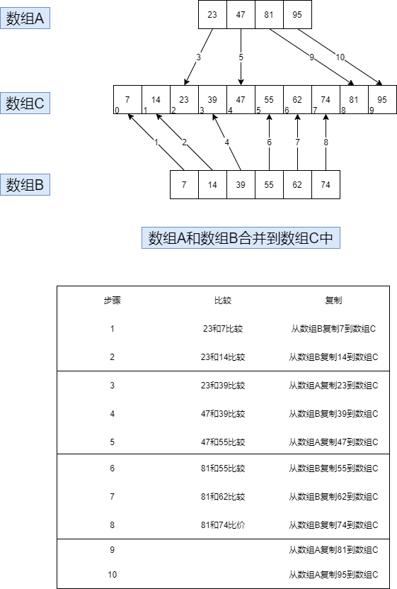

代码实现

```java
public class MergeApp {
    public static void main(String[] args) {
        int[] arrayA = {23, 47, 81, 95};
        int[] arrayB = {7, 14, 39, 55, 62, 74};
        int[] arrayC = new int[10];
        merge(arrayA, 4, arrayB, 6, arrayC);

        display(arrayC, 10);  // 7  14  23  39  47  55  62  74  81  95  
    }

    /**
     * 合并有序数组A和有序数组B到数组C
     *
     * @param arrayA
     * @param sizeA
     * @param arrayB
     * @param sizeB
     * @param arrayC
     */
    public static void merge(int[] arrayA, int sizeA, int[] arrayB, int sizeB, int[] arrayC) {
        int aDex = 0, bDex = 0, cDex = 0;
        while (aDex < sizeA && bDex < sizeB) {
            if (arrayA[aDex] < arrayB[bDex]) {
                arrayC[cDex++] = arrayA[aDex++];
            } else {
                arrayC[cDex++] = arrayB[bDex++];
            }
        }

        // 数组A非空,数组B还有元素
        while (aDex < sizeA) {
            arrayC[cDex++] = arrayA[aDex++];
        }

        // 数组A空了,数组B非空
        while (bDex < sizeB) {
            arrayC[cDex++] = arrayC[bDex++];
        }
    }

    public static void display(int[] array, int size) {
        for (int i = 0; i < size; i++) {
            System.out.print(array[i]+"  ");
        }
    }

}
```

## 4.2 通过归并合并两个数组
归并排序的思想:  
   把数组分成两半,排序每一半,再把两半合并成一个有序数组.如何排序每一个一半呢?把1/2分成两个1/4,然后把它们归成有序数组的一半.类似的,对一对1/8归成有序的1/4,每一对1/16归成有序的1/8的一部分.反复的分隔数组,直到得到的数组只含有一个数据项.这就是基值条件;设定只有一个数据项的数组是有序的

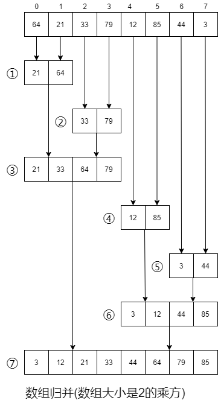


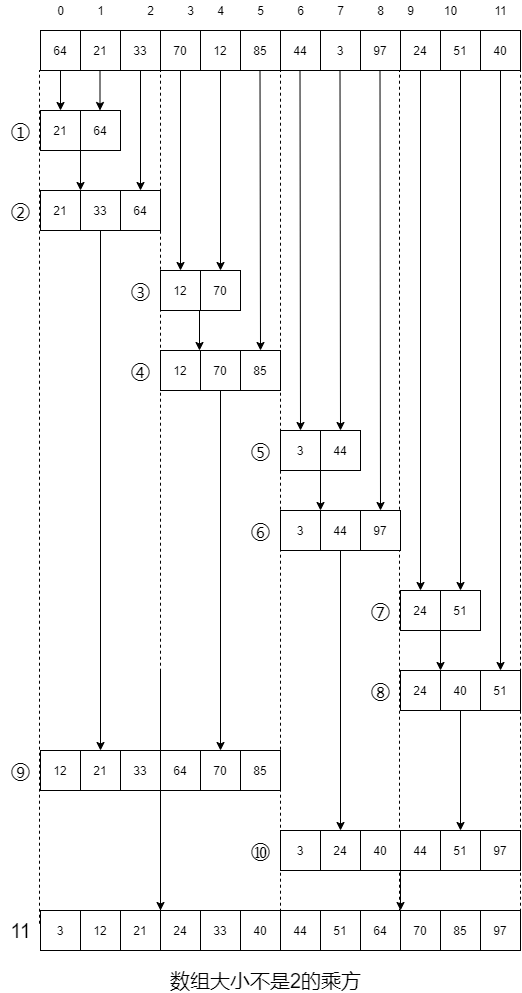

代码实现

```java
public class DArray {
    private long[] theArray;
    private int nElement;

    public DArray(int max) {
        theArray = new long[max];
        nElement = 0;
    }

    public void insert(long value) {
        theArray[nElement] = value;
        nElement ++;
    }

    public void display() {
        for (int i = 0; i < nElement; i++) {
            System.out.print(theArray[i] + " ");
        }
        System.out.println("");
    }


    public void mergeSort() {
        long[] workSpace = new long[nElement];
        recMergeSort(workSpace, 0, nElement - 1);

    }

    private void recMergeSort(long[] workSpace, int lowerBound, int upperBound) {
        if (lowerBound == upperBound) {
            return;
        } else {
            int mid = (lowerBound + upperBound) / 2;
            recMergeSort(workSpace, lowerBound, mid);
            recMergeSort(workSpace, mid + 1, upperBound);
            merge(workSpace, lowerBound, mid + 1, upperBound);
        }

    }

    private void merge(long[] workSpace, int lowPtr, int highPtr, int upperBound) {
        int j = 0;
        int lowBound = lowPtr;
        int mid = highPtr - 1;
        int n = upperBound - lowBound +1; // nElement
        while (lowPtr <= mid && highPtr <= upperBound) {
            if (theArray[lowPtr] < theArray[highPtr]) {
                workSpace[j++] = theArray [lowPtr++];
            } else {
                workSpace[j++] = theArray[highPtr++];
            }
        }

        while (lowPtr <= mid) {
            workSpace[j++] = theArray[lowPtr++];
        }

        while (highPtr <= upperBound) {
            workSpace[j++] = theArray[highPtr++];
        }

        for (j = 0; j < n; j++) {
            theArray[lowBound + j] = workSpace[j];
        }

    }

    static class MergeApp {
        public static void main(String[] args) {
            int maxsize = 100;
            DArray arr = new DArray(maxsize);
            arr.insert(64);
            arr.insert(10);
            arr.insert(1);
            arr.insert(9);
            arr.insert(81);
            arr.insert(78);
            arr.insert(55);
            arr.insert(32);
            arr.insert(66);
            arr.insert(17);
            arr.insert(23);
            arr.insert(47);
            arr.display();  // 64 10 1 9 81 78 55 32 66 17 23 47 
            arr.mergeSort();
            arr.display();  //1 9 10 17 23 32 47 55 64 66 78 81 
        }
    }
}

```

## 4.3 归并排序的效率
归并排序的运行时间是 O(N*logN) 

+  当N是2的乘方时候操作次数

| N | log₂N | 复制到工作区的次数 | 复制次数 | 最多(最少)比较次数 |
| :---: | :---: | :---: | :---: | :---: |
| 2 | 1 | 2 | 4 | 1(1) |
| 4 | 2 | 8 | 16 | 5(4) |
| 8 | 3 | 24 | 48 | 17(12) |
| 16 | 4 | 64 | 128 | 49(32) |
| 32 | 5 | 160 | 320 | 129(80) |
| 64 | 6 | 384 | 768 | 321(192) |
| 128 | 7 | 896 | 1792 | 769(448) |


+ 最大和最小比较次数

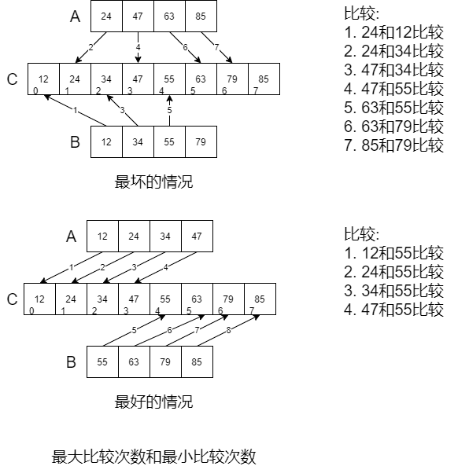

+  包含8个数据项的比较次数

| 步骤 | 1 | 2 | 3 | 4 | 5 | 6 | 7  | 总计 |
| :--- | :---: | :---: | :---: | :---: | :---: | :---: | :---: | :---: |
| 归并的项数(N) | 2 | 2 | 4 | 2 | 2 | 4 | 8 | 24 |
| 最多的比较(N-1) | 1 | 1 | 3 | 1 | 1 | 3 | 7 | 17 |
| 最少比较(N/2) | 1 | 1 | 2 | 1 | 1 | 2 | 4 | 12 |


# 5 高级排序
 希尔排序

**<font style="color:rgb(32, 33, 34);">希尔排序</font>**<font style="color:rgb(32, 33, 34);">（Shellsort），也称</font>**<font style="color:rgb(32, 33, 34);">递减增量排序算法</font>**<font style="color:rgb(32, 33, 34);">，是</font>[插入排序](https://zh.wikipedia.org/wiki/%E6%8F%92%E5%85%A5%E6%8E%92%E5%BA%8F)<font style="color:rgb(32, 33, 34);">的一种更高效的改进版本。</font>

<font style="color:rgb(32, 33, 34);">希尔排序是基于插入排序的以下两点性质而提出改进方法的：</font>

+ <font style="color:rgb(32, 33, 34);">插入排序在对几乎已经排好序的数据操作时，效率高，即可以达到</font>[线性排序](https://zh.wikipedia.org/w/index.php?title=%E7%B7%9A%E6%80%A7%E6%8E%92%E5%BA%8F&action=edit&redlink=1)<font style="color:rgb(32, 33, 34);">的效率</font>
+ <font style="color:rgb(32, 33, 34);">但插入排序一般来说是低效的，因为插入排序每次只能将数据移动一位</font>

算法实现

<font style="color:rgb(32, 33, 34);">希尔排序通过将比较的全部元素分为几个区域来提升</font>[插入排序](https://zh.wikipedia.org/wiki/%E6%8F%92%E5%85%A5%E6%8E%92%E5%BA%8F)<font style="color:rgb(32, 33, 34);">的性能。这样可以让一个元素可以一次性地朝最终位置前进一大步。然后算法再取越来越小的步长进行排序，算法的最后一步就是普通的</font>[插入排序](https://zh.wikipedia.org/wiki/%E6%8F%92%E5%85%A5%E6%8E%92%E5%BA%8F)<font style="color:rgb(32, 33, 34);">，但是到了这步，需排序的数据几乎是已排好的了（此时</font>[插入排序](https://zh.wikipedia.org/wiki/%E6%8F%92%E5%85%A5%E6%8E%92%E5%BA%8F)<font style="color:rgb(32, 33, 34);">较快）。</font>

## 5.1 n-增量排序
希尔排序通过加大插入排序中元素之间的间隔,然后在这些间隔的元素中济宁插入排序,使数据项能够大跨度的移动.当这些数据项排过一趟顺序后,再减小数据间的间隔再进行排序,依次进行下去.排序时,数据之间的间隔称为增量,习惯用字母h表示.

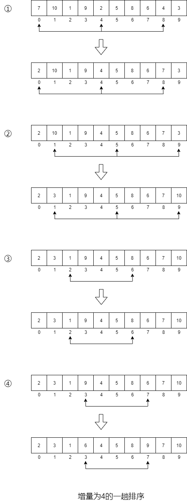

或则更好的描述算法:


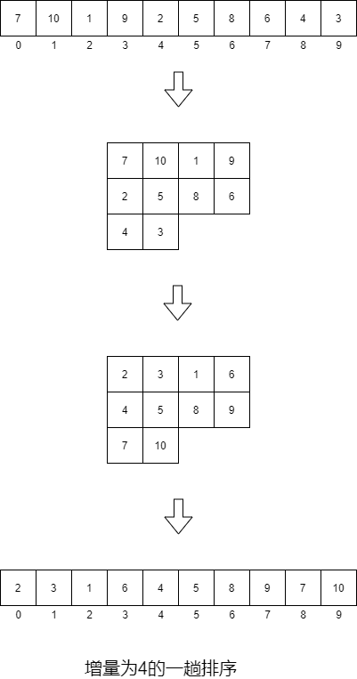


在完成以4为增量的希尔排序后,所有元素离它最终有序序列中的位置相差不到两个单元,数组"基本有序",这是希尔排序的奥秘所在.通过创建这种交错的内部有序的数据项集合,把排序的工作量降到了最小.


希尔排序比插入排序快很多,什么原因呢?当h值很大的时候,数据每一趟排序需要移动的个数很少,但数据项移动的距离很长.当h减小的时候,每一趟排序需要移动的元素个数增多,但是此时数据项已经接近他们排序后最终的位置,这对于插排序更有效率.真是这两种情况的结合才使希尔排序效率那么高.


## 5.2 减小间隔
对于大的数组,开始间隔也应该更大,然后间隔不断减小,知道间隔变成1.

常用间隔序列公式(Knuth序列)

| h | 3*h+1 | (h-1)/3 |
| :---: | :---: | :---: |
| 1 | 4 |  |
| 4 | 13 | 1 |
| 13 | 40 | 4 |
| 40 | 121 | 13 |
| 121 | 364 | 40 |
| 364 | 1093 | 121 |
| 1093 | 3280 | 364 |


```java
public class ArrayShell {
    private long[] array;
    private int nELements;

    public ArrayShell(int max) {
        array = new long[max];
        nELements = 0;
    }

    public void insert(long value) {
        array[nELements] = value;
        nELements++;
    }

    public void display() {
        for (int i = 0; i < nELements; i++) {
            System.out.print(array[i]+ " ");
        }
        System.out.println();
    }

    public void shellSort() {
        int inner, outer;
        long temp;

        int h = 1;
        while (h < nELements / 3) {
            h = h * 3 + 1;
        }
        while (h > 0) {
            for (outer = h; outer < nELements; outer++) {
                temp = array[outer];
                inner = outer;

                while (inner > h - 1 && array[inner - h] >= temp) {
                    array[inner] = array[inner - h];
                    inner -= h;
                }
                array[inner] = temp;
            }
            h = (h - 1) / 3;
        }

    }

    static class ShellSortApp {
        public static void main(String[] args) {
            int maxsize = 10;
            ArrayShell array = new ArrayShell(maxsize);
//            for (int j = 0; j < maxsize; j++) {
//                long n = (long) (Math.random() * 99);
//                array.insert(n);
//            }
            array.insert(7);
            array.insert(10);
            array.insert(1);
            array.insert(9);
            array.insert(2);
            array.insert(5);
            array.insert(8);
            array.insert(6);
            array.insert(4);
            array.insert(3);
            array.display();
            array.shellSort();
            array.display();
        }
    }

}
```

## 5.3 划分
划分数据,把数据分为两组,使关键字大于特定值的数据项在一组,使所有关键字小于特定值的数据项在另外一组.

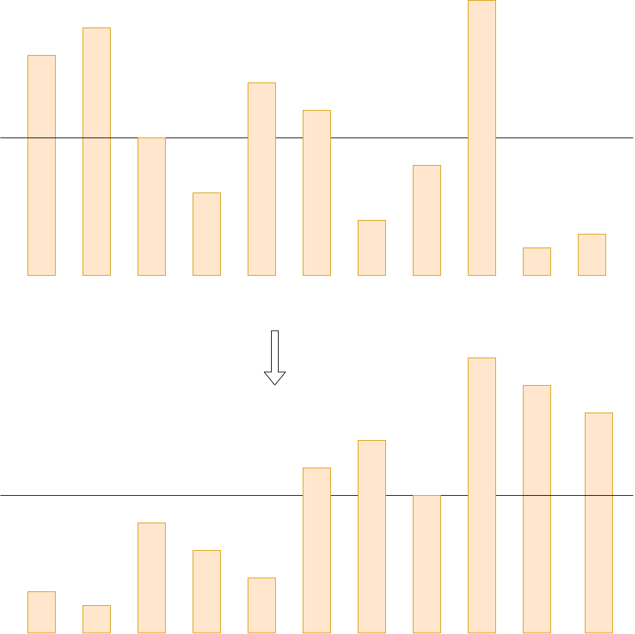

代码实现:

```java
public class ArrayPar {
    private long[] array;
    private int nElements;

    public ArrayPar(int max) {
        array = new long[max];
        nElements = 0;
    }

    public void insert(long value) {
        array[nElements] = value;
        nElements++;
    }

    public int size() {
        return nElements;
    }

    public void display() {
        for (int i = 0; i < nElements; i++) {
            System.out.print(array[i]+" ");
        }
        System.out.println();
    }

    public int partitionIt(int left, int right, long pivot) {
        int leftPtr = left ;
        int rightPtr = right;
        while (true) {
            while (leftPtr < right && array[leftPtr] < pivot) {
                ++leftPtr;
            }

            while (rightPtr > left && array[rightPtr] > pivot) {
                --rightPtr;

            }

            if (leftPtr >= rightPtr) {
                break;
            } else {
                swap(leftPtr, rightPtr);
            }
        }
        return leftPtr;
    }

    private void swap(int dex1, int dex2) {
        long temp;
        temp = array[dex1];
        array[dex1] = array[dex2];
        array[dex2] = temp;
    }

     public static void main(String[] args) {
        int maxsize =16;
         ArrayPar array = new ArrayPar(maxsize);
         for (int i = 0; i < maxsize; i++) {
             long n = (int) (Math.random() * 199);
             array.insert(n);
         }

         array.display();

         long pivot = 99;

         int size = array.size();
         int parDex = array.partitionIt(0, size - 1, pivot);

         array.display();
    }
}

```

## 5.4 快排
  快排排序(Quicksort),又称分区交换排序(Partition-exchange sort),简称快排.在平均状态下,排序n个项目需要O(n log n)次比较,在最坏情况下,需要O(n²)次比较,.

基本步骤:

1. 挑选基准值: 从序列中挑选一个元素,称为基准"pivot"
2. 分割: 重新排序数列,所有比基准小的元素排在基准前面,所有比基准大的排在基准后面.
3. 递归排序子序列: 递归的将小于基准值的序列和大于基准值的序列排序.

递归到底部的判断条件是序列的大小是零或则一,显然此时序列是有序的.

```java
public class ArrayIns {
    private long[] array;
    private int nELements;

    public ArrayIns(int max) {
        array = new long[max];
        nELements = 0;
    }

    public void insert(long value) {
        array[nELements] =value;
        nELements ++;
    }

    public void display() {
        for (int i = 0; i < nELements; i++) {
            System.out.print(array[i]+ " ");
        }
        System.out.println();
    }

    public void quickSort() {
        recQuickSort(0, nELements - 1);
    }

    private void recQuickSort(int left, int right) {
        if (right - left <= 0) {
            return ;
        } else {
            long pivot = array[right];

            int partition = partitionIt(left, right, pivot);
            recQuickSort(left, partition - 1);
            recQuickSort(partition + 1, right);
        }
    }

    private int partitionIt(int left, int right, long pivot) {
        int leftPtr = left -1;
        int rightPtr = right;
        while (true) {
            while (array[++leftPtr] < pivot) {
                ;
            }
            while (rightPtr > 0 && array[--rightPtr] > pivot) {
                ;
            }

            if (leftPtr >= rightPtr) {
                break;
            } else {
                swap(leftPtr, rightPtr);
            }
        }
        swap(leftPtr, right); // 重置 基准 pivot
        return leftPtr;
    }

    private void swap(int dex1, int dex2) {
        long temp = array[dex1];
        array[dex1] = array[dex2];
        array[dex2] = temp;
    }

    public static void main(String[] args) {
        int maxsize = 10;
        ArrayIns ai = new ArrayIns(maxsize);
        ai.insert(42);
        ai.insert(89);
        ai.insert(63);
        ai.insert(12);
        ai.insert(94);
        ai.insert(27);
        ai.insert(78);
        ai.insert(3);
        ai.insert(50);
        ai.insert(36);

//        for (int i = 0; i < maxsize; i++) {
//            long value = (long)(Math.random()*99);
//            ai.insert(value);
//        }

        ai.display();  
        ai.quickSort();
        ai.display(); 
    }
}

```


注意两个递归不包含基准值,为什么不包含这个基准值?原因在于基准的的选择方法:

## 5.5 基准的选择
+ 理想状态应该选择排序序列的中值数据项作为枢纽.对于快排来说,拥有两个大小相等的子数组是最优的情况
+ 应该选择序列的一个元素作为基准值,这个元素的数据项称为pivot(枢纽)
+ 可以选择任意一个元素作为枢纽.我们假设总是选择待划分序列最右端的数据项作为枢纽
+ 划分之后,如果枢纽被插入到左右序列的分界处,那么枢纽在落在排序之后的最终位置了

## 5.6 最右划分
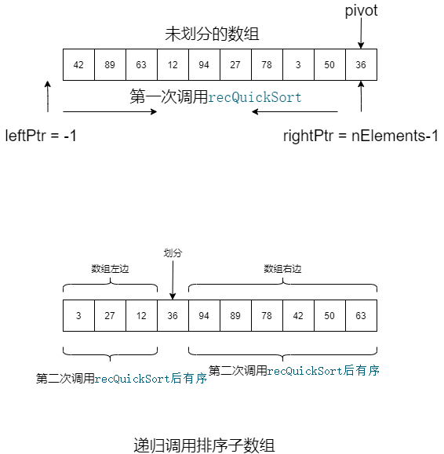

使用枢纽来划分数组,所以划分之后的左边子数组的数据项都小于枢纽,右边的子数组的数据项都大于枢纽.枢纽开始在数组最右端,但是把他放在两个子数组之间,枢纽就会在正确的位置了.只要交换枢纽和右数组最左端的数据项即可.

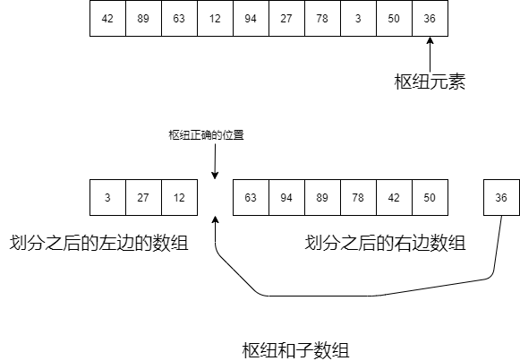

## 5.7 三数据项取中划分
选择枢纽的方法应该简单,但能避免出现最大或则最小的数据项最为枢纽.

+ 选择任意一个数据项作为枢纽?不是最优解
+ 检测所有数据项,计算哪一个是中值?花费时间很长,不可行
+ 折中方法,取数组第一个,最后一个,中间位置数据项的中值

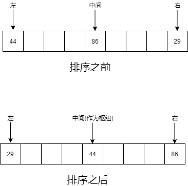

```java
public class ArrayIns1 {
    private long[] array;
    private int nElements;

    public ArrayIns1(int maxsize) {
        array = new long[maxsize];
        nElements = 0;
    }

    public void insert(long value) {
        array[nElements] = value;
        nElements++;
    }

    public void display() {
        for (int i = 0; i < nElements; i++) {
            System.out.print(array[i] + " ");
        }
        System.out.println();
    }

    public void qucikSort() {
        recQuickSort(0, nElements - 1);
    }

    private void recQuickSort(int left, int right) {
        int size = right - left + 1;
        if (size < 3) {
            manualSort(left, right);
        } else {
            long median = medianOf3(left, right);
            int partition = partitionIt(left, right, median);
            recQuickSort(left, partition - 1);
            recQuickSort(partition + 1, right);
        }
    }

    private int partitionIt(int left, int right, long pivot) {
        int leftPtr = left;
        int rightPtr = right - 1;

        while (true) {
            while (array[++leftPtr] < pivot) {
                ;
            }
            while (array[--rightPtr] > pivot) {
                ;
            }
            if (leftPtr >= rightPtr) {
                break;
            } else {
                swap(leftPtr, rightPtr);
            }
        }
        swap(leftPtr, right - 1);
        return leftPtr;
    }

    private long medianOf3(int left, int right) {
        int center = (left + right) / 2;
        if (array[left] > array[center]) {
            swap(left, center);
        }
        if (array[left] > array[right]) {
            swap(left, right);
        }
        if (array[center] > array[right]) {
            swap(center, right);
        }
        swap(center, right - 1);
        return array[right - 1];
    }

    private void swap(int dex1, int dex2) {
        long temp = array[dex1];
        array[dex1] = array[dex2];
        array[dex2] = temp;
    }

    private void manualSort(int left, int right) {
        int size = right - left + 1;
        if (size <= 1) {
            return;
        }
        if (size == 2) {
            if (array[left] > array[right]) {
                swap(left, right);
                return;
            }
        } else {
            if (array[left] > array[right - 1]) {
                swap(left, right - 1);
            }
            if (array[left] > array[right]) {
                swap(left, right);
            }
            if (array[right - 1] > array[right]) {
                swap(right - 1, right);
            }
        }
    }

    public static void main(String[] args) {
        int maxsize = 16;
        ArrayIns1 array = new ArrayIns1(maxsize);
        for (int i = 0; i < maxsize; i++) {
            long n = (long) (Math.random() * 99);
            array.insert(n);
        }
        array.display();
        array.qucikSort();
        array.display();
    }
}

```

## 5.8 插入处理小数据项
```java
public class ArrayIns2 {
    private long[] array;
    private int nElements;

    public ArrayIns2(int maxsize) {
        array = new long[maxsize];
        nElements = 0;
    }

    public void insert(long value) {
        array[nElements] = value;
        nElements++;
    }

    public void display() {
        for (int i = 0; i < nElements; i++) {
            System.out.print(array[i] + " ");
        }
        System.out.println();
    }

    public void qucikSort() {
        recQuickSort(0, nElements - 1);
    }

    private void recQuickSort(int left, int right) {
        int size = right - left + 1;
        if (size < 10) {
            // 插入排序
            insertionSort(left, right);
        } else {
            long median = medianOf3(left, right);
            int partition = partitionIt(left, right, median);
            recQuickSort(left, partition - 1);
            recQuickSort(partition + 1, right);
        }
    }

    private void insertionSort(int left, int right) {
        int in, out;
        for (out = left + 1; out <= right; out++) {
            long temp = array[out];
            in = out;
            while (in > left && array[in - 1] >= temp) {
                array[in] = array[in - 1];
                --in;
            }
            array[in] = temp;
        }

    }

    private int partitionIt(int left, int right, long pivot) {
        int leftPtr = left;
        int rightPtr = right - 1;

        while (true) {
            while (array[++leftPtr] < pivot) {
                ;
            }
            while (array[--rightPtr] > pivot) {
                ;
            }
            if (leftPtr >= rightPtr) {
                break;
            } else {
                swap(leftPtr, rightPtr);
            }
        }
        swap(leftPtr, right - 1);
        return leftPtr;
    }

    private long medianOf3(int left, int right) {
        int center = (left + right) / 2;
        if (array[left] > array[center]) {
            swap(left, center);
        }
        if (array[left] > array[right]) {
            swap(left, right);
        }
        if (array[center] > array[right]) {
            swap(center, right);
        }
        swap(center, right - 1);
        return array[right - 1];
    }

    private void swap(int dex1, int dex2) {
        long temp = array[dex1];
        array[dex1] = array[dex2];
        array[dex2] = temp;
    }

    public static void main(String[] args) {
        int maxsize = 16;
        ArrayIns2 array = new ArrayIns2(maxsize);
        for (int i = 0; i < maxsize; i++) {
            long n = (long) (Math.random() * 99);
            array.insert(n);
        }
        array.display();
        array.qucikSort();
        array.display();
    }
}
```

# 6 树
## 6.1  二叉树
+ 树解决的问题:

      能像链表那样快速的插入和删除,又像数组那样快速查找.

+ 树种每个节点最多只能有两个子节点的树称为二叉树.

## 6.2 树的结构
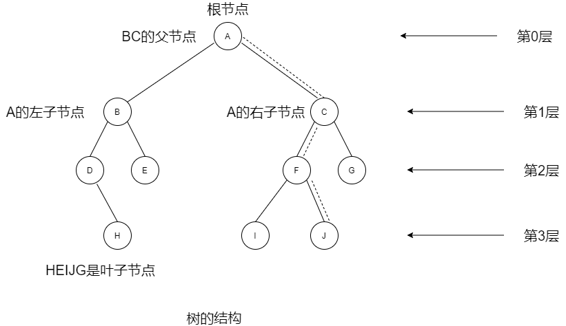


```java

public class Node {
    public int iData;
    public double dData;
    public Node leftChild;
    public Node rightChild;

    public void displayNode() {
        System.out.print("{"+iData+","+dData+"} ");
    }
}
```

```java

package com.chen.tree;

/**
 * @program: algorithms
 * @description: 树
 * @author: admin
 * @created: 2021/08/24 19:57
 */
public class Tree {
    public Node root;

    public Tree() {
        root = null;
    }

    public Node find(int key) {
        Node current = root;
        while (current.iData != key) {
            if (key < current.iData) {
                current = current.leftChild;
            } else {
                current = current.rightChild;
            }
            if (current == null) {
                return null;
            }
        }
        return current;
    }

    public void insert(int id, double dd) {
        Node newNode = new Node();
        newNode.iData = id;
        newNode.dData = dd;

        if (root == null) {
            root = newNode;
        } else {
            Node current = root;
            Node parent;

            while (true) {
                parent = current;
                if (id < current.iData) {
                    current = current.leftChild;
                    if (current == null) {
                        parent.leftChild = newNode;
                        return;
                    }
                } else {
                    current = current.rightChild;
                    if (current == null) {
                        parent.rightChild = newNode;
                        return;
                    }
                }
            }
        }

    }

    public boolean delete(int key) {
        Node current = root;
        Node parent = root;
        boolean isLeftChild = true;
        while (current.iData != key) {
            parent = current;
            if (key < current.iData) {
                isLeftChild = true;
                current = current.leftChild;
            } else {
                isLeftChild = false;
                current = current.rightChild;
            }
            if (current == null) {
                return false;
            }
        }

        if (current.leftChild == null && current.rightChild == null) {
            // 叶子节点
            if (current == root) {
                root = null;
            } else if (isLeftChild) {
                parent.leftChild = null;
            } else {
                parent.rightChild = null;
            }
        } else if (current.rightChild == null) {
            // 没有右子节点
            if (current == root) {
                root = current.leftChild;
            } else if (isLeftChild) {
                parent.leftChild = current.leftChild;
            } else {
                parent.rightChild = current.leftChild;
            }
        } else if (current.leftChild == null) {
            // 没有左子节点
            if (current == root) {
                root = current.rightChild;
            } else if (isLeftChild) {
                parent.leftChild = current.rightChild;
            } else {
                parent.rightChild = current.rightChild;
            }

        } else {
            // 两个子节点
            Node successor = getSuccessor(current);
            if (current == root) {
                root = successor;
            } else if (isLeftChild) {
                parent.leftChild = successor;
            } else {
                parent.rightChild = successor;
            }
            successor.leftChild = current.leftChild;
        }

        return true;

    }

    // 找删除节点的后继节点,转向右子树,然后右子树的左孩子
    private Node getSuccessor(Node delNode) {
        Node successorParent = delNode;
        Node successor = delNode;
        Node current = delNode.rightChild;

        while (current != null) {
            successorParent = successor;
            successor = current;
            current = current.leftChild;
        }
        // 中继节点不是删除节点的右节点,处理后继节点
        if (successor != delNode.rightChild) {
            // 中继节点父节点的左子节点指向中继节点的右子节点
            successorParent.leftChild = successor.rightChild;
            // 中继节点的右子节点指向删除节点的右子节点
            successor.rightChild = delNode.rightChild;
        }


        return successor;
    }

    // 递归先序遍历,考察到一个节点,先输出节点的值,再递归遍历左右子树.(根左右)
    public void preOrder(Node localRoot) {
        if (localRoot != null) {
            System.out.print(localRoot.iData + " ");
            preOrder(localRoot.leftChild);
            preOrder(localRoot.rightChild);
        }
    }

    //递归中序遍历 考察到一个节点,将其暂存,遍历完左子树后,再输出节点的值,然后遍历右子树(左根右)
    public void inOrder(Node localRoot) {
        if (localRoot != null) {
            inOrder(localRoot.leftChild);
            System.out.print(localRoot.iData + " ");
            inOrder(localRoot.rightChild);
        }
    }

    // 后续遍历 考察到一个节点,将其暂存,遍历完左右子树后,再输出该节点的值(左右根)
    public void postOrder(Node localRoot) {
        if (localRoot != null) {
            postOrder(localRoot.leftChild);
            postOrder(localRoot.rightChild);
            System.out.print(localRoot.iData + " ");
        }
    }

    public void displayTree() {

    }
}

```

```java
package com.chen.tree;

public class TreeApp {
    public static void main(String[] args) {
        Tree tree = new Tree();
        tree.insert(50,1.5);
        tree.insert(25,1.2);
        tree.insert(75,1.7);
        tree.insert(12,1.5);
        tree.insert(37,1.4);
        tree.insert(43,1.1);
        tree.insert(30,1.9);
        tree.insert(33,1.6);
        tree.insert(87,1.1);
        tree.insert(93,1.8);
        tree.insert(97,1.4);

        tree.preOrder(tree.root); // 50 25 12 37 30 33 43 75 87 93 97 
        System.out.println();
        tree.inOrder(tree.root);  // 12 25 30 33 37 43 50 75 87 93 97 
        System.out.println();
        tree.postOrder(tree.root); // 12 33 30 43 37 25 97 93 87 75 50 
    }
}

```

## 6.3 插入节点
```java
public void insert(int id, double dd) {
        Node newNode = new Node();
        newNode.iData = id;
        newNode.dData = dd;

        if (root == null) {
            root = newNode;
        } else {
            Node current = root;
            Node parent;

            while (true) {
                parent = current;
                if (id < current.iData) {
                    current = current.leftChild;
                    if (current == null) {
                        parent.leftChild = newNode;
                        return;
                    }
                } else {
                    current = current.rightChild;
                    if (current == null) {
                        parent.rightChild = newNode;
                        return;
                    }
                }
            }
        }

    }
```

## 6.4 查找节点
```java
public Node find(int key) {
        Node current = root;
        while (current.iData != key) {
            if (key < current.iData) {
                current = current.leftChild;
            } else {
                current = current.rightChild;
            }
            if (current == null) {
                return null;
            }
        }
        return current;
    }
```

## 6.5 遍历树
参考 [https://blog.csdn.net/weixin_44032878/article/details/88070556](https://blog.csdn.net/weixin_44032878/article/details/88070556)

### 1. 先序遍历(preorder)
```java
// 递归先序遍历,考察到一个节点,先输出节点的值,再递归遍历左右子树.(根左右)
public void preOrder(Node localRoot) {
    if (localRoot != null) {
        System.out.print(localRoot.iData + " ");
        preOrder(localRoot.leftChild);
        preOrder(localRoot.rightChild);
    }
}
```


### 2. 中序遍历(inOrder)
```java
//递归中序遍历 考察到一个节点,将其暂存,遍历完左子树后,再输出节点的值,然后遍历右子树(左根右)
    public void inOrder(Node localRoot) {
        if (localRoot != null) {
            inOrder(localRoot.leftChild);
            System.out.print(localRoot.iData + " ");
            inOrder(localRoot.rightChild);
        }
    }
```


###  3. 后序遍历(postorder)
```java
//递归中序遍历 考察到一个节点,将其暂存,遍历完左子树后,再输出节点的值,然后遍历右子树(左根右)
    public void inOrder(Node localRoot) {
        if (localRoot != null) {
            inOrder(localRoot.leftChild);
            System.out.print(localRoot.iData + " ");
            inOrder(localRoot.rightChild);
        }
    }
```


三节点树的中序遍历,输出BAC


## 6.6 删除节点
找到该节点,这个删除的节点需要考虑到三种情况

1. 该节点是叶子节点:  要删除叶子结点,只需要改变此节点父节点的对应字段的值,指向此节点的值置为null.要删除的节点依然存在,不属于树的一部分了,等待垃圾回收.
2. 该节点有一个子节点:  此节点父节点的左节点或则右节点指向此节点的左节点或则右节点
3. 该节点有两个子节点:  用他的中序后继节点来代替该节点

```java
public boolean delete(int key) {
        Node current = root;
        Node parent = root;
        boolean isLeftChild = true;
        while (current.iData != key) {
            parent = current;
            if (key < current.iData) {
                isLeftChild = true;
                current = current.leftChild;
            } else {
                isLeftChild = false;
                current = current.rightChild;
            }
            if (current == null) {
                return false;
            }
        }

        if (current.leftChild == null && current.rightChild == null) {
            // 叶子节点
            if (current == root) {
                root = null;
            } else if (isLeftChild) {
                parent.leftChild = null;
            } else {
                parent.rightChild = null;
            }
        } else if (current.rightChild == null) {
            // 没有右子节点
            if (current == root) {
                root = current.leftChild;
            } else if (isLeftChild) {
                parent.leftChild = current.leftChild;
            } else {
                parent.rightChild = current.leftChild;
            }
        } else if (current.leftChild == null) {
            // 没有左子节点
            if (current == root) {
                root = current.rightChild;
            } else if (isLeftChild) {
                parent.leftChild = current.rightChild;
            } else {
                parent.rightChild = current.rightChild;
            }

        } else {
            // 两个子节点
            Node successor = getSuccessor(current);
            if (current == root) {
                root = successor;
            } else if (isLeftChild) {
                parent.leftChild = successor;
            } else {
                parent.rightChild = successor;
            }
            successor.leftChild = current.leftChild;
        }

        return true;

    }

 // 找删除节点的后继节点,转向右子树,然后右子树的左孩子
    private Node getSuccessor(Node delNode) {
        Node successorParent = delNode;
        Node successor = delNode;
        Node current = delNode.rightChild;

        while (current != null) {
            successorParent = successor;
            successor = current;
            current = current.leftChild;
        }
        // 中继节点不是删除节点的右节点,处理后继节点
        if (successor != delNode.rightChild) {
            // 中继节点父节点的左子节点指向中继节点的右子节点
            successorParent.leftChild = successor.rightChild;
            // 中继节点的右子节点指向删除节点的右子节点
            successor.rightChild = delNode.rightChild;
        }


        return successor;
    }	
```

#  7 AVL树
+ AVL(Adelson-Velskii 和 Landis)树**:带有平衡条件**(balance condition)的二叉查找树,每个节点的左子树和右子树的高度最多相差1的二叉查找树.
+ 旋转:插入节点可能破坏AVL树的特性,通过**旋转**来回复AVL平衡特性

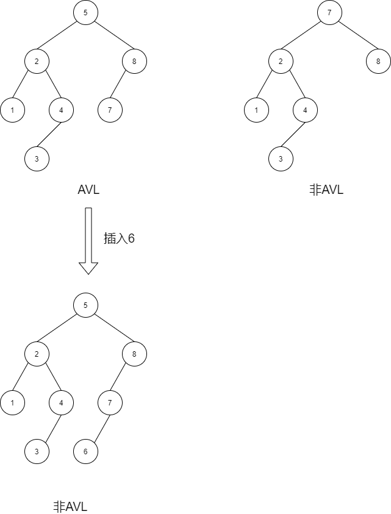

## 7.1 树旋转
[**树旋转**](https://zh.wikipedia.org/wiki/%E6%A0%91%E6%97%8B%E8%BD%AC)<font style="color:rgb(32, 33, 34);">（Tree rotation）是对</font>[二叉树](https://zh.wikipedia.org/wiki/%E4%BA%8C%E5%8F%89%E6%A0%91)<font style="color:rgb(32, 33, 34);">的一种操作，不影响元素的顺序，但会改变树的结构，将一个节点上移、一个节点下移。树旋转会改变树的形状，因此常被用来将较小的子树下移、较大的子树上移，从而降低树的高度、提升许多树操作的效率。</font>

<font style="color:rgb(32, 33, 34);">对一棵树进行旋转时，这棵树的根节点是被旋转的两棵子树的父节点，称为旋转时的</font>**<font style="color:rgb(32, 33, 34);">根</font>**<font style="color:rgb(32, 33, 34);">（root）；如果节点在旋转后会成为新的父节点，则该节点为旋转时的</font>**<font style="color:rgb(32, 33, 34);">转轴</font>**<font style="color:rgb(32, 33, 34);">（pivot）。</font>

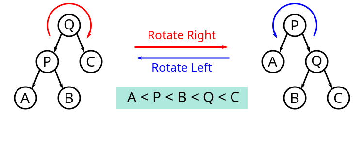

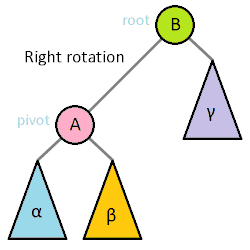

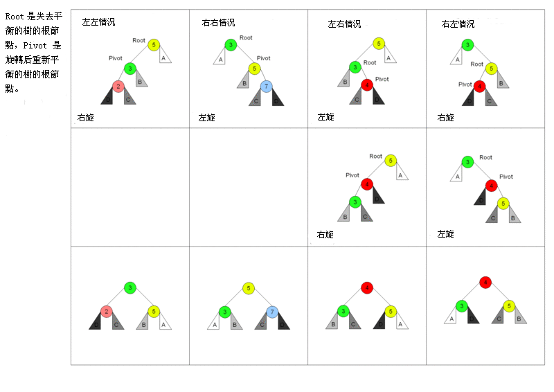


插入节点之后,必须要重新平衡的节点定义α,四种情况的:

1. 对α的左儿子左子树插入:**单旋转(single rotation)/右旋转(Rotate Right)**
2. 对α的左儿子右子树插入:**双旋转(double rotation)/左转,右转**
3. 对α的右儿子左子树插入:**双旋转(double rotation)/右转,左转**
4. 对α的右儿子右子树插入:**单旋转(single rotation)/左旋转(Rotate Left)**

1和4是关于α的镜像对称,2和3是关于α的镜像对称,理论上只有两种情况.

## 7.2  单旋转(single rotation)
+ 情况1的旋转操作

  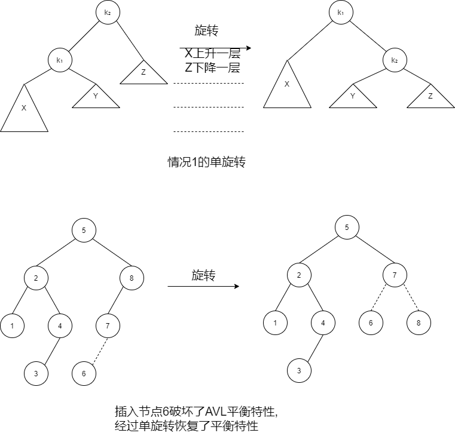

+ 情况4的单旋转

  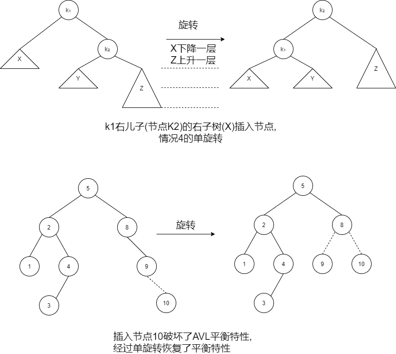

+ 情况1和情况4

  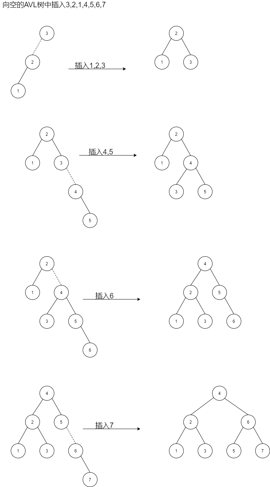

## 7.3 双旋转(double rotation)
* 情况2,使用单旋转

  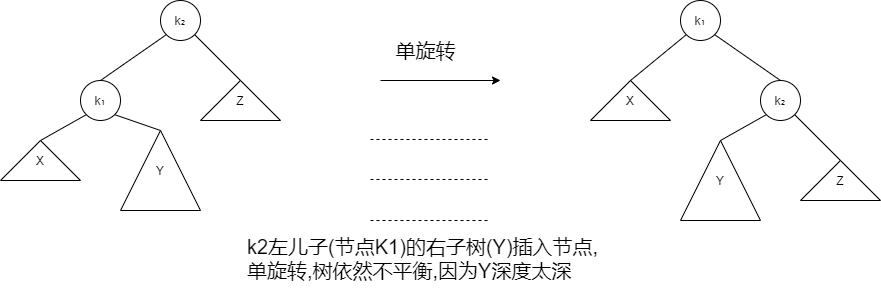

+ 情况2,使用双旋转

  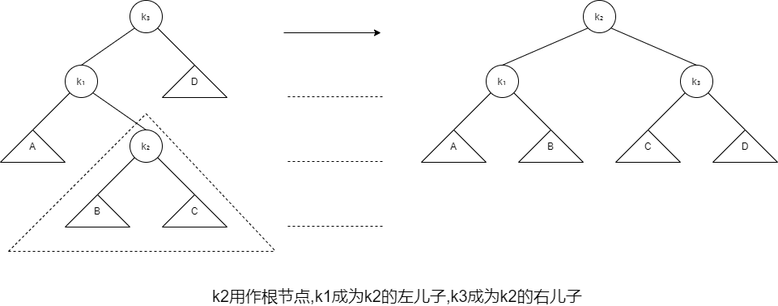

+ 情况3的双旋转

  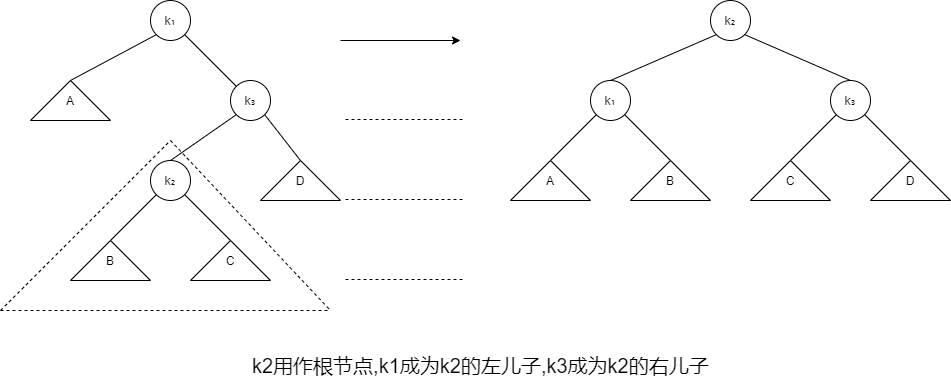

+ 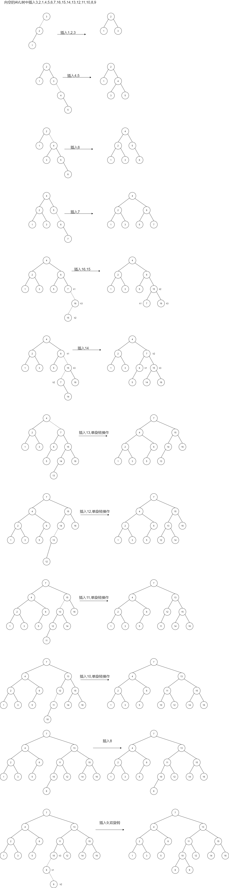

```java
package com.chen.analysis;// AvlTree class
//
// CONSTRUCTION: with no initializer
//
// ******************PUBLIC OPERATIONS*********************
// void insert( x )       --> Insert x
// void remove( x )       --> Remove x (unimplemented)
// boolean contains( x )  --> Return true if x is present
// boolean remove( x )    --> Return true if x was present
// Comparable findMin( )  --> Return smallest item
// Comparable findMax( )  --> Return largest item
// boolean isEmpty( )     --> Return true if empty; else false
// void makeEmpty( )      --> Remove all items
// void printTree( )      --> Print tree in sorted order
// ******************ERRORS********************************
// Throws UnderflowException as appropriate

/**
 * Implements an AVL tree.
 * Note that all "matching" is based on the compareTo method.
 * @author Mark Allen Weiss
 */
public class AvlTree<AnyType extends Comparable<? super AnyType>>
{
    /**
     * Construct the tree.
     */
    public AvlTree( )
    {
        root = null;
    }

    /**
     * Insert into the tree; duplicates are ignored.
     * @param x the item to insert.
     */
    public void insert( AnyType x )
    {
        root = insert( x, root );
    }

    /**
     * Remove from the tree. Nothing is done if x is not found.
     * @param x the item to remove.
     */
    public void remove( AnyType x )
    {
        root = remove( x, root );
    }

       
    /**
     * Internal method to remove from a subtree.
     * @param x the item to remove.
     * @param t the node that roots the subtree.
     * @return the new root of the subtree.
     */
    private AvlNode<AnyType> remove( AnyType x, AvlNode<AnyType> t )
    {
        if( t == null )
            return t;   // Item not found; do nothing
            
        int compareResult = x.compareTo( t.element );
            
        if( compareResult < 0 )
            t.left = remove( x, t.left );
        else if( compareResult > 0 )
            t.right = remove( x, t.right );
        else if( t.left != null && t.right != null ) // Two children
        {
            t.element = findMin( t.right ).element;
            t.right = remove( t.element, t.right );
        }
        else
            t = ( t.left != null ) ? t.left : t.right;
        return balance( t );
    }
    
    /**
     * Find the smallest item in the tree.
     * @return smallest item or null if empty.
     */
    public AnyType findMin( )
    {
        if( isEmpty( ) )
            throw new UnderflowException( );
        return findMin( root ).element;
    }

    /**
     * Find the largest item in the tree.
     * @return the largest item of null if empty.
     */
    public AnyType findMax( )
    {
        if( isEmpty( ) )
            throw new UnderflowException( );
        return findMax( root ).element;
    }

    /**
     * Find an item in the tree.
     * @param x the item to search for.
     * @return true if x is found.
     */
    public boolean contains( AnyType x )
    {
        return contains( x, root );
    }

    /**
     * Make the tree logically empty.
     */
    public void makeEmpty( )
    {
        root = null;
    }

    /**
     * Test if the tree is logically empty.
     * @return true if empty, false otherwise.
     */
    public boolean isEmpty( )
    {
        return root == null;
    }

    /**
     * Print the tree contents in sorted order.
     */
    public void printTree( )
    {
        if( isEmpty( ) )
            System.out.println( "Empty tree" );
        else
            printTree( root );
    }

    private static final int ALLOWED_IMBALANCE = 1;
    
    // Assume t is either balanced or within one of being balanced
    private AvlNode<AnyType> balance( AvlNode<AnyType> t )
    {
        if( t == null )
            return t;
        
        if( height( t.left ) - height( t.right ) > ALLOWED_IMBALANCE )
            if( height( t.left.left ) >= height( t.left.right ) )
                t = rotateWithLeftChild( t );
            else
                t = doubleWithLeftChild( t );
        else
        if( height( t.right ) - height( t.left ) > ALLOWED_IMBALANCE )
            if( height( t.right.right ) >= height( t.right.left ) )
                t = rotateWithRightChild( t );
            else
                t = doubleWithRightChild( t );

        t.height = Math.max( height( t.left ), height( t.right ) ) + 1;
        return t;
    }
    
    public void checkBalance( )
    {
        checkBalance( root );
    }
    
    private int checkBalance( AvlNode<AnyType> t )
    {
        if( t == null )
            return -1;
        
        if( t != null )
        {
            int hl = checkBalance( t.left );
            int hr = checkBalance( t.right );
            if( Math.abs( height( t.left ) - height( t.right ) ) > 1 ||
                    height( t.left ) != hl || height( t.right ) != hr )
                System.out.println( "OOPS!!" );
        }
        
        return height( t );
    }
    
    
    /**
     * Internal method to insert into a subtree.
     * @param x the item to insert.
     * @param t the node that roots the subtree.
     * @return the new root of the subtree.
     */
    private AvlNode<AnyType> insert( AnyType x, AvlNode<AnyType> t )
    {
        if( t == null )
            return new AvlNode<>( x, null, null );
        
        int compareResult = x.compareTo( t.element );
        
        if( compareResult < 0 )
            t.left = insert( x, t.left );
        else if( compareResult > 0 )
            t.right = insert( x, t.right );
        else
            ;  // Duplicate; do nothing
        return balance( t );
    }

    /**
     * Internal method to find the smallest item in a subtree.
     * @param t the node that roots the tree.
     * @return node containing the smallest item.
     */
    private AvlNode<AnyType> findMin( AvlNode<AnyType> t )
    {
        if( t == null )
            return t;

        while( t.left != null )
            t = t.left;
        return t;
    }

    /**
     * Internal method to find the largest item in a subtree.
     * @param t the node that roots the tree.
     * @return node containing the largest item.
     */
    private AvlNode<AnyType> findMax( AvlNode<AnyType> t )
    {
        if( t == null )
            return t;

        while( t.right != null )
            t = t.right;
        return t;
    }

    /**
     * Internal method to find an item in a subtree.
     * @param x is item to search for.
     * @param t the node that roots the tree.
     * @return true if x is found in subtree.
     */
    private boolean contains( AnyType x, AvlNode<AnyType> t )
    {
        while( t != null )
        {
            int compareResult = x.compareTo( t.element );
            
            if( compareResult < 0 )
                t = t.left;
            else if( compareResult > 0 )
                t = t.right;
            else
                return true;    // Match
        }

        return false;   // No match
    }

    /**
     * Internal method to print a subtree in sorted order.
     * @param t the node that roots the tree.
     */
    private void printTree( AvlNode<AnyType> t )
    {
        if( t != null )
        {
            printTree( t.left );
            System.out.println( t.element );
            printTree( t.right );
        }
    }

    /**
     * Return the height of node t, or -1, if null.
     */
    private int height( AvlNode<AnyType> t )
    {
        return t == null ? -1 : t.height;
    }

    /**
     * Rotate binary tree node with left child.
     * For AVL trees, this is a single rotation for case 1.
     * Update heights, then return new root.
     */
    private AvlNode<AnyType> rotateWithLeftChild( AvlNode<AnyType> k2 )
    {
        AvlNode<AnyType> k1 = k2.left;
        k2.left = k1.right;
        k1.right = k2;
        k2.height = Math.max( height( k2.left ), height( k2.right ) ) + 1;
        k1.height = Math.max( height( k1.left ), k2.height ) + 1;
        return k1;
    }

    /**
     * Rotate binary tree node with right child.
     * For AVL trees, this is a single rotation for case 4.
     * Update heights, then return new root.
     */
    private AvlNode<AnyType> rotateWithRightChild( AvlNode<AnyType> k1 )
    {
        AvlNode<AnyType> k2 = k1.right;
        k1.right = k2.left;
        k2.left = k1;
        k1.height = Math.max( height( k1.left ), height( k1.right ) ) + 1;
        k2.height = Math.max( height( k2.right ), k1.height ) + 1;
        return k2;
    }

    /**
     * Double rotate binary tree node: first left child
     * with its right child; then node k3 with new left child.
     * For AVL trees, this is a double rotation for case 2.
     * Update heights, then return new root.
     */
    private AvlNode<AnyType> doubleWithLeftChild( AvlNode<AnyType> k3 )
    {
        k3.left = rotateWithRightChild( k3.left );
        return rotateWithLeftChild( k3 );
    }

    /**
     * Double rotate binary tree node: first right child
     * with its left child; then node k1 with new right child.
     * For AVL trees, this is a double rotation for case 3.
     * Update heights, then return new root.
     */
    private AvlNode<AnyType> doubleWithRightChild( AvlNode<AnyType> k1 )
    {
        k1.right = rotateWithLeftChild( k1.right );
        return rotateWithRightChild( k1 );
    }

    private static class AvlNode<AnyType>
    {
            // Constructors
        AvlNode( AnyType theElement )
        {
            this( theElement, null, null );
        }

        AvlNode( AnyType theElement, AvlNode<AnyType> lt, AvlNode<AnyType> rt )
        {
            element  = theElement;
            left     = lt;
            right    = rt;
            height   = 0;
        }

        AnyType           element;      // The data in the node
        AvlNode<AnyType>  left;         // Left child
        AvlNode<AnyType>  right;        // Right child
        int               height;       // Height
    }

      /** The tree root. */
    private AvlNode<AnyType> root;


        // Test program
    public static void main( String [ ] args )
    {
        AvlTree<Integer> t = new AvlTree<>( );
        final int SMALL = 40;
        final int NUMS = 1000000;  // must be even
        final int GAP  =   37;

        System.out.println( "Checking... (no more output means success)" );

        for( int i = GAP; i != 0; i = ( i + GAP ) % NUMS )
        {
        //    System.out.println( "INSERT: " + i );
            t.insert( i );
            if( NUMS < SMALL )
                t.checkBalance( );
        }
        
        for( int i = 1; i < NUMS; i+= 2 )
        {
         //   System.out.println( "REMOVE: " + i );
            t.remove( i );
            if( NUMS < SMALL )
                t.checkBalance( );
        }
        if( NUMS < SMALL )
            t.printTree( );
        if( t.findMin( ) != 2 || t.findMax( ) != NUMS - 2 )
            System.out.println( "FindMin or FindMax error!" );

        for( int i = 2; i < NUMS; i+=2 )
             if( !t.contains( i ) )
                 System.out.println( "Find error1!" );

        for( int i = 1; i < NUMS; i+=2 )
        {
            if( t.contains( i ) )
                System.out.println( "Find error2!" );
        }
    }
}

```

