*[美]Robert Lalore**

[Java数据结构和算法.pdf)](../assets/file/Java数据结构和算法.pdf)

# 第1章 综述
# 第2章 数组
```java
package com.chen.array;

/**
 * @program: algorithms
 * @description: 数组的基本操作
 * @author: admin
 * @created: 2021/06/16 23:44
 */
public class LowArray {
    private long[] a;

    public LowArray(int size) {
        a = new long[size];
    }

    public void setElement(int index, long value) {
        a[index] = value;
    }

    public long getElement(int index) {
        return a[index];
    }

    public static class longArrayApp{
        public static void main(String[] args) {
            LowArray lowArray = new LowArray(100);
            lowArray.setElement(0,00);
            lowArray.setElement(1,11);
            lowArray.setElement(2,22);
            lowArray.setElement(3,33);
            lowArray.setElement(4,44);
            lowArray.setElement(5,55);
            lowArray.setElement(6,66);
            lowArray.setElement(7,77);
            lowArray.setElement(8,88);
            lowArray.setElement(9,99);

            for (int i = 0; i < 10; i++) {
                System.out.println(lowArray.getElement(i));
            }

            int searchKey =77;

            for (int m = 0; m < 10; m++) {
                if (lowArray.getElement(m) == searchKey) {
                    System.out.println("find key:"+searchKey);
                    break;
                }
            }
        }
    }
}

```

缺点:不那么方便,各自应当担负的责任,改进的代码

```java
package com.chen.array;

/**
 * @program: algorithms
 * @description: 数组常用操作
 * @author: admin
 * @created: 2021/06/18 21:19
 */
public class HighArray {
    private long[] a;
    private int nElements;

    public HighArray(int size) {
        a = new long[size];
        nElements = 0;
    }

    public boolean find(long key) {
        int j;
        for (j = 0; j < nElements; j++) {
            if (a[j] == key) {
                break;
            }
        }
        if (j == nElements) {
            return false;
        } else {
            return true;
        }
    }

    public void insert(long value) {
        a[nElements] = value;
        nElements++;
    }

    public boolean delete(long value) {
        int j;
        for (j = 0; j < nElements; j++) {
            if (value == a[j]) {
                break;
            }
        }
        if (j == nElements) {
            return false;
        } else {
            for (int k = j; k < nElements; k++) {
                a[k] = a[k + 1];
            }
            nElements--;
            return true;
        }
    }

    public void display() {
        for (int i = 0; i < nElements; i++) {
            System.out.println(a[i]);
        }
    }

    static class HighArrayApp {
        public static void main(String[] args) {
            HighArray ha = new HighArray(100);
            ha.insert(77);
            ha.insert(45);
            ha.insert(45);
            ha.insert(34);
            ha.insert(35);
            ha.insert(99);
            ha.insert(34);
            ha.insert(75);
            ha.insert(67);
            ha.insert(27);

            ha.display();

            int searchkey = 34;
            if (ha.find(searchkey)) {
                System.out.println("find key:" + searchkey);
            } else {
                System.out.println("can not find key:" + searchkey);
            }

            ha.delete(77);
            ha.delete(67);
            ha.delete(27);

            ha.display();

        }

    }

}

```

二分查找的OrderArray

```java
package com.chen.array;

/**
 * @program: algorithms
 * @description: 排序
 * @author: admin
 * @created: 2021/06/18 22:19
 */
public class OrderArray {
    private long[] a;
    private int nElements;

    public OrderArray(int max) {
        a = new long[max];
        nElements = 0;
    }

    public int size() {
        return nElements;
    }

    public int find(long searchkey) {
        int lowBound = 0;
        int upperBound = nElements - 1;
        int curin;

        while (true) {
            curin = (lowBound + upperBound) / 2;
            if (a[curin] == searchkey) {
                return curin;
            } else if (lowBound > upperBound) {
                return nElements;
            } else {
                if (a[curin] < searchkey) {
                    lowBound = curin + 1;
                } else {
                    upperBound = curin - 1;
                }
            }

        }
    }

    public void insert(long value) {
        int j;
        for (j = 0; j < nElements; j++) {
            if (a[j] > value) {
                break;
            }
        }
        for (int k = nElements; k > j; k--) {
            a[k] = a[k - 1];
        }
        a[j] = value;
        nElements++;
    }

    public boolean delete(long value) {
        int j = find(value);
        if (j == nElements) {
            return false;
        } else {
            for (int k = j; k < nElements; k++) {
                a[k] = a[k + 1];
            }
            nElements--;
            return true;
        }
    }

    public void display(){
        for (int i=0;i<nElements;i++){
            System.out.println(a[i]);
        }
    }

    static class OrderArrayApp{
        public static void main(String[] args) {
            OrderArray oa = new OrderArray(100);
            oa.insert(77);
            oa.insert(12);
            oa.insert(2);
            oa.insert(3);
            oa.insert(44);
            oa.insert(98);
            oa.insert(27);
            oa.insert(68);
            oa.insert(96);
            oa.display();
            int i = oa.find(27);
            System.out.println("find key,index:"+i);
            oa.delete(68);
            oa.display();

        }
    }
}

```

## 2.1 大O表示法
用一种快捷的方法来评价计算机算法的效率.在计算机中,这种粗略的的度量方法被称为"大O"表示法.

+ 无序数组的插入:常数 T=K
+ 线性查找:与N成正比 T=K*N
+ 二分查找:与log(N)成正比 T=K*log2(N)  T = K*log(N)
+ 大O表示法表示运行时间

| 算法 | 大O表示法表示的运行时间 |
| --- | --- |
| 线性查找 | O(N) |
| 二分查找 | O(Log N) |
| 无序数组的插入 | O(1) |
| 有序数组的插入 | O(N) |
| 无序数组的删除 | O(N) |
| 有序数组的删除 | O(N) |
| 冒泡排序 | O(N^2) |


# 第3章 简单排序
## 3.1 冒泡排序
```java
package com.chen.array.order;

/**
 * @program: algorithms
 * @description: 冒泡排序
 * @author: admin
 * @created: 2021/06/19 22:41
 */
public class BubbleSort {
    private long[] a;
    private int nElements;
    public BubbleSort(int size) {
        a = new long[size];
        nElements = 0;
    }
    public void insert(long value) {
        a[nElements] = value;
        nElements ++;
    }
    public void display() {
        for (int i =0;i<nElements;i++) {
            System.out.println(a[i]);
        }
    }

    public void bubbleSort(){
        int out,in;
        for (out = nElements -1;out >1;out--){
            for (in=0;in < out;in++){
                if(a[in] > a[in+1]) {
                    swap(in,in+1);
                }
            }
        }
    }

    private void swap(int one, int two) {
        long temp = a[one];
        a[one] = a[two];
        a[two] = temp;

    }

    static class BubbleSortApp {
        public static void main(String[] args) {
            int maxsize = 100;
            BubbleSort bs = new BubbleSort(maxsize);
            bs.insert(34);
            bs.insert(33);
            bs.insert(32);
            bs.insert(34);
            bs.insert(76);
            bs.insert(56);
            bs.insert(36);
            bs.insert(79);
            bs.insert(45);
            bs.bubbleSort();
            bs.display();
        }
    }

}

```

## 3.2 选择排序
```java
package com.chen.array.order;

/**
 * @program: algorithms
 * @description: 选择排序
 * @author: admin
 * @created: 2021/06/19 23:06
 */
public class SelectSort {
    private long[] a;
    private int nElements;
    public SelectSort(int size) {
        a = new long[size];
        nElements =0;
    }

    public void insert(long value) {
        a[nElements] = value;
        nElements ++;
    }

    public void display(){
        for (int i =0;i<nElements;i++){
            System.out.println(a[i]);
        }
    }

    public void selectSort(){
        int out,in,min;
        for (out =0;out <nElements-1;out++){
            min = out;
            for ( in = out+1;in<nElements;in++){
                if (a[in] < a[min]){
                    min =in;
                }

            }
            swap(out, in);
        }
    }

    private void swap(int one, int two) {
        long temp = a[one];
        a[one] = a[two];
        a[two] = temp;
    }

    static class selectSortApp{
        public static void main(String[] args) {
            int maxsize =100;
            SelectSort ss = new SelectSort(maxsize);
            ss.insert(11);
            ss.insert(14);
            ss.insert(54);
            ss.insert(10);
            ss.insert(99);
            ss.insert(33);
            ss.insert(56);
            ss.insert(30);
            ss.display();
            ss.selectSort();
            ss.display();
        }
    }
}

```

## 3.3 插入排序
```java
package com.chen.array.order;

/**
 * @program: algorithms
 * @description: 插入排序
 * @author: admin
 * @created: 2021/06/20 22:21
 */
public class InsertSort {
    private long[] a;
    private int nElement;

    public InsertSort(int maxsize) {
        a = new long[maxsize];
        nElement = 0;
    }

    public void insert(long value) {
        a[nElement] = value;
        nElement++;
    }

    public void display() {
        for (int i = 0; i < nElement; i++) {
            System.out.println(a[i]);
        }
    }

    public void insertSor() {
        int in, out;
        for (out = 1; out < nElement; out++) {
            long temp = a[out];
            in = out;
            while (in > 0 && a[in - 1] > temp) {
                a[in] = a[in - 1];
                --in;
            }
            a[in] = temp;
        }
    }

    static class insertSortApp{
        public static void main(String[] args) {
            InsertSort is = new InsertSort(100);
            is.insert(33);
            is.insert(31);
            is.insert(11);
            is.insert(89);
            is.insert(00);
            is.insert(23);
            is.insert(34);
            is.insert(56);
            is.insert(18);
            is.insert(29);
            is.insert(30);
            is.display();
            is.insertSor();
            is.display();
        }
    }
}

```

# 第4章 栈和队列
## 4.1 栈
栈只允许访问一个数据项,即最后插入的数据项.移除这个数据项后才能访问倒数第二个插入的数据项,一次类推.最先插入的数据会被最后移除(LIFO)

```java
package com.chen.array.stack;

import com.chen.stack.array.Stack;

/**
 * @program: algorithms
 * @description: 数据模拟栈
 * @author: admin
 * @created: 2021/07/05 21:00
 */
public class StackX {
    private int maxsize;
    private long[] stackArray;
    private int top;
    public StackX(int s){
        maxsize = s;
        stackArray = new long[maxsize];
        top = -1;
    }

    public void push(long j){
        stackArray[++top] = j;
    }

    public long pop(){
        return stackArray[top--];
    }

    public long peek(){
        return stackArray[top];
    }

    public boolean isEmpty() {
        return (top == -1);
    }

    public boolean isFull(){
        return (top == maxsize-1);
    }

    static class StackApp{
        public static void main(String[] args) {
            StackX stackX = new StackX(20);
            stackX.push(90);
            stackX.push(10);
            stackX.push(20);
            stackX.push(14);
            stackX.push(100);
            stackX.push(12);
            stackX.push(30);
            stackX.push(40);
            stackX.push(60);

            while(!stackX.isEmpty()){
                long value = stackX.pop();
                System.out.println(value);
            }
        }
    }
}
```

## 4.2 队列
第一个插入的数据会被最先移除(FIFO)

```java
package com.chen.array.queue;

/**
 * @program: algorithms
 * @description: 数据模拟队列
 * @author: admin
 * @created: 2021/07/05 21:24
 */
public class Queue {
    private int maxsize;
    private long[] queueArray;
    private int front;
    private int rear;
    private int nItems;
    public Queue(int s){
        maxsize = s;
        queueArray = new long[s];
        front = 0;
        rear = -1;
        nItems = 0;
    }
    public void insert(long j){
        if (rear == maxsize - 1) {
            rear = -1;
        }
        queueArray[++rear]=j;
        nItems ++;
    }

    public long remove(){
        long temp = queueArray[front++];
        if (front == maxsize) {
            front=0;
        }
        nItems--;
        return temp;
    }

    public long peekFront(){
        return queueArray[front];
    }

    public boolean isEmpty(){
        return (nItems == 0);
    }

    public boolean isFull(){
        return (nItems==maxsize);
    }

    public int size(){
        return nItems;
    }

    static class QueueApp{
        public static void main(String[] args) {
            Queue queue = new Queue(10);
            queue.insert(10);
            queue.insert(20);
            queue.insert(30);
            queue.insert(40);
            queue.remove();
            queue.remove();
            queue.remove();
            queue.remove();
            queue.insert(50);
            queue.insert(60);
            queue.insert(70);
            queue.insert(80);
            queue.insert(90);
            queue.insert(99);

            while(!queue.isEmpty()){
                long value = queue.remove();
                System.out.println(value);
            }
        }
    }
}
```

## 4.3 优先级队列
优先级队列有一个队头一个队尾,并且也是从队头移除数据项.数据按照关键字的值有序,关键字最小的数据项总是在队头.数据在插入的时候获按照顺序插入到合适的位置一确保队列的顺序.

```java
package com.chen.array.queue;


/**
 * @program: algorithms
 * @description: 优先队列
 * @author: admin
 * @created: 2021/07/08 22:25
 */
public class PriorityQ {
    private long[] array;
    private int maxsize;
    private int nElement;

    public PriorityQ(int size) {
        array = new long[size];
        maxsize = size;
        nElement = 0;
    }

    public void insert(long item) {
        int j;

        if (nElement == 0) {
            array[nElement++] = item;
        } else {
            for (j = nElement - 1; j >= 0; j--) {
                if (item > array[j]) {
                    array[j + 1] = array[j];
                } else {
                    break;
                }
            }
            array[j + 1] = item;
            nElement++;
        }
    }

    public long remove() {
        return array[--nElement];
    }

    public long peekMin() {
        return array[nElement - 1];
    }

    public boolean isEmpty() {
        return (nElement == 0);
    }

    public boolean isFull() {
        return (nElement == maxsize);
    }

    static class PriorityApp {
        public static void main(String[] args) {
            PriorityQ p = new PriorityQ(10);
            p.insert(60);
            p.insert(50);
            p.insert(10);
            p.insert(30);
            p.insert(20);
            p.insert(90);
            p.insert(10);
            p.insert(60);
            p.insert(80);

            while (!p.isEmpty()) {
                long e = p.remove();
                System.out.println(e);
            }
        }
    }
}
```

# 第5章 链表
## 5.1 单链表
```java
package com.chen.link1;
public class Link {
    public int iData;
    public double dData;
    public Link next;

    public Link(int id,double dd){
        this.iData = id;
        this.dData = dd;
    }

    public void displayLink(){
        System.out.println("iData:"+iData+",dData"+dData);
    }
}

```

```java
package com.chen.link1;

import com.chen.link.LinkList;

public class LinkFirst {
    private Link first;

    public LinkFirst() {
        first = null;
    }

    public void insertFirst(int id, double dd) {
        Link newLink = new Link(id, dd);
        newLink.next = first;
        first = newLink;
    }

    public Link find(int key) {
        Link current = first;
        while (current.iData != key) {
            if (current.next != null) {
                return null;
            } else {
                current = current.next;
            }
        }
        return current;
    }

    public Link delete(int key){
        Link current = first;
        Link previous = first;
        while (current.iData != key){
            if (current.next == null){
                return null;
            } else {
                previous = current;
                current = current.next;
            }
            if (current == first ){
                first = first.next;
            } else {
                previous.next = current.next;
            }
        }
        return current;
    }

    public void displayList(){
        Link current = first;
        while(current != null){
            current.displayLink();
            current = current.next;
        }
    }

    static class LinkList2APP{
        public static void main(String[] args) {
            LinkList list = new LinkList();
            list.insertFirst(22,2.99);
            list.insertFirst(44,4.99);
            list.insertFirst(66,6.99);
            list.insertFirst(88,8.99);

            list.display();

            list.find(44);
        }
    }
}

```

## 5.2 双链表
```java
package com.chen.link.dlink;

public class Link {
    public long dData;
    public Link next;  // 下一个节点
    public Link previous;  // 上一个节点

    public Link(long d){
        dData = d;
    }

    public void display(){
        System.out.println(dData);
    }

}

```

```java
package com.chen.link.dlink;

public class DoubleLinkList {
    private Link first;
    private Link last;

    public DoubleLinkList(){
        first = null;
        last = null;
    }

    public boolean isEmpty(){
        return first == null;
    }

    /**
     * 头插入方
     * @param dd
     */
    public void insertFirst(long dd){
        Link link = new Link(dd);
        if (isEmpty()) {
            last = link;
        } else {
            first.previous = link;
        }
        link.next = first;
        first = link;
    }

    /**
     * 尾部插入
     * @param dd
     */
    public void insertLast(long dd){
        Link link = new Link(dd);
        if (isEmpty()){
            first = link;
        } else {
            last.next = link;
            link.previous = last;
        }
        last = link;
    }

    /**
     * 删除链表头结点
     * @return
     */
    public  Link deleteFirst(){
        Link temp = first;
        if (first.next==null){
            last = null;
        } else {
            first.next.previous = null;
        }
        first = first.next;
        return temp;
    }

    /**
     * 尾部删除
     * @return
     */
    public Link deletelast(){
        Link temp = last;
        if(first.next == null){
            first = null;
        } else {
            last.previous.next = null;
        }
        last = last.previous;
        return temp;
    }

    /**
     * 在key值后面插入dd
     * @param key
     * @param dd
     * @return
     */
    public boolean insertAfter(long key,long dd){
        Link current = first;
        while (current.dData!=key){
            current = current.next;
            if(current == null){
                return false;
            }
        }
        Link link = new Link(dd);
        if (current == last){
            link.next=null;
            last = link;
        } else {
            link.previous = current;
            current.next = link;
        }
        return true;

    }

    /**
     * 删除指定key
     * @param key
     * @return
     */
    public Link deleteKey(long key){
        Link current = first;
        while (current.dData != key) {
            current = current.next;
            if (current == null) {
                return null;
            }
        }

        if (current==first) {
            first = first.next;
        } else {
            current.previous.next = current.next;
        }

        if (current == last) {
            last = current.previous;
        } else {
            current.next.previous = current.previous;
        }
        return current;
    }

    /**
     * 向前遍历
     */
    public void displayForward(){
        Link current = first;
        while (current != null){
            current.display();
            current = current.next;
        }
    }

    /**
     * 向后遍历
     */
    public void displayBackward(){
        Link current = last;
        while(current != null) {
            current.display();
            current = current.previous;
        }
    }

    static class DoubleLinkApp {
        public static void main(String[] args) {
            DoubleLinkList link = new DoubleLinkList();
            link.insertFirst(10);
            link.insertFirst(60);
            link.insertFirst(20);
            link.insertFirst(90);
            link.insertFirst(30);
            link.insertFirst(40);
            link.insertFirst(50);
            link.displayBackward();
            link.displayForward();
            link.insertAfter(20, 100);
            link.displayForward();

        }
    }

}
```

# 第6章 递归
分治算法

递归的二分查找法是分支算法的一个例子.把一个大的问题分成两个相对来说更小的问题,并且分别解决每一个小问题.对于每一个小的问题的解决方法都是一样的:把每个小问题分成两个更小的问题并且解决他们.

这个过程一致持续下去直到易于求解的基值情况,就不用再继续分了.

##  归并排序
归并排序的缺点就是他需要在存储器中有另外一个大小等于被排序的数据项数目的数组.如果初始数组几乎占满整个存储器,那么归并排序将不能工作.但是如果有足够的空间,归并排序会是一个很好的选择.

## 6.1 合并两个有序数组
归并算法的中心就是归并两个有序的数组.归并两个有序数组A和数组B,就生成了数组C,数组C包含数组A和数组B的所有数据项,并且使他们有序的排序在数组C中.

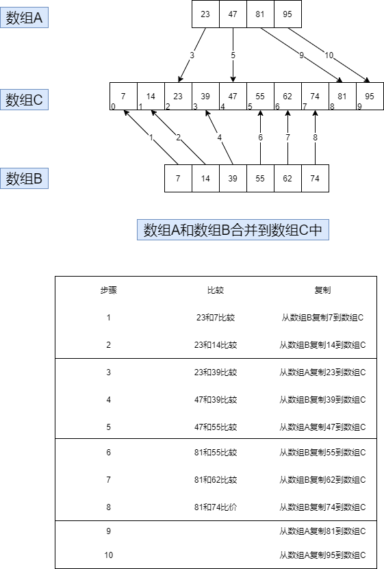

代码实现

```java
package com.chen.array.merge;

/**
 * @program: algorithms
 * @description: 合并两个有序数组
 * @author: admin
 * @created: 2021/07/17 18:11
 */
public class MergeApp {
    public static void main(String[] args) {
        int[] arrayA = {23, 47, 81, 95};
        int[] arrayB = {7, 14, 39, 55, 62, 74};
        int[] arrayC = new int[10];
        merge(arrayA, 4, arrayB, 6, arrayC);

        display(arrayC, 10);  // 7  14  23  39  47  55  62  74  81  95  
    }

    /**
     * 合并有序数组A和有序数组B到数组C
     *
     * @param arrayA
     * @param sizeA
     * @param arrayB
     * @param sizeB
     * @param arrayC
     */
    public static void merge(int[] arrayA, int sizeA, int[] arrayB, int sizeB, int[] arrayC) {
        int aDex = 0, bDex = 0, cDex = 0;
        while (aDex < sizeA && bDex < sizeB) {
            if (arrayA[aDex] < arrayB[bDex]) {
                arrayC[cDex++] = arrayA[aDex++];
            } else {
                arrayC[cDex++] = arrayB[bDex++];
            }
        }

        // 数组A非空,数组B还有元素
        while (aDex < sizeA) {
            arrayC[cDex++] = arrayA[aDex++];
        }

        // 数组A空了,数组B非空
        while (bDex < sizeB) {
            arrayC[cDex++] = arrayC[bDex++];
        }
    }

    public static void display(int[] array, int size) {
        for (int i = 0; i < size; i++) {
            System.out.print(array[i]+"  ");
        }
    }

}
```

## 6.2 通过归并合并两个数组
归并排序的思想:  
   把数组分成两半,排序每一半,再把两半合并成一个有序数组.如何排序每一个一半呢?把1/2分成两个1/4,然后把它们归成有序数组的一半.类似的,对一对1/8归成有序的1/4,每一对1/16归成有序的1/8的一部分.反复的分隔数组,直到得到的数组只含有一个数据项.这就是基值条件;设定只有一个数据项的数组是有序的

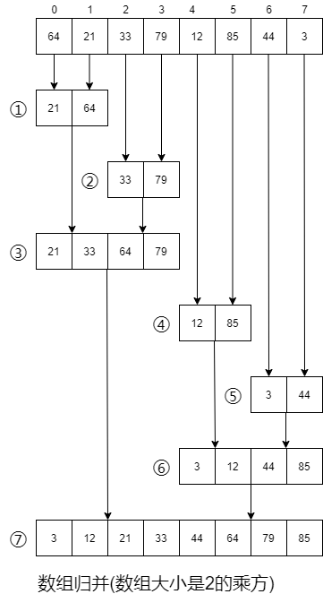

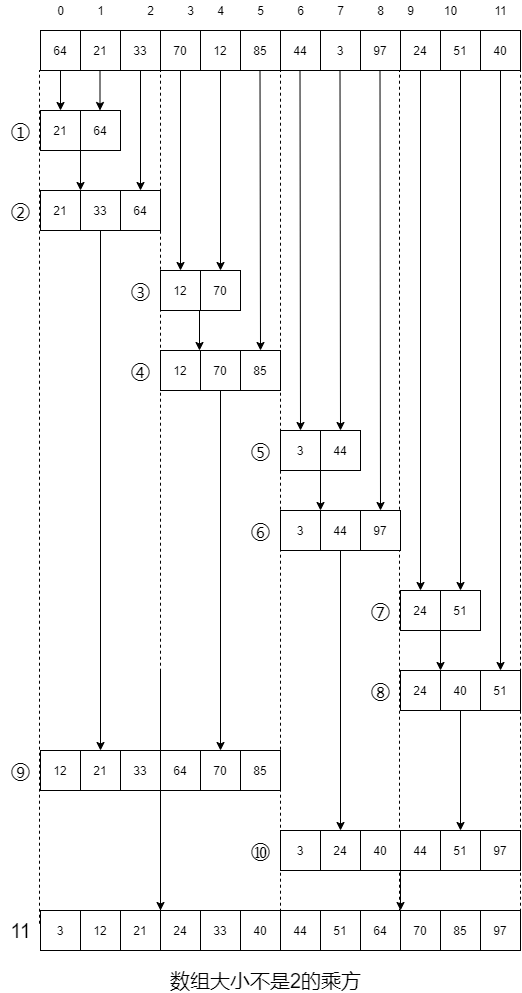

代码实现

```java
package com.chen.array.merge;

/**
 * @program: algorithms
 * @description: 归并排序
 * @author: admin
 * @created: 2021/07/17 22:59
 */
public class DArray {
    private long[] theArray;
    private int nElement;

    public DArray(int max) {
        theArray = new long[max];
        nElement = 0;
    }

    public void insert(long value) {
        theArray[nElement] = value;
        nElement ++;
    }

    public void display() {
        for (int i = 0; i < nElement; i++) {
            System.out.print(theArray[i] + " ");
        }
        System.out.println("");
    }


    public void mergeSort() {
        long[] workSpace = new long[nElement];
        recMergeSort(workSpace, 0, nElement - 1);

    }

    private void recMergeSort(long[] workSpace, int lowerBound, int upperBound) {
        if (lowerBound == upperBound) {
            return;
        } else {
            int mid = (lowerBound + upperBound) / 2;
            recMergeSort(workSpace, lowerBound, mid);
            recMergeSort(workSpace, mid + 1, upperBound);
            merge(workSpace, lowerBound, mid + 1, upperBound);
        }

    }

    private void merge(long[] workSpace, int lowPtr, int highPtr, int upperBound) {
        int j = 0;
        int lowBound = lowPtr;
        int mid = highPtr - 1;
        int n = upperBound - lowBound +1; // nElement
        while (lowPtr <= mid && highPtr <= upperBound) {
            if (theArray[lowPtr] < theArray[highPtr]) {
                workSpace[j++] = theArray [lowPtr++];
            } else {
                workSpace[j++] = theArray[highPtr++];
            }
        }

        while (lowPtr <= mid) {
            workSpace[j++] = theArray[lowPtr++];
        }

        while (highPtr <= upperBound) {
            workSpace[j++] = theArray[highPtr++];
        }

        for (j = 0; j < n; j++) {
            theArray[lowBound + j] = workSpace[j];
        }

    }

    static class MergeApp {
        public static void main(String[] args) {
            int maxsize = 100;
            DArray arr = new DArray(maxsize);
            arr.insert(64);
            arr.insert(10);
            arr.insert(1);
            arr.insert(9);
            arr.insert(81);
            arr.insert(78);
            arr.insert(55);
            arr.insert(32);
            arr.insert(66);
            arr.insert(17);
            arr.insert(23);
            arr.insert(47);
            arr.display();  // 64 10 1 9 81 78 55 32 66 17 23 47 
            arr.mergeSort();
            arr.display();  //1 9 10 17 23 32 47 55 64 66 78 81 
        }
    }
}

```

## 6.3 归并排序的效率
归并排序的运行时间是 O(N*logN) 

1.  当N是2的乘方时候操作次数

| N | log₂N | 复制到工作区的次数 | 复制次数 | 最多(最少)比较次数 |
| :---: | :---: | :---: | :---: | :---: |
| 2 | 1 | 2 | 4 | 1(1) |
| 4 | 2 | 8 | 16 | 5(4) |
| 8 | 3 | 24 | 48 | 17(12) |
| 16 | 4 | 64 | 128 | 49(32) |
| 32 | 5 | 160 | 320 | 129(80) |
| 64 | 6 | 384 | 768 | 321(192) |
| 128 | 7 | 896 | 1792 | 769(448) |


2. 最大和最小比较次数

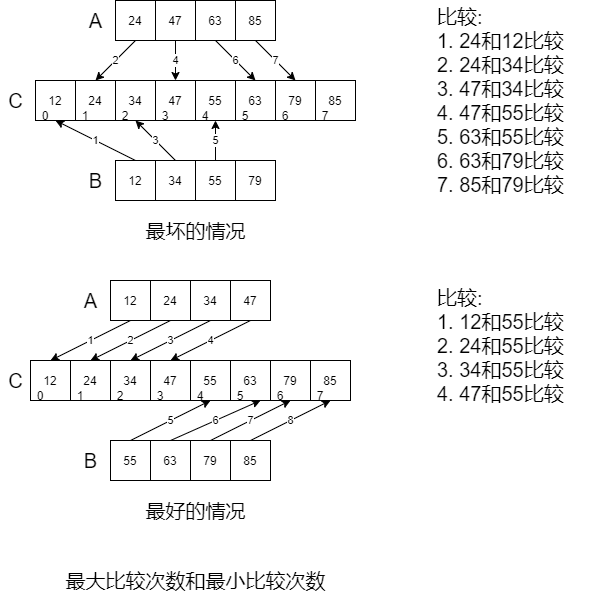

3. 包含8个数据项的比较次数

## 6.4 消除递归
一个算法作为递归的方法通常从概念上很容易理解,但是在实际的运用证明递归算法的效率不太高.在这种情况下,吧递归算法转换成非递归的算法是非常有用的.这用转换常用到栈.


递归和栈

递归和栈有一种紧密的联系.事实上,大部分的编译器是通过栈来实现递归.当调用一个方法的时候,编译器会把这个方法的所有参数以及返回地址(这个方法返回时控制到达的地方)都压入栈中,然后把控制转移给这个 方法.当方法返回的时候,这些值退栈.参数消失了,然后把控制权重新回到返回到返回地址处.

# 第7章 高级排序
希尔排序

希尔排序因计算机科学家Donald L.Shell命名,他发明的希尔排序算法.希尔排序给予插入排序,但是增加了新的特性,大大提高了插入排序的效率.

## 7.1 n-增量排序
希尔排序通过加大插入排序中元素之间的间隔,然后在这些间隔的元素中济宁插入排序,使数据项能够大跨度的移动.当这些数据项排过一趟顺序后,再减小数据间的间隔再进行排序,依次进行下去.排序时,数据之间的间隔称为增量,习惯用字母h表示.

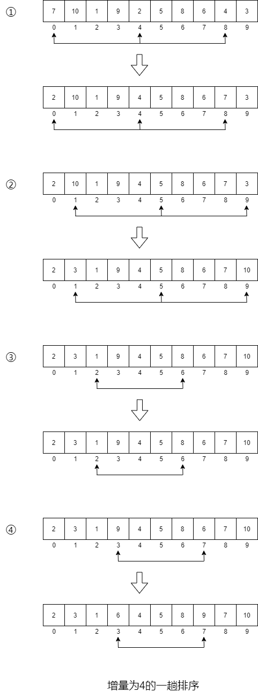

或则更好的描述算法:

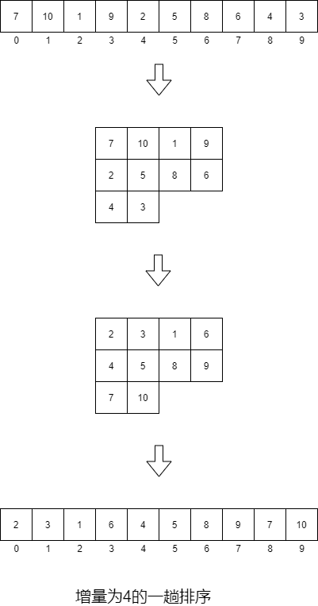


在完成以4为增量的希尔排序后,所有元素离它最终有序序列中的位置相差不到两个单元,数组"基本有序",这是希尔排序的奥秘所在.通过创建这种交错的内部有序的数据项集合,把排序的工作量降到了最小.


希尔排序比插入排序快很多,什么原因呢?当h值很大的时候,数据每一趟排序需要移动的个数很少,但数据项移动的距离很长.当h减小的时候,每一趟排序需要移动的元素个数增多,但是此时数据项已经接近他们排序后最终的位置,这对于插排序更有效率.真是这两种情况的结合才使希尔排序效率那么高.


## 7.2 减小间隔
对于大的数组,开始间隔也应该更大,然后间隔不断减小,知道间隔变成1.

常用间隔序列公式(Knuth序列)

| h | 3*h+1 | (h-1)/3 |
| :---: | :---: | :---: |
| 1 | 4 |  |
| 4 | 13 | 1 |
| 13 | 40 | 4 |
| 40 | 121 | 13 |
| 121 | 364 | 40 |
| 364 | 1093 | 121 |
| 1093 | 3280 | 364 |


```java
package com.chen.array.shell;

/**
 * @program: algorithms
 * @description: 希尔排序
 * @author: admin
 * @created: 2021/07/26 19:15
 */
public class ArrayShell {
    private long[] array;
    private int nELements;

    public ArrayShell(int max) {
        array = new long[max];
        nELements = 0;
    }

    public void insert(long value) {
        array[nELements] = value;
        nELements++;
    }

    public void display() {
        for (int i = 0; i < nELements; i++) {
            System.out.print(array[i]+ " ");
        }
        System.out.println();
    }

    public void shellSort() {
        int inner, outer;
        long temp;

        int h = 1;
        while (h < nELements / 3) {
            h = h * 3 + 1;
        }
        while (h > 0) {
            for (outer = h; outer < nELements; outer++) {
                temp = array[outer];
                inner = outer;

                while (inner > h - 1 && array[inner - h] >= temp) {
                    array[inner] = array[inner - h];
                    inner -= h;
                }
                array[inner] = temp;
            }
            h = (h - 1) / 3;
        }

    }

    static class ShellSortApp {
        public static void main(String[] args) {
            int maxsize = 10;
            ArrayShell array = new ArrayShell(maxsize);
//            for (int j = 0; j < maxsize; j++) {
//                long n = (long) (Math.random() * 99);
//                array.insert(n);
//            }
            array.insert(7);
            array.insert(10);
            array.insert(1);
            array.insert(9);
            array.insert(2);
            array.insert(5);
            array.insert(8);
            array.insert(6);
            array.insert(4);
            array.insert(3);
            array.display();
            array.shellSort();
            array.display();
        }
    }

}
```

## 7.3 希尔排序的效率
## 7.4 划分
划分数据,把数据分为两组,使关键字大于特定值的数据项在一组,使所有关键字小于特定值的数据项在另外一组.

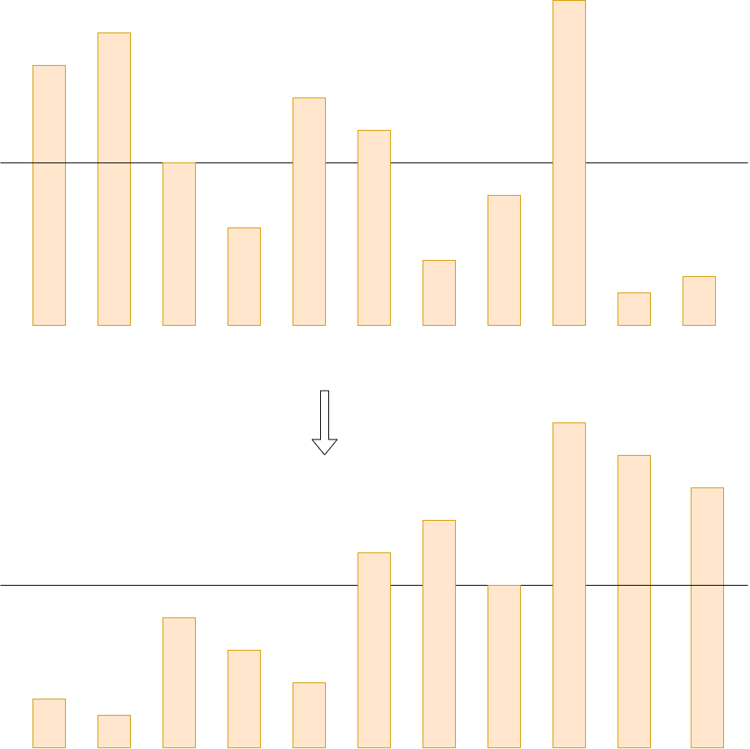

代码实现:

```
package com.chen.array.order;

/**
 * @program: algorithms
 * @description: 数组划分操作
 * @author: admin
 * @created: 2021/08/15 22:33
 */
public class ArrayPar {
    private long[] array;
    private int nElements;

    public ArrayPar(int max) {
        array = new long[max];
        nElements = 0;
    }

    public void insert(long value) {
        array[nElements] = value;
        nElements++;
    }

    public int size() {
        return nElements;
    }

    public void display() {
        for (int i = 0; i < nElements; i++) {
            System.out.print(array[i]+" ");
        }
        System.out.println();
    }

    public int partitionIt(int left, int right, long pivot) {
        int leftPtr = left ;
        int rightPtr = right;
        while (true) {
            while (leftPtr < right && array[leftPtr] < pivot) {
                ++leftPtr;
            }

            while (rightPtr > left && array[rightPtr] > pivot) {
                --rightPtr;

            }

            if (leftPtr >= rightPtr) {
                break;
            } else {
                swap(leftPtr, rightPtr);
            }
        }
        return leftPtr;
    }

    private void swap(int dex1, int dex2) {
        long temp;
        temp = array[dex1];
        array[dex1] = array[dex2];
        array[dex2] = temp;
    }

     public static void main(String[] args) {
        int maxsize =16;
         ArrayPar array = new ArrayPar(maxsize);
         for (int i = 0; i < maxsize; i++) {
             long n = (int) (Math.random() * 199);
             array.insert(n);
         }

         array.display();

         long pivot = 99;

         int size = array.size();
         int parDex = array.partitionIt(0, size - 1, pivot);

         array.display();
    }
}

```

## 7.5 快排
+ 快排排序(Quicksort),又称分区交换排序(Partition-exchange sort),简称快排.在平均状态下,排序n个项目需要O(n log n)次比较,在最坏情况下,需要O(n²)次比较,.


+ 算法:快排使用分治(Divide and conquer)策略,来吧一个序列(list)分为较大的和较小的子序列,然后递归的排序两个子序列.


+ 基本步骤
1. 挑选基准值: 从序列中挑选一个元素,称为基准"pivot"
2. 分割: 重新排序数列,所有比基准小的元素排在基准前面,所有比基准大的排在基准后面.
3. 递归排序子序列: 递归的将小于基准值的序列和大于基准值的序列排序.

递归到底部的判断条件是序列的大小是零或则一,显然此时序列是有序的.

```java
package com.chen.array.order;

/**
 * @program: algorithms
 * @description: 快排
 * @author: admin
 * @created: 2021/08/17 22:06
 */
public class ArrayIns {
    private long[] array;
    private int nELements;

    public ArrayIns(int max) {
        array = new long[max];
        nELements = 0;
    }

    public void insert(long value) {
        array[nELements] =value;
        nELements ++;
    }

    public void display() {
        for (int i = 0; i < nELements; i++) {
            System.out.print(array[i]+ " ");
        }
        System.out.println();
    }

    public void quickSort() {
        recQuickSort(0, nELements - 1);
    }

    private void recQuickSort(int left, int right) {
        if (right - left <= 0) {
            return ;
        } else {
            long pivot = array[right];

            int partition = partitionIt(left, right, pivot);
            recQuickSort(left, partition - 1);
            recQuickSort(partition + 1, right);
        }
    }

    private int partitionIt(int left, int right, long pivot) {
        int leftPtr = left -1;
        int rightPtr = right;
        while (true) {
            while (array[++leftPtr] < pivot) {
                ;
            }
            while (rightPtr > 0 && array[--rightPtr] > pivot) {
                ;
            }

            if (leftPtr >= rightPtr) {
                break;
            } else {
                swap(leftPtr, rightPtr);
            }
        }
        swap(leftPtr, right); // 重置 基准 pivot
        return leftPtr;
    }

    private void swap(int dex1, int dex2) {
        long temp = array[dex1];
        array[dex1] = array[dex2];
        array[dex2] = temp;
    }

    public static void main(String[] args) {
        int maxsize = 10;
        ArrayIns ai = new ArrayIns(maxsize);
        ai.insert(42);
        ai.insert(89);
        ai.insert(63);
        ai.insert(12);
        ai.insert(94);
        ai.insert(27);
        ai.insert(78);
        ai.insert(3);
        ai.insert(50);
        ai.insert(36);

//        for (int i = 0; i < maxsize; i++) {
//            long value = (long)(Math.random()*99);
//            ai.insert(value);
//        }

        ai.display();  
        ai.quickSort();
        ai.display(); 
    }
}

```


注意两个递归不包含基准值,为什么不包含这个基准值?原因在于基准的的选择方法:

+ 理想状态应该选择排序序列的中值数据项作为枢纽.对于快排来说,拥有两个大小相等的子数组是最优的情况
+ 应该选择序列的一个元素作为基准值,这个元素的数据项称为pivot(枢纽)
+ 可以选择任意一个元素作为枢纽.我们假设总是选择待划分序列最右端的数据项作为枢纽
+ 划分之后,如果枢纽被插入到左右序列的分界处,那么枢纽在落在排序之后的最终位置了

## 7.6 最右划分
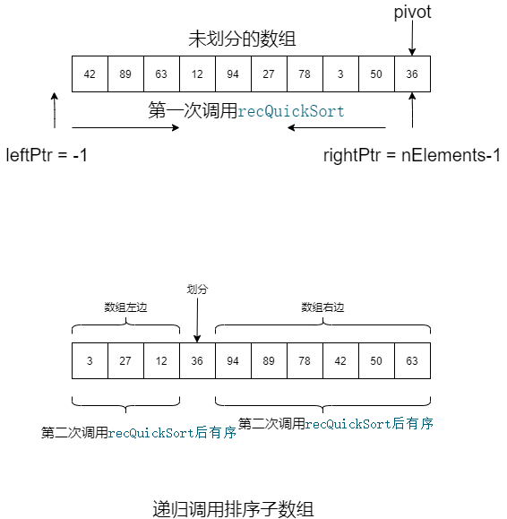

使用枢纽来划分数组,所以划分之后的左边子数组的数据项都小于枢纽,右边的子数组的数据项都大于枢纽.枢纽开始在数组最右端,但是把他放在两个子数组之间,枢纽就会在正确的位置了.只要交换枢纽和右数组最左端的数据项即可.

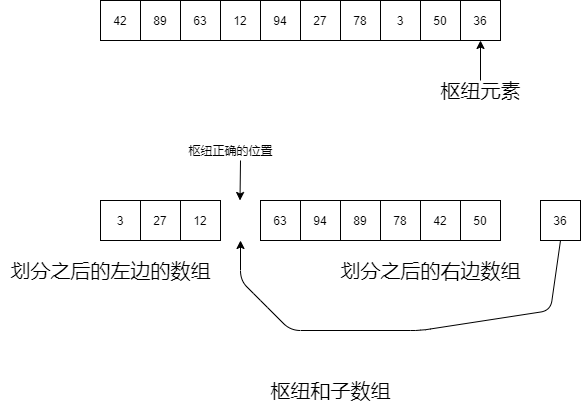

## 7.7  三数据项取中划分
选择枢纽的方法应该简单,但能避免出现最大或则最小的数据项最为枢纽.

+ 选择任意一个数据项作为枢纽?不是最优解
+ 检测所有数据项,计算哪一个是中值?花费时间很长,不可行
+ 折中方法,取数组第一个,最后一个,中间位置数据项的中值

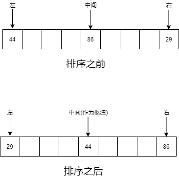

## 7.8 插入处理小数据项
```java
package com.chen.array.order;

/**
 * @program: algorithms
 * @description: 处理小于10个数据项的子数组, 使用插入排序
 * @author: admin
 * @created: 2021/08/22 22:15
 */
public class ArrayIns2 {
    private long[] array;
    private int nElements;

    public ArrayIns2(int maxsize) {
        array = new long[maxsize];
        nElements = 0;
    }

    public void insert(long value) {
        array[nElements] = value;
        nElements++;
    }

    public void display() {
        for (int i = 0; i < nElements; i++) {
            System.out.print(array[i] + " ");
        }
        System.out.println();
    }

    public void qucikSort() {
        recQuickSort(0, nElements - 1);
    }

    private void recQuickSort(int left, int right) {
        int size = right - left + 1;
        if (size < 10) {
            // 插入排序
            insertionSort(left, right);
        } else {
            long median = medianOf3(left, right);
            int partition = partitionIt(left, right, median);
            recQuickSort(left, partition - 1);
            recQuickSort(partition + 1, right);
        }
    }

    private void insertionSort(int left, int right) {
        int in, out;
        for (out = left + 1; out <= right; out++) {
            long temp = array[out];
            in = out;
            while (in > left && array[in - 1] >= temp) {
                array[in] = array[in - 1];
                --in;
            }
            array[in] = temp;
        }

    }

    private int partitionIt(int left, int right, long pivot) {
        int leftPtr = left;
        int rightPtr = right - 1;

        while (true) {
            while (array[++leftPtr] < pivot) {
                ;
            }
            while (array[--rightPtr] > pivot) {
                ;
            }
            if (leftPtr >= rightPtr) {
                break;
            } else {
                swap(leftPtr, rightPtr);
            }
        }
        swap(leftPtr, right - 1);
        return leftPtr;
    }

    private long medianOf3(int left, int right) {
        int center = (left + right) / 2;
        if (array[left] > array[center]) {
            swap(left, center);
        }
        if (array[left] > array[right]) {
            swap(left, right);
        }
        if (array[center] > array[right]) {
            swap(center, right);
        }
        swap(center, right - 1);
        return array[right - 1];
    }

    private void swap(int dex1, int dex2) {
        long temp = array[dex1];
        array[dex1] = array[dex2];
        array[dex2] = temp;
    }

    public static void main(String[] args) {
        int maxsize = 16;
        ArrayIns2 array = new ArrayIns2(maxsize);
        for (int i = 0; i < maxsize; i++) {
            long n = (long) (Math.random() * 99);
            array.insert(n);
        }
        array.display();
        array.qucikSort();
        array.display();
    }
}
```

消除递归

使用循环来代替递归,通过取消递归调用来加快算法的运行.但是 消除递归带来的改进不是太明显

## 7.9 快排的效率
时间复杂度为O(N*log₂N)

# 第8章 二叉树
树解决的问题

+ 能像链表那样快速的插入和删除,又像数组那样快速查找.

## 8.1 树的结构
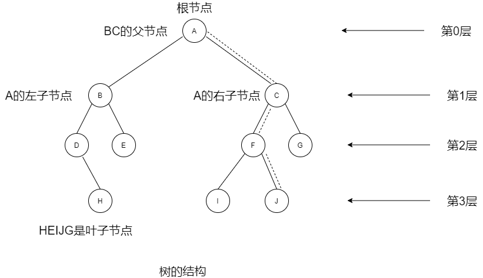

二叉树

树种每个节点最多只能有两个子节点的树称为二叉树.

```java

public class Node {
    public int iData;
    public double dData;
    public Node leftChild;
    public Node rightChild;

    public void displayNode() {
        System.out.print("{"+iData+","+dData+"} ");
    }
}
```

```java

package com.chen.tree;

/**
 * @program: algorithms
 * @description: 树
 * @author: admin
 * @created: 2021/08/24 19:57
 */
public class Tree {
    public Node root;

    public Tree() {
        root = null;
    }

    public Node find(int key) {
        Node current = root;
        while (current.iData != key) {
            if (key < current.iData) {
                current = current.leftChild;
            } else {
                current = current.rightChild;
            }
            if (current == null) {
                return null;
            }
        }
        return current;
    }

    public void insert(int id, double dd) {
        Node newNode = new Node();
        newNode.iData = id;
        newNode.dData = dd;

        if (root == null) {
            root = newNode;
        } else {
            Node current = root;
            Node parent;

            while (true) {
                parent = current;
                if (id < current.iData) {
                    current = current.leftChild;
                    if (current == null) {
                        parent.leftChild = newNode;
                        return;
                    }
                } else {
                    current = current.rightChild;
                    if (current == null) {
                        parent.rightChild = newNode;
                        return;
                    }
                }
            }
        }

    }

    public boolean delete(int key) {
        Node current = root;
        Node parent = root;
        boolean isLeftChild = true;
        while (current.iData != key) {
            parent = current;
            if (key < current.iData) {
                isLeftChild = true;
                current = current.leftChild;
            } else {
                isLeftChild = false;
                current = current.rightChild;
            }
            if (current == null) {
                return false;
            }
        }

        if (current.leftChild == null && current.rightChild == null) {
            // 叶子节点
            if (current == root) {
                root = null;
            } else if (isLeftChild) {
                parent.leftChild = null;
            } else {
                parent.rightChild = null;
            }
        } else if (current.rightChild == null) {
            // 没有右子节点
            if (current == root) {
                root = current.leftChild;
            } else if (isLeftChild) {
                parent.leftChild = current.leftChild;
            } else {
                parent.rightChild = current.leftChild;
            }
        } else if (current.leftChild == null) {
            // 没有左子节点
            if (current == root) {
                root = current.rightChild;
            } else if (isLeftChild) {
                parent.leftChild = current.rightChild;
            } else {
                parent.rightChild = current.rightChild;
            }

        } else {
            // 两个子节点
            Node successor = getSuccessor(current);
            if (current == root) {
                root = successor;
            } else if (isLeftChild) {
                parent.leftChild = successor;
            } else {
                parent.rightChild = successor;
            }
            successor.leftChild = current.leftChild;
        }

        return true;

    }

    // 找删除节点的后继节点,转向右子树,然后右子树的左孩子
    private Node getSuccessor(Node delNode) {
        Node successorParent = delNode;
        Node successor = delNode;
        Node current = delNode.rightChild;

        while (current != null) {
            successorParent = successor;
            successor = current;
            current = current.leftChild;
        }
        // 中继节点不是删除节点的右节点,处理后继节点
        if (successor != delNode.rightChild) {
            // 中继节点父节点的左子节点指向中继节点的右子节点
            successorParent.leftChild = successor.rightChild;
            // 中继节点的右子节点指向删除节点的右子节点
            successor.rightChild = delNode.rightChild;
        }


        return successor;
    }

    // 递归先序遍历,考察到一个节点,先输出节点的值,再递归遍历左右子树.(根左右)
    public void preOrder(Node localRoot) {
        if (localRoot != null) {
            System.out.print(localRoot.iData + " ");
            preOrder(localRoot.leftChild);
            preOrder(localRoot.rightChild);
        }
    }

    //递归中序遍历 考察到一个节点,将其暂存,遍历完左子树后,再输出节点的值,然后遍历右子树(左根右)
    public void inOrder(Node localRoot) {
        if (localRoot != null) {
            inOrder(localRoot.leftChild);
            System.out.print(localRoot.iData + " ");
            inOrder(localRoot.rightChild);
        }
    }

    // 后续遍历 考察到一个节点,将其暂存,遍历完左右子树后,再输出该节点的值(左右根)
    public void postOrder(Node localRoot) {
        if (localRoot != null) {
            postOrder(localRoot.leftChild);
            postOrder(localRoot.rightChild);
            System.out.print(localRoot.iData + " ");
        }
    }

    public void displayTree() {

    }
}

```

```java
package com.chen.tree;

public class TreeApp {
    public static void main(String[] args) {
        Tree tree = new Tree();
        tree.insert(50,1.5);
        tree.insert(25,1.2);
        tree.insert(75,1.7);
        tree.insert(12,1.5);
        tree.insert(37,1.4);
        tree.insert(43,1.1);
        tree.insert(30,1.9);
        tree.insert(33,1.6);
        tree.insert(87,1.1);
        tree.insert(93,1.8);
        tree.insert(97,1.4);

        tree.preOrder(tree.root); // 50 25 12 37 30 33 43 75 87 93 97 
        System.out.println();
        tree.inOrder(tree.root);  // 12 25 30 33 37 43 50 75 87 93 97 
        System.out.println();
        tree.postOrder(tree.root); // 12 33 30 43 37 25 97 93 87 75 50 
    }
}

```

## 8.2 插入节点
```java
public void insert(int id, double dd) {
        Node newNode = new Node();
        newNode.iData = id;
        newNode.dData = dd;

        if (root == null) {
            root = newNode;
        } else {
            Node current = root;
            Node parent;

            while (true) {
                parent = current;
                if (id < current.iData) {
                    current = current.leftChild;
                    if (current == null) {
                        parent.leftChild = newNode;
                        return;
                    }
                } else {
                    current = current.rightChild;
                    if (current == null) {
                        parent.rightChild = newNode;
                        return;
                    }
                }
            }
        }

    }
```

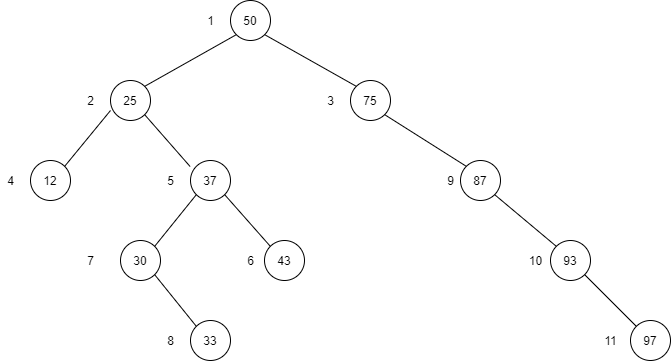

## 8.3 查找节点
```java
public Node find(int key) {
        Node current = root;
        while (current.iData != key) {
            if (key < current.iData) {
                current = current.leftChild;
            } else {
                current = current.rightChild;
            }
            if (current == null) {
                return null;
            }
        }
        return current;
    }
```

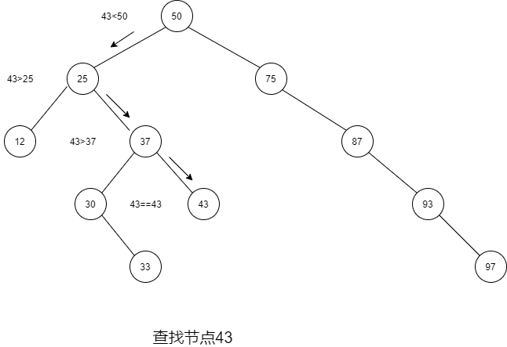

## 8.4 遍历树
参考 [https://blog.csdn.net/weixin_44032878/article/details/88070556](https://blog.csdn.net/weixin_44032878/article/details/88070556)

*  先序遍历(preorder)

```java
// 递归先序遍历,考察到一个节点,先输出节点的值,再递归遍历左右子树.(根左右)
public void preOrder(Node localRoot) {
    if (localRoot != null) {
        System.out.print(localRoot.iData + " ");
        preOrder(localRoot.leftChild);
        preOrder(localRoot.rightChild);
    }
}
```

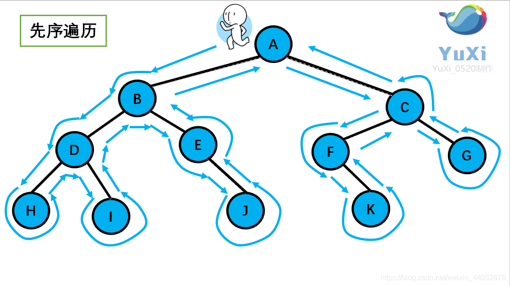
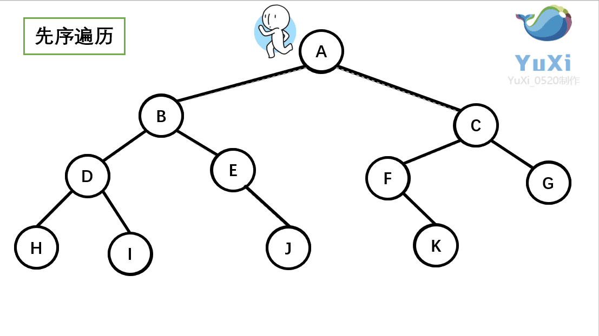

* 中序遍历(inOrder)

```java
//递归中序遍历 考察到一个节点,将其暂存,遍历完左子树后,再输出节点的值,然后遍历右子树(左根右)
    public void inOrder(Node localRoot) {
        if (localRoot != null) {
            inOrder(localRoot.leftChild);
            System.out.print(localRoot.iData + " ");
            inOrder(localRoot.rightChild);
        }
    }
```

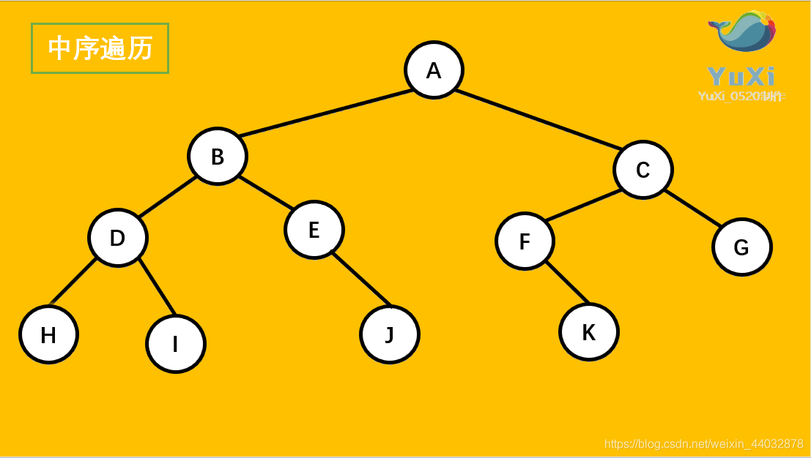

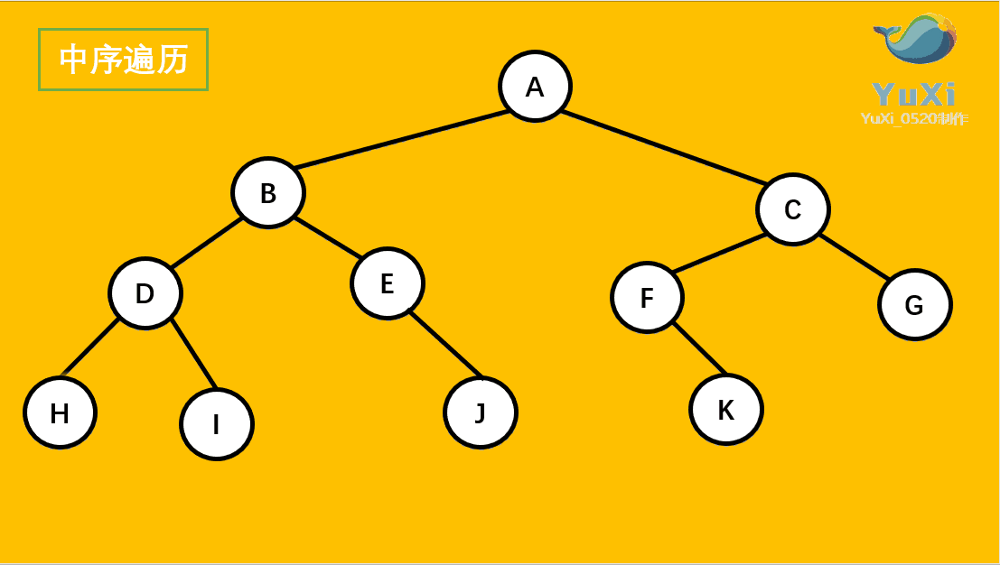

* 后序遍历(postorder)

```java
//递归中序遍历 考察到一个节点,将其暂存,遍历完左子树后,再输出节点的值,然后遍历右子树(左根右)
    public void inOrder(Node localRoot) {
        if (localRoot != null) {
            inOrder(localRoot.leftChild);
            System.out.print(localRoot.iData + " ");
            inOrder(localRoot.rightChild);
        }
    }
```

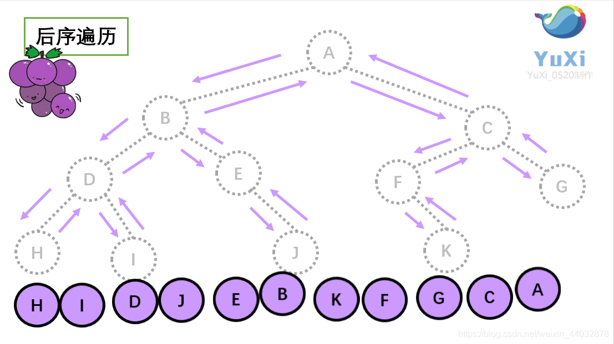

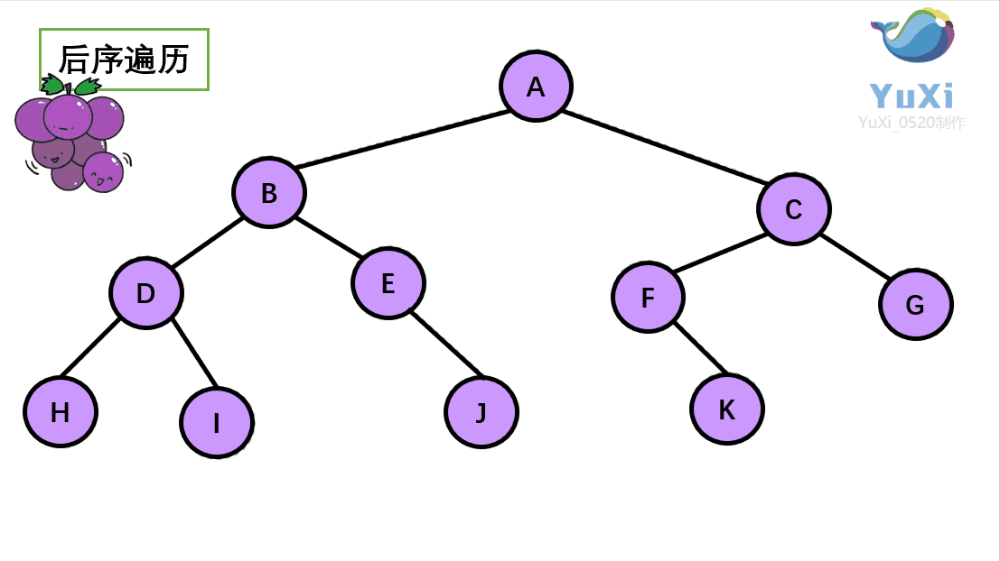

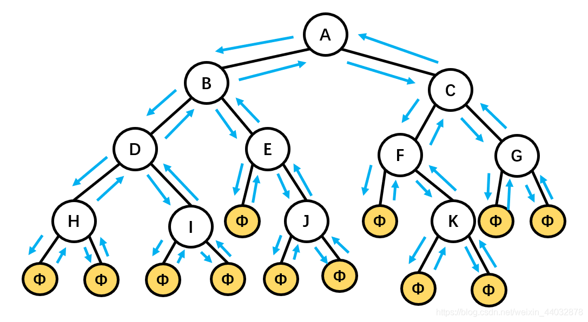


三节点树的中序遍历,输出BAC

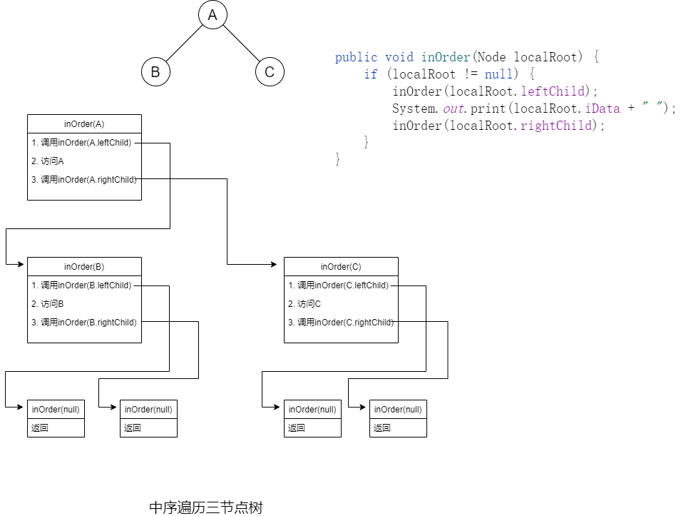

## 8.5 删除节点
找到该节点,这个删除的节点需要考虑到三种情况

1. 该节点是叶子节点:  要删除叶子结点,只需要改变此节点父节点的对应字段的值,指向此节点的值置为null.要删除的节点依然存在,不属于树的一部分了,等待垃圾回收.
2. 该节点有一个子节点:  此节点父节点的左节点或则右节点指向此节点的左节点或则右节点
3. 该节点有两个子节点:  用他的中序后继节点来代替该节点

```java
public boolean delete(int key) {
        Node current = root;
        Node parent = root;
        boolean isLeftChild = true;
        while (current.iData != key) {
            parent = current;
            if (key < current.iData) {
                isLeftChild = true;
                current = current.leftChild;
            } else {
                isLeftChild = false;
                current = current.rightChild;
            }
            if (current == null) {
                return false;
            }
        }

        if (current.leftChild == null && current.rightChild == null) {
            // 叶子节点
            if (current == root) {
                root = null;
            } else if (isLeftChild) {
                parent.leftChild = null;
            } else {
                parent.rightChild = null;
            }
        } else if (current.rightChild == null) {
            // 没有右子节点
            if (current == root) {
                root = current.leftChild;
            } else if (isLeftChild) {
                parent.leftChild = current.leftChild;
            } else {
                parent.rightChild = current.leftChild;
            }
        } else if (current.leftChild == null) {
            // 没有左子节点
            if (current == root) {
                root = current.rightChild;
            } else if (isLeftChild) {
                parent.leftChild = current.rightChild;
            } else {
                parent.rightChild = current.rightChild;
            }

        } else {
            // 两个子节点
            Node successor = getSuccessor(current);
            if (current == root) {
                root = successor;
            } else if (isLeftChild) {
                parent.leftChild = successor;
            } else {
                parent.rightChild = successor;
            }
            successor.leftChild = current.leftChild;
        }

        return true;

    }

 // 找删除节点的后继节点,转向右子树,然后右子树的左孩子
    private Node getSuccessor(Node delNode) {
        Node successorParent = delNode;
        Node successor = delNode;
        Node current = delNode.rightChild;

        while (current != null) {
            successorParent = successor;
            successor = current;
            current = current.leftChild;
        }
        // 中继节点不是删除节点的右节点,处理后继节点
        if (successor != delNode.rightChild) {
            // 中继节点父节点的左子节点指向中继节点的右子节点
            successorParent.leftChild = successor.rightChild;
            // 中继节点的右子节点指向删除节点的右子节点
            successor.rightChild = delNode.rightChild;
        }


        return successor;
    }	
```

## 8.6 二叉树的效率
时间复杂度 O(logN)


# 第9章 红-黑树
# 第10章 234树和外部存储
## 10.1 介绍
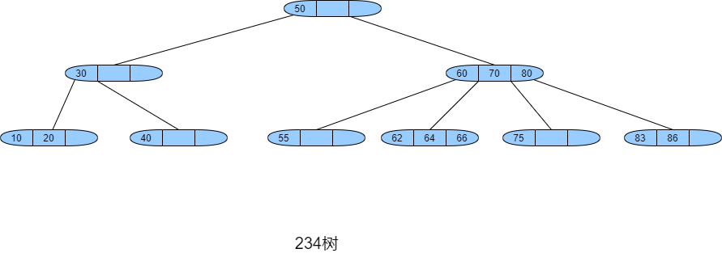

1. **含义**:234指的是一个节点可能含有的子节点数,对于非叶子结点
+ 有一个数据项的节点总是含有两个子节点

+ 有两个数据项的节点总是含有三个子节点

+ 有三个数据项的节点总是含有四个子节点

  **总结:**非叶子节点的节点数总是比他的数据项多1.或则用符号表示,设节点链接的个数是L,数据项的个数是D,那么**L=D+1**

2. **特性:**
+   每个节点至少2个子节点,不允许只有一个子节点,有2个子节点的称为2-节点,有三个子节点的称为3-节点,有4个子节点的称为4-节点,但是没有1-节点
+ 关键字不能重复

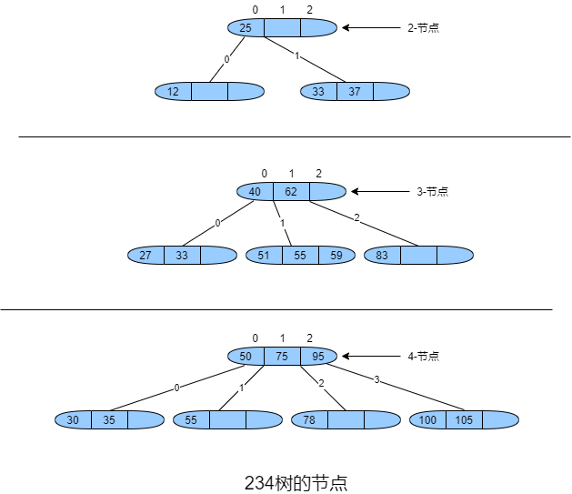

## 10.2 234树的组织
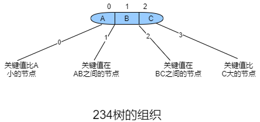

+ 根是child0的子树的所有节点的关键字都小于key0
+ 根是child1的子树的所有节点的关键字都大于key0并且小于key1
+ 根是child2的子树的所有节点的关键字都大于key1并且小于key2
+ 根是child3的子树的所有节点的关键字都大于key2

## 10.3 234树的搜索
查找特定关键字和二叉树类似.从根开始,除非查找的关键字的值就是根,否则选择关键字所在的合适范围,转向哪个方向,知道找到为止.

## 10.4 插入
新的数据项总是插入在叶子节点里面,在树的最底层.子节点的编号就要发生变化来保持树的结构,保证节点的子节点数比数据项多1.

查找时没有碰到满叶子节点时,插入简单.找到合适的位置,把新的数据项插入进去就可以了.

插入可能会涉及到在一个节点中移动一个或则两个其他的数据项,这样在数据项插入后关键字依然可以保持正确的顺序

## 10.5 节点分裂
如果往下找要插入的位置的途中,节已经满了,插入变得复杂了.这种情况,节点必须分裂.正是这种分裂过程保证了树的平衡.

### 1.非根节点的分裂
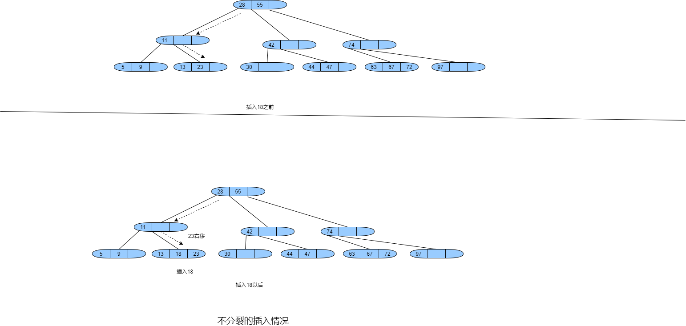

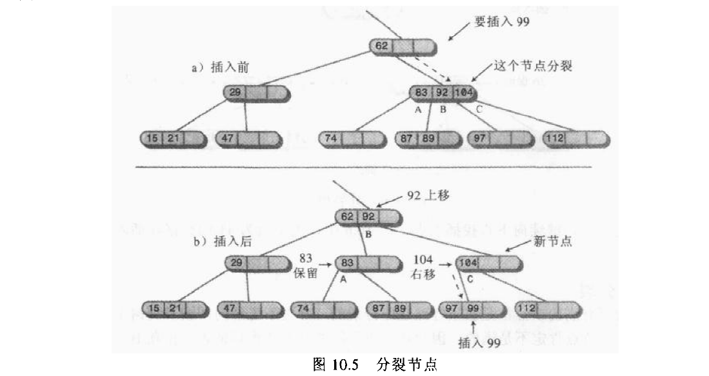

+ 创建一个新的空节点.他是分裂节点的兄弟,在要分裂节点的右边
+ 数据项C移到新节点中.
+ 数据项B移到要分裂的节点的父节点中.
+ 数据项A保留在原来的位置上.
+ 最右边的两个子节点从分裂的节点处断开,连到新节点上.

### 2. 根节点的分裂
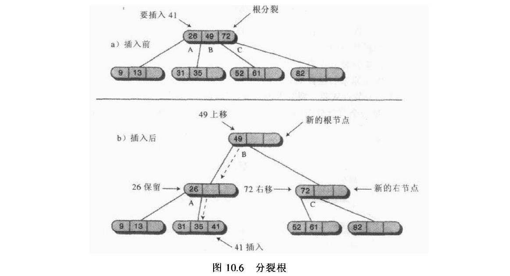

+ 创建新的根,他是要分裂节点的父节点.
+ 创建第二个新的节点.他是要分裂节点的兄弟节点.
+ 数据项C移到新的兄弟节点中.
+ 数据项B移到新的根节点中.
+ 数据项A保持在原来的位置上.
+ 要分裂节点最右边的两个子节点断开连接,连到新的兄弟节点中.


234树的插入和分裂

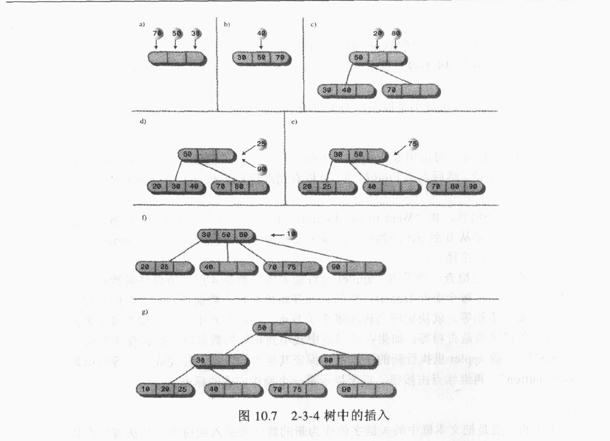

```java
public class DataItem {
    public long dData;

    public DataItem(long dd) {
        dData = dd;
    }

    public void displayItem() {
        System.out.println("/"+dData);
    }
}
```

```cpp
public class Node {
    private static final int ORDER = 4;
    private int numItems;
    private Node parent;
    private Node childArray[] = new Node[ORDER];
    private DataItem itemArray[] = new DataItem[ORDER - 1];

    public void connectChild(int childNum, Node child) {

        childArray[childNum] = child;
        if (child != null) {
            child.parent = this;
        }
    }

    public Node disconnectChild(int childNum) {
        Node tempNode = childArray[childNum];
        childArray[childNum] = null;
        return tempNode;
    }

    public Node getChild(int childNum) {
        return childArray[childNum];
    }

    public Node getParent() {
        return parent;
    }

    public boolean isLeaf() {
        return ((childArray[0] == null) ? true : false);
    }

    public int getNumItems(){
        return numItems;
    }

    public DataItem getItem(int index) {
        return itemArray[index];
    }

    public boolean isFull() {
        return (numItems == ORDER-1) ? true : false;
    }

    public int findItem(long key) {
        for (int j = 0; j < ORDER - 1; j++) {
            if (itemArray[j] == null) {
                break;
            } else if (itemArray[j].dData == key) {
                return j;
            }
        }
        return -1;
    }

    /**
     * 插入新节点
     * @param newItem
     * @return
     */
    public int insertItem(DataItem newItem) {
        numItems++;
        long newKey = newItem.dData;

        for (int j = ORDER - 2; j >= 0; j--) {
            if (itemArray[j] == null) {
                continue;
            } else {
                long itskey = itemArray[j].dData;
                if (newKey < itskey) {  // 插入的值较小,已送节点
                    itemArray[j+1] = newItem;
                } else {    // 插入的节点较大,方最右边
                    itemArray[j+1] = newItem;
                    return j+1;
                }
            }
        }
        itemArray[0]= newItem;
        return 0;
    }

    /**
     * 删除最大的一个节点
     * @return
     */
    public DataItem removeItem() {
        DataItem temp = itemArray[numItems - 1];
        itemArray[numItems-1] = null;
        numItems--;
        return temp;
    }

    public void displayNode() {
        for (int j = 0; j < numItems; j++) {
            itemArray[j].displayItem();
        }
        System.out.println("/");
    }


}
```

```java
public class Tree234 {
    private Node root = new Node();

    public int find(long key) {
        Node curNode = root;
        int childNumber;
        while (true) {
            if ((childNumber = curNode.findItem(key)) != -1) {
                return childNumber;
            } else if (curNode.isLeaf()) {
                return -1;
            } else {
                curNode = getNextChild(curNode, key);
            }
        }
    }

    public void insert(long dValue) {
        Node curNode = root;
        DataItem tempItem = new DataItem(dValue);

        while (true) {
            if (curNode.isFull()) { // if node full
                split(curNode);
                curNode = curNode.getParent();

                curNode = getNextChild(curNode, dValue);
            } else if (curNode.isLeaf()) { // if node is leaf
                break;  // go insert
            } else {    // node is not full,not a leaf;so go to lower level
                curNode = getNextChild(curNode, dValue);

            }
        }

        curNode.insertItem(tempItem); // inset new DataItem
    }


    /**
     * 节点的分裂
     *
     * @param thisNode
     */
    private void split(Node thisNode) {
        DataItem itemB, itemC;
        Node parent, child2, child3;
        int itemIndex;

        itemC = thisNode.removeItem();
        itemB = thisNode.removeItem();
        child2 = thisNode.disconnectChild(2);
        child3 = thisNode.disconnectChild(3);

        Node newRight = new Node();

        if (thisNode == root) { // this is root
            root = new Node();
            parent = root;
            root.connectChild(0, thisNode);
        } else {    // this node not the root
            parent = thisNode.getParent();// get parent

            // deal with parent
            itemIndex = parent.insertItem(itemB); // itemB to parent
            int n = parent.getNumItems();

            for (int j = n - 1; j > itemIndex; j--) {
                Node temp = parent.disconnectChild(j);
                parent.connectChild(j + 1, temp);
            }

            parent.connectChild(itemIndex + 1, newRight); // connect newRight to parent

            // deal with newRight
            newRight.insertItem(itemC); // itemc to newRight
            newRight.connectChild(0, child2); // connect to 0 and 1
            newRight.connectChild(1, child3);

        }

    }

    /**
     * 查找合适的子节点
     *
     * @param theNode
     * @param theValue
     * @return
     */
    private Node getNextChild(Node theNode, long theValue) {
        int j;
        int numItems = theNode.getNumItems();
        for (j = 0; j < numItems; j++) {
            if (theValue < theNode.getItem(j).dData) {
                return theNode.getChild(j);
            }
        }

        return theNode.getChild(j);

    }

    public void displayTree() {
        recDisplayTree(root, 0, 0);
    }

    private void recDisplayTree(Node thisNode, int level, int childNumber) {
        System.out.println("level=" + level + " child=" + childNumber + " ");
        thisNode.displayNode();

        int numItem = thisNode.getNumItems();

        for (int j = 0; j < numItem + 1; j++) {
            Node nextNode = thisNode.getChild(j);
            if (nextNode != null) {
                recDisplayTree(nextNode, level + 1, j);
            } else {
                return ;
            }
        }
    }
}
```

```java
public class Tree234App {
    public static void main(String[] args) {
        long value;
        Tree234 theTree = new Tree234();

        theTree.insert(50);
        theTree.insert(40);
        theTree.insert(60);
        theTree.insert(30);
        theTree.insert(70);

        while (true) {

        }

    }
}
```

# 第11章 哈希表
## 11.1 开放地址法
数据不能直接放在由哈希函数计算出来的数组所指的单元,就要寻找其他位置.他们在寻找下一个空白单元时,使用的方法不同:线性探测,二次探测和再哈希法

+ **线性探测,步骤是步数+1**

在线性探测中,线性的查找空白单元(如果哈希函数计算的原始下标是x,线性探测就是x+1,x+2,x+3,一次类推)

+ **二测探测,步骤是步数的平方**

二次探测,防止聚集产生的一种尝试,思想是探测相隔较远的单元,而不是和原始位置相邻的单元.(x+1,x+4,x+9,x+16,x+25)

+ **再哈希法,步骤是把关键字用不同的哈希函数再做一遍哈希,把这个作为步长**

为了消除原始聚集和二次聚集,使用二次哈希法.

第二个函数必须具备如下特点

    - 和第一个哈希函数不同
    - 不能输出0

```java
// 好的哈希函数
stepSize = constant - ( key % constant)
    constant : 质数,且小于数组容量
    
```

## 11.2 链地址法
在哈希表中每个单元设置链表

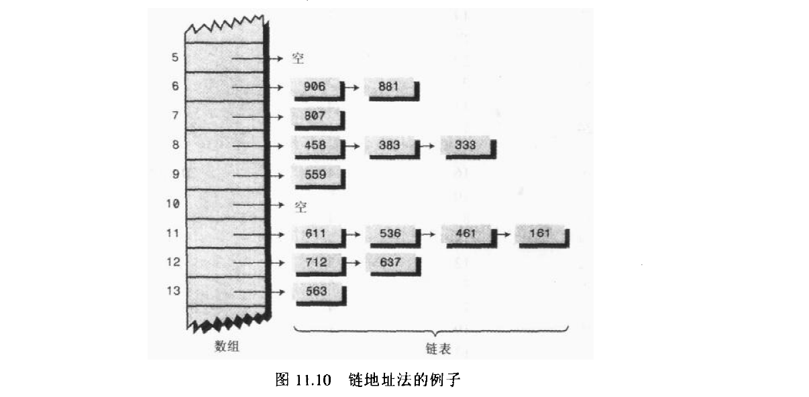

## 11.3 哈希函数
+ 快速计算

+ 随机关键字

+ 使用质数作为区模的基数

  哈希函数通常包含对数据容量的取模操作.要求数组容量是量质数,消除数据的聚集.

+ 哈希化字符串


# 第12章 堆
**实现优先队列的另一种结构:堆.堆是一种树,它实现的优先队列的插入和删除时间复杂度是O(longN).**

## 12.1 堆的介绍
堆的特点:

+ 它是完全二叉树.除了树的最后一层,其他的每一层都是满的.
+ 它常常有一个数组实现
+ 堆中的每一个节点都满足堆的条件.

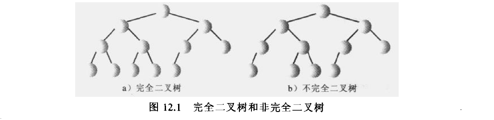

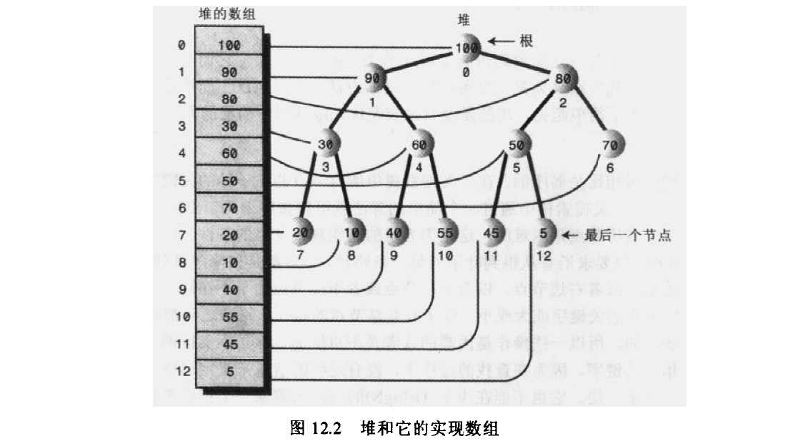

# 第13章 图
## 13.1 图的简介
+ 邻接

 	如果两个顶点被同一条变链接,就称为这两个顶点是领结的.

+ 路径

  路径是边的序列

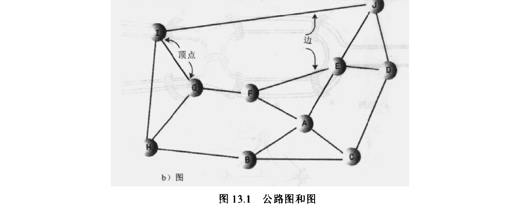

+ 连通图

  如果至少有一条路径可以连接起所有的顶点,那么这个图称为连通的.

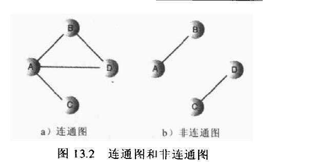

+ 有向图和带权图

## 12.2 在程序中表示图
+ 顶点

  顶点表示对象,用数据项来描述

+ 边
    
    - 邻接矩阵
    
      邻接矩阵是一个二维数组,数据项表示两点间是否存在边.如果有N个顶点,邻接矩阵就是N*N的数组.
    
    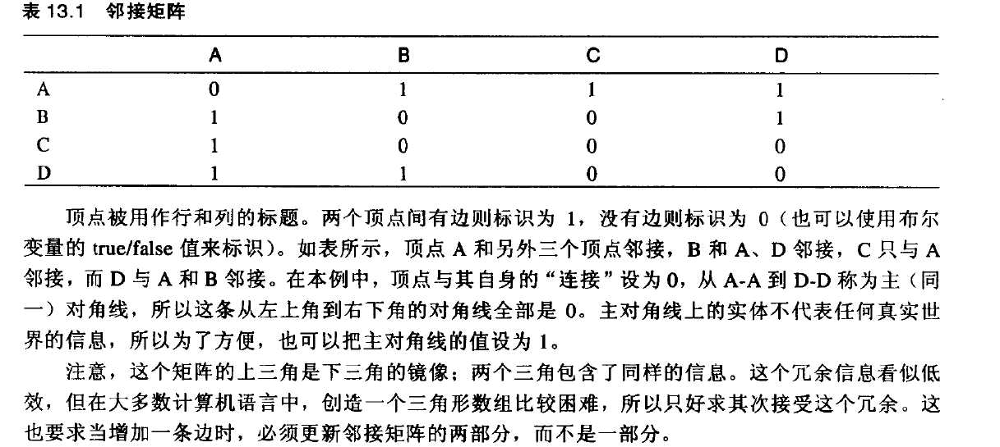
    
+ 邻接表

    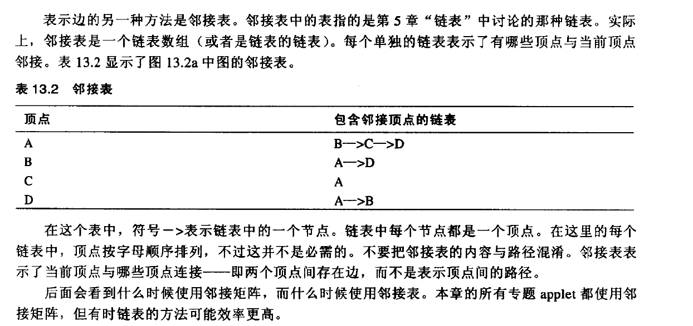

## 12.3 搜索
+ 深度优先搜索

在搜索走到尽头的时候,深度优先搜索用栈 记住下一步的走向.算法表现得好像要尽快原理起始点

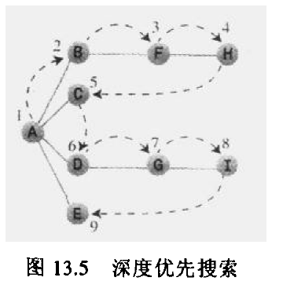

**规则1**

```java
如果可能,访问一个邻接的未访问顶点,标记它,把他放入栈中
```

**规则2**

```java
当不能执行1时,如果栈中不为空,就从栈中弹出一个顶点
```

**规则3**

```java
当不能执行规则1时和规则2,就完成了整个搜索过程
```

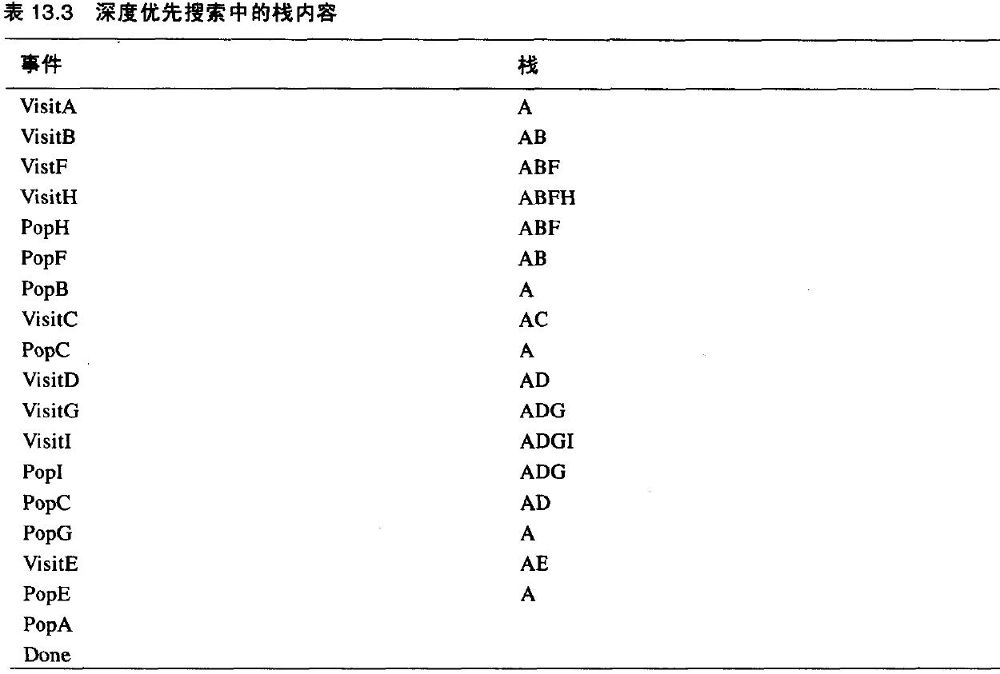

+ 广度优先搜索

  算法好像要尽可能靠近起始点.它首先访问起始点顶点的所有领结点,然后访问较远的区域.这种所有不能用栈,而要用队列来实现.

  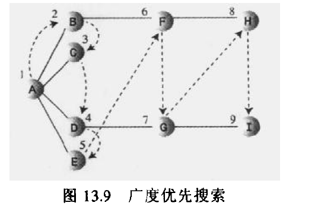

**规则1**

```java
访问下一个未来访问的邻接点(如果存在),这个顶点必须是当前顶点邻接点,标记它,并把他插入到队列中.
```

**规则2**

```java
如果因为已经没有未访问顶点而不能执行规则1,那么从队列头取一个顶点(如果存在),并使其成为当前顶点.
```

**规则3**

```java
如果因为队列为空而不能执行规则2,则搜索结束.
```

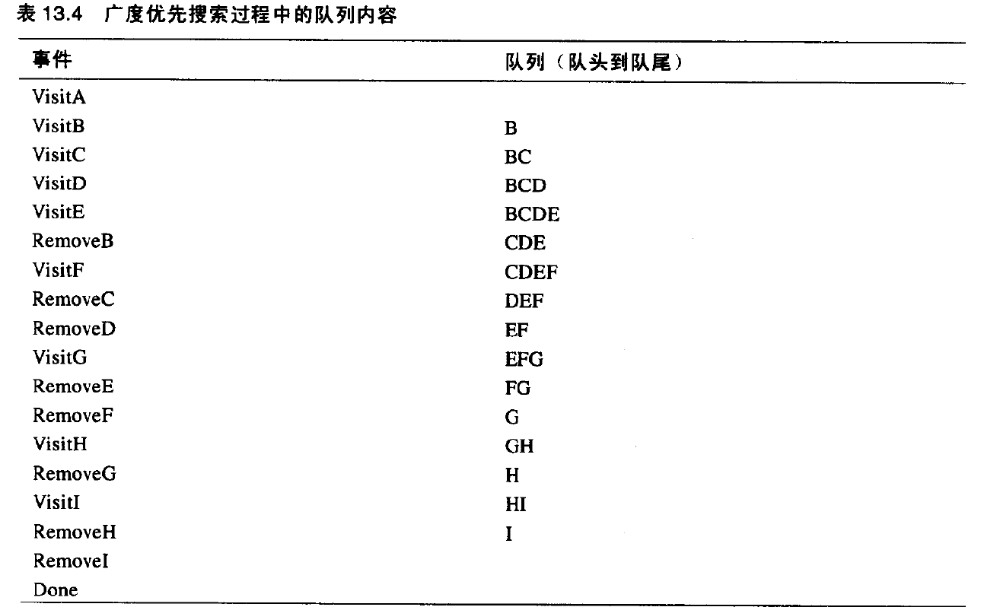
## 12.4 有向图的拓扑排序
拓扑排序是可以用图模拟的一种操作.即某些项目或则事件必须按照特定的顺序或则发生.


**例子:课程的优先关系**

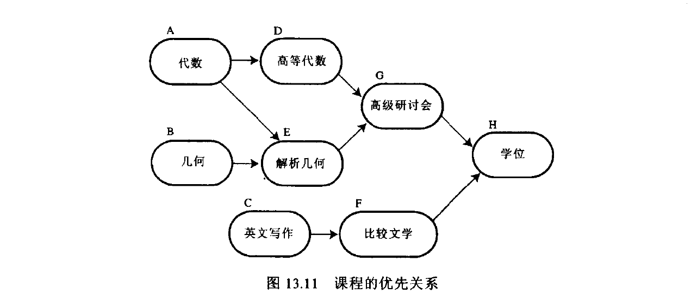

+ **有向图**

边有方向的这种图称为有向图.

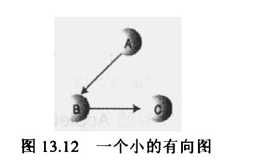

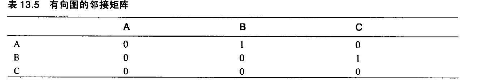

# 第14章 带权图


# 第15章 应用场合
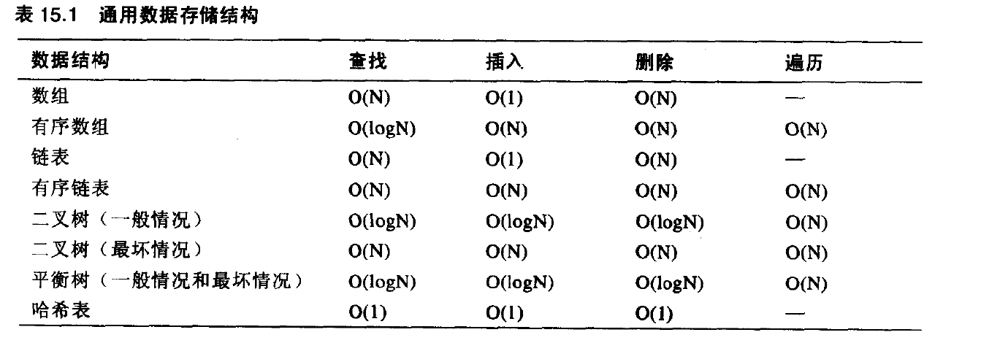

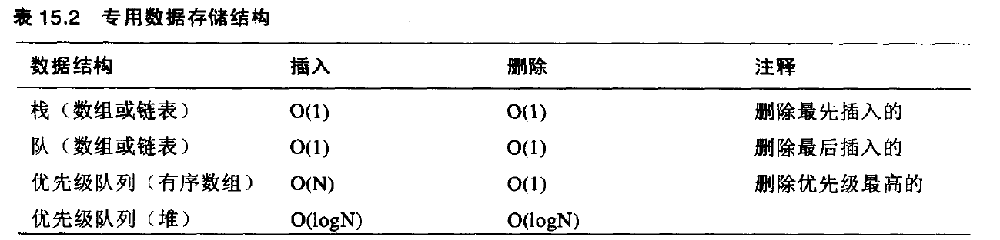


