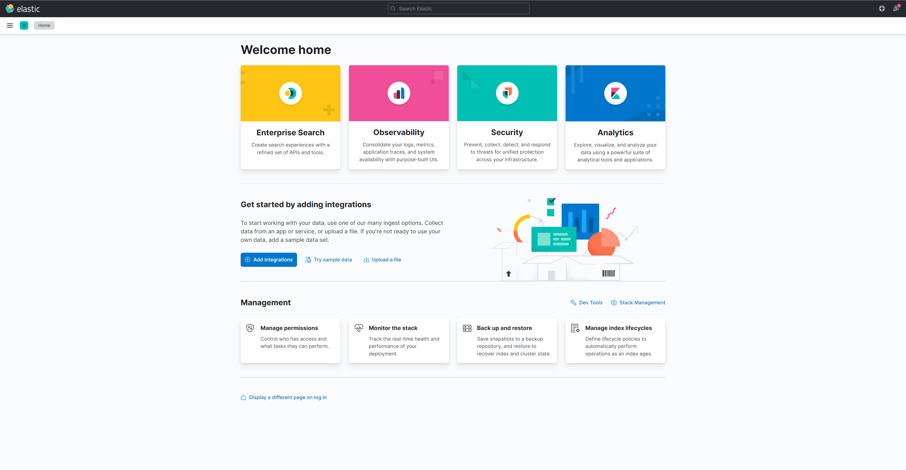
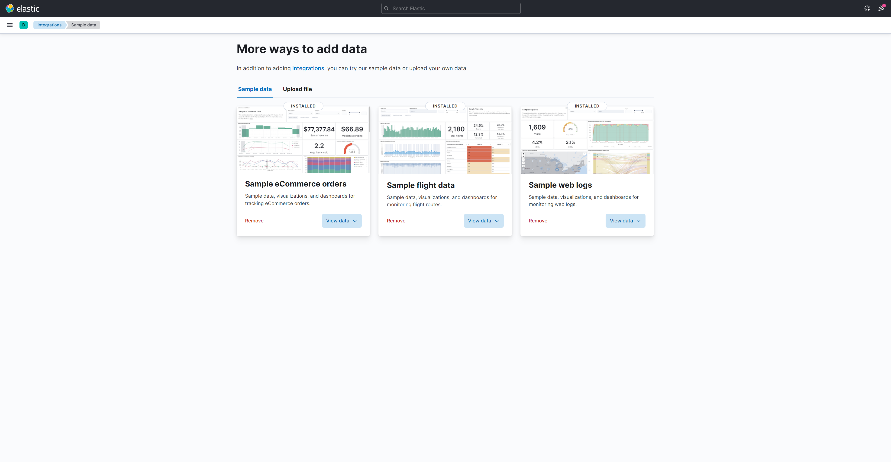
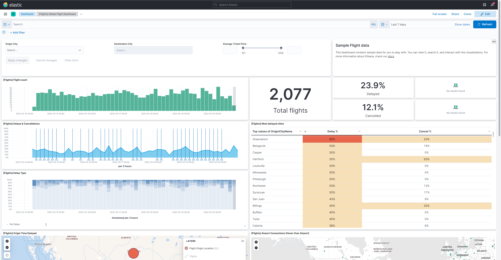
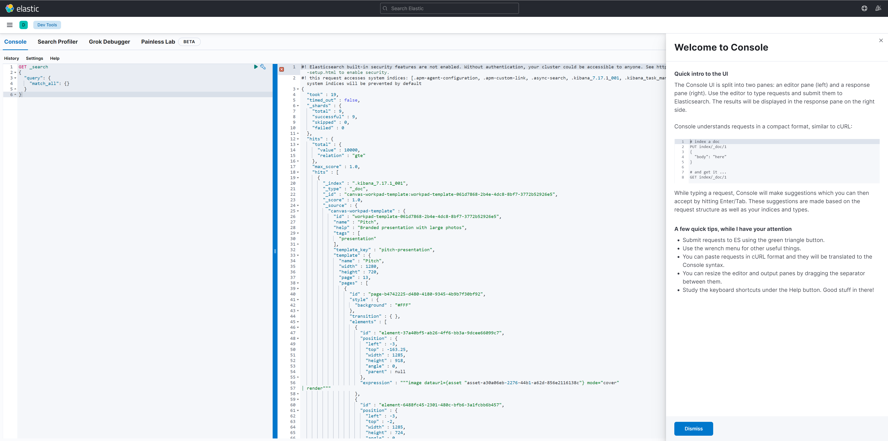

# 一 下载和elasticsearch相同版本的kibana
[kibana](https://www.elastic.co/cn/downloads/past-releases#kibana) 下载

# 二 解压文件
tar -zxvf 

# 三 分配权限
chown -R chen [文件目录]

vi /opt/kibana-7.12.0-linux-x86_64/config/kibana.yml 

server.host: 0.0.0.0]

# 四 关闭防火墙 
1. 查看运行状态：firewall-[cmd](https://so.csdn.net/so/search?q=cmd&spm=1001.2101.3001.7020) --state
2. 关闭防火墙： systemctl stop firewalld
3. 开机禁用  ： systemctl disable firewalld
4. 开启成功，可通过外网访问

# 五 访问   
[http://【ip】:5601](http://192.168.208.128:5601/app/dashboards#/view/7adfa750-4c81-11e8-b3d7-01146121b73d?_g=(filters:!(),refreshInterval:(pause:!t,value:0),time:(from:now-7d,to:now)))
出现loading kibana：升级浏览器

# 六 配置账号和密码
# 七 开发常用dev tools调用操作elasticsearch

