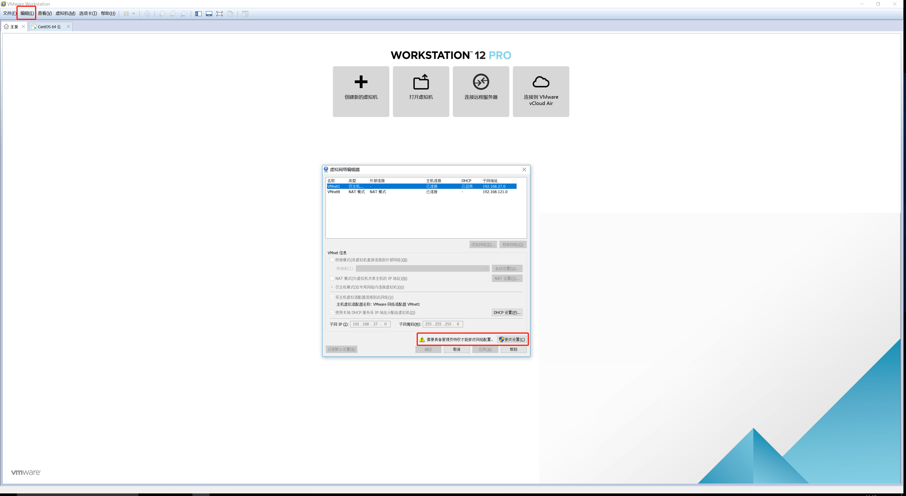
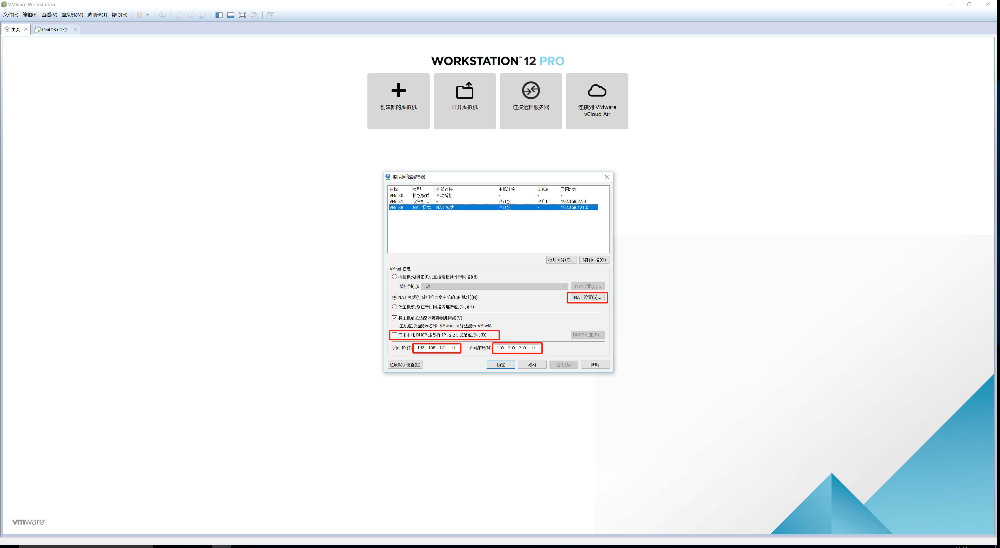
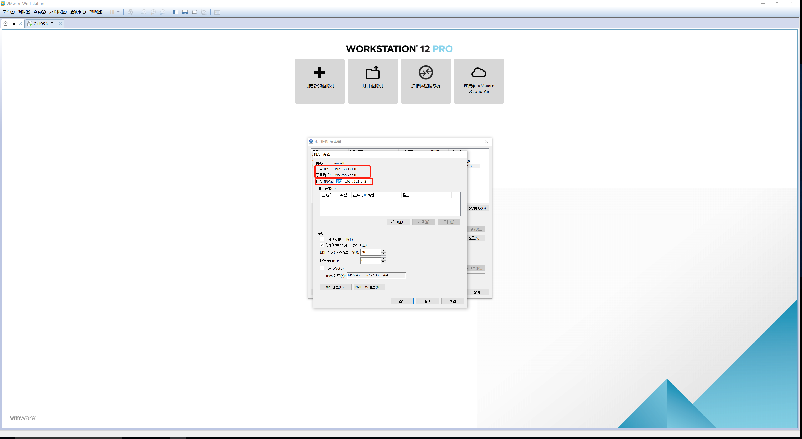
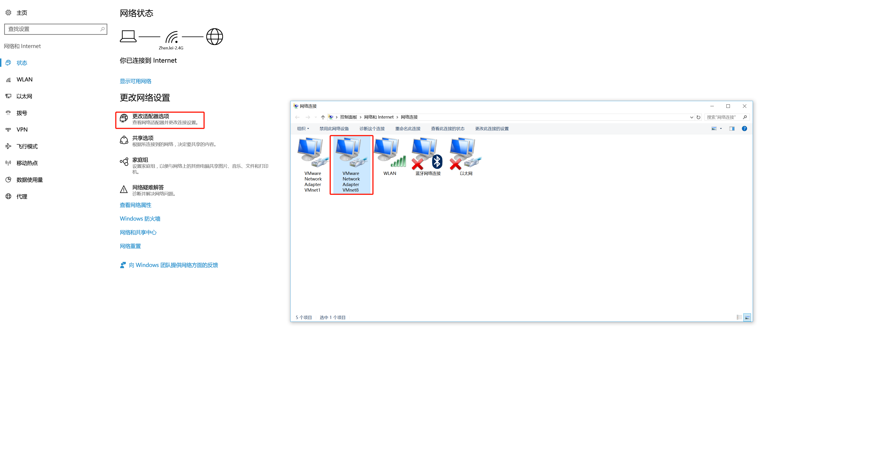
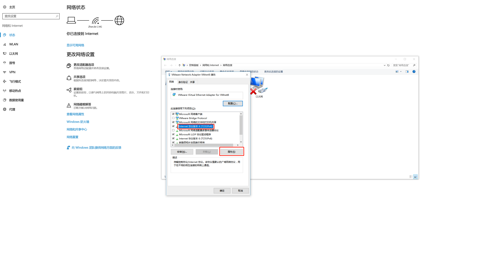
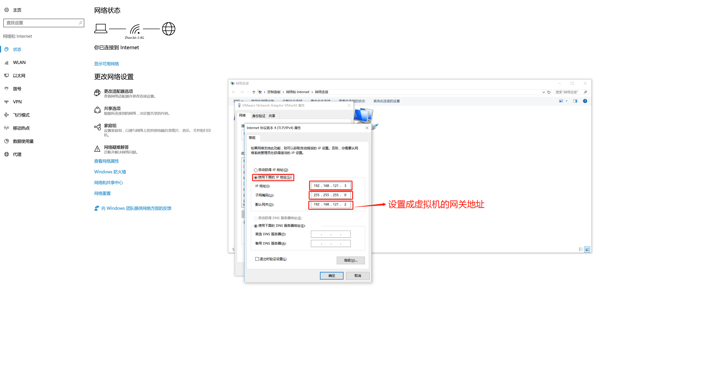

# 一   查看vm  nat网络配置







# 二 配置window VM虚拟网卡








# 三 配置centos网络配置

1. **备份网络配置文件**

```plain
cp  ifcfg-ens33 ifcfg-ens33-bnk
```

2. **修改配置文件**

```plain
 vi /etc/sysconfig/network-scripts/ifcfg-ens33
```

```plain
YPE=Ethernet
BOOTPROTO=static		#设置静态ip地址
DEFROUTE=yes
PEERDNS=yes
PEERROUTES=yes
IPV4_FAILURE_FATAL=no
IPV6INIT=yes
IPV6_AUTOCONF=yes
IPV6_DEFROUTE=yes
IPV6_PEERDNS=yes
IPV6_PEERROUTES=yes
IPV6_FAILURE_FATAL=no
IPV6_ADDR_GEN_MODE=stable-privacy
NAME=ens33
UUID=83ade40d-acdf-4b59-8460-1576a8078b33
DEVICE=ens33
ONBOOT=yes		#开机自动联网

# static config
IPADDR=192.168.121.1 	#固定ip地址
NETMASK=255.255.255.0	#子网掩码
GATEWAY=192.168.121.2	#默认网关

```

3. **使网络配置生效**

```plain
service network restart
```

