# 第一章 计算机系统漫游
## 1.2 程序被其他程序翻译成不同的格式

hello程序的生命周期

```cpp
linux> gcc -o hello hello.c
```

GCC编译器读取源文件hello.c,并把他翻译成一个可执行文件.翻译过程的四个程序,构成了编译系统(**compilation system**)

+ 预处理器
+ 编译器
+ 汇编器
+ 链接器
+ 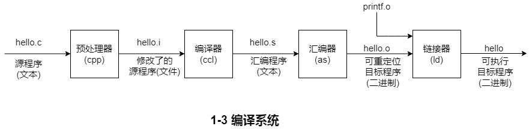

+ 预处理阶段

  预处理器(cpp),根据以字符#开头的命令,修改原始的C程序,得到另外一个C程序,通常是以.i作为文件扩展名.

+ 编译阶段

  编译器(ccl)将程序文本hello.i翻译成文本文件hello.s,它包含了一个汇编语言程序.

+ 汇编阶段

  汇编器(as)将hello.s翻译成机器语言格式,并将这些指令打包成可重定位目标程序(**relocatable object program**)的格式,并将结果保存在目标文件hello.o中

+ 链接阶段

  链接器(ld)负责将调用函数文件合并到hello.o中,得到一个hello文件,它是一个目标可执行文件,可被加载到内存中,由系统执行.

## 1.3 了解编译系统是如何工作的
+ 优化程序性能
+ 理解链接时出现的错误
+ 避免安全漏洞

## 1.4 处理器读取并解释存储在内存中的指令
此时,hello.c源程序已经被编译系统编译翻译成了目标文件hello,并被放在磁盘上.要想再Unix系统上面运行,我们将他的文件名输入到shell的应用程序中:

```cpp
linux> ./hello
hello,world
linux>
```

shell是一个命令行解释器.

### 1.4.1 系统硬件的组成
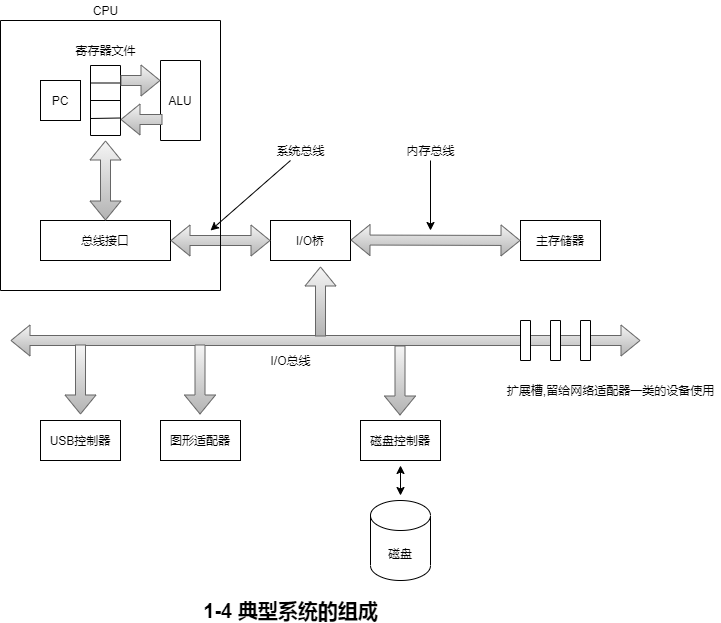

1. **总线**

   贯穿整个系统的是一组电子管道,称做**总线**,他携带信息字节并负责再各个部件之间传递.通常总线被设计成传送定长的字节快,也就是子(world).子中的字节数是一个基本的系统参数,各系统都不同.4字节或则8字节.

2. **I/O设备**

   I/O(输入/输出)设备是系统与外部世界的联系通道.每个I/O设备都通过一个控制器或则适配器与I/O总线相连,他们的功能都是在I/O总线和I/O设备之间传递信息.控制器和适配器的区别主要在于他们的封装方式.控制器是I/O设备本身或则主板上的芯片组,而适配器则是一块插在主板插槽上的卡.

   * 输入:键盘,鼠标

   * 输出:显示器,磁盘

3. **主存**

   主存是一个临时存储设备,在处理器执行程序时,用来存放程序和程序处理的数据.从物理上说,主存是有一组动态随机存取器(DRAM)芯片组成的.从逻辑上面来说,存储器是线性的字节数组,每个字节都有其唯一的地址(数组索引).

4. **处理器**

   中央处理器(CPU),简称处理器,是解释(或则执行)存储在主存中指令的引擎.处理器的核心是一个大小为一个字节的存储器(寄存器),称为程序计数器(PC).在任何时候,PC都指向主存中的某条机器语言指令(指令地址)


# 第二章 程序结构和执行
三种最重要的数组表示

+ **无符号(unsigned)**:编码基于传统的二进制表示法,表示大于或则等于零的数字
+ **补码(two`s-complement)**:编码是表示有符号整数,有符号整数就是可以认为正或则负的数字
+ **浮点数(floating-point)**:编码是表示实数的科学计数法的以2为基数的版本

## 2.1 信息存储
### 2.1.1 十六进制表示法
一字节由8位组成.在二进制表示法,他的值范围就是 00000000~11111111.转换成十进制整数,范围就是0~255.二进制表示法冗长,二十进制表示法与位模式的互相转化很麻烦.替代的方法是,以16为基数,或则叫做十六进制(dexadecimal)数,来表示位模式.十六进制(简写 hex),使用0-9以及字母A-F来表示16个可能的值.十六进制值域 00~FF

以0X或则0x开头的数字常量都被认为十六进制的值.

| 十六进制 | 0 | 1 | 2 | 3 | 4 | 5 | 6 | 7 |
| :---: | :---: | :---: | :---: | :---: | :---: | :---: | :---: | :---: |
| 十进制 | 0 | 1 | 2 | 3 | 4 | 5 | 6 | 7 |
| 二进制 | 0000 | 0001 | 0010 | 0011 | 0100 | 0101 | 0110 | 0111 |
| 十六进制 | 8 | 9 | A | B | C | D | E | F |
| 十进制 | 8 | 9 | 10 | 11 | 12 | 13 | 14 | 15 |
| 二进制 | 1000 | 1001 | 1010 | 1011 | 1100 | 1101 | 1110 | 1111 |


+ 十六进制和二进制互转

```cpp
0x173A4c  ---> 0001	0111	0011	1010	0100	1100

十六进制	1		7		3		A		4		C
二进制		0001	0111	0011	1010	0100	1100
```

+ 二进制和十六进制互转,从右到左,4个分一组转十六进制,不足4位,前面步0

```cpp
二进制		11	1100	1010	1101	1011	0011
十六进制	3	C		A		D		B		3
```

## 2.2 整数表示法
### 2.2.2 无符号数编码
定义:

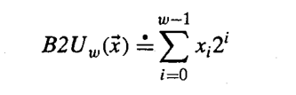

例子:

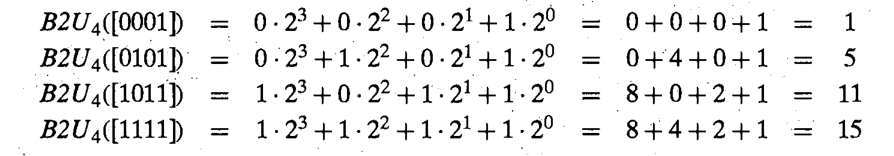

### 2.2.3 补码编码
表示负数值,最高位为负权

定义:

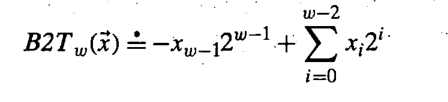

例子:
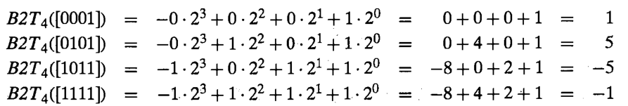

有符号的其他表示法

反码:<font style="color:rgb(0, 0, 0);">除了最高有效位的权是</font>**<font style="color:rgb(0, 0, 0);">-2w-1-1</font>**<font style="color:rgb(0, 0, 0);">，而不是</font>**<font style="color:rgb(0, 0, 0);">-2w-1</font>**<font style="color:rgb(0, 0, 0);">其余的和补码表示方式一样</font>

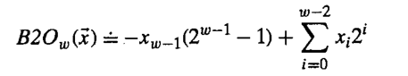

原码:<font style="color:rgb(0, 0, 0);">最高有效位是符号位，用来确定剩下的位是正还是负</font>

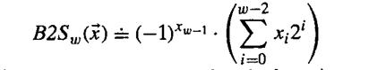

### 2.2.4 有符号数和无符号数之间的转换
# 第六章 存储器与层次结构
## 6.1 存储技术
### 6.1.1 访问主存
数据流通过总线(bus)的共享电子电路在处理器和DRAM主存之间来来回回.每次cpu和主存之间的数据传送都是通过一些列步骤完成的,这些步骤称为总线事务(bus transaction).

读事务(read transaction)从主存传送数据到CPU.

写事务(write transaction)从CPU传送数据到主存.

总线是一组并行的导线,能携带地址,数据和控制信号.

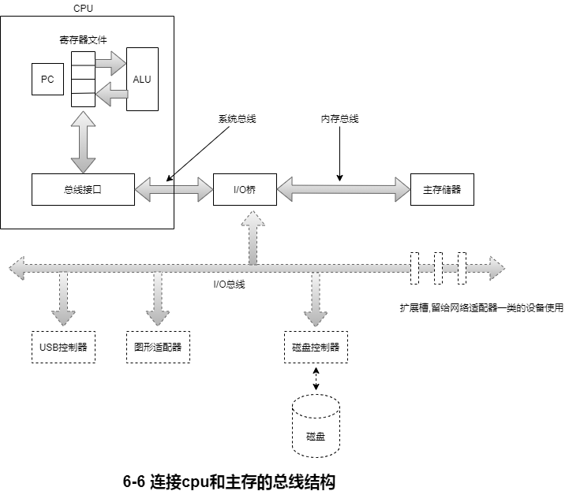

系统总线(system bus):连接CPU和I/O桥接器.

内存总线(memory bus):连接I/O桥接器和主存.

I/O桥接器:将系统的总线的电子信号翻译成内存总线的电子信号.

## 6.2 读取操作

CPU执行如下操作

movq A,%rax

地址A的内容被记载到寄存器%rax中.cpu芯片上称为总线接口(bus interface)的电路在总线上发起读事务.读取事务是由三个步骤完成

1. CPU将地址A放到系统总线上.I/O桥将信号传递到内存总线
2. 主存感觉到内存总线上的地址信号,从内存总线读取地址,从DRAM取出数字,并将数据写到内存总线.I/O桥将内存总线信号翻译成系统总线信号,然后沿着系统总线传递.
3. CPU感觉到系统总线上的数据,从总线上读取数据,并将数据复制到寄存器%rax

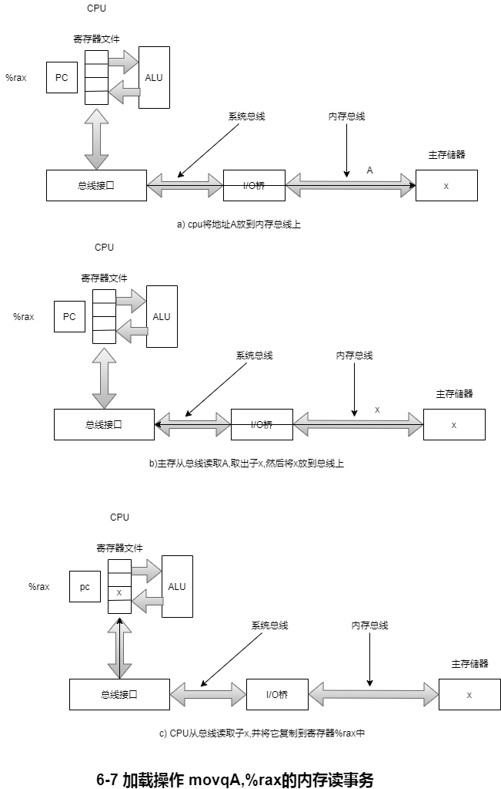

## 6.3 存储操作

movq %rax,A

寄存器%rax的内容被写到地址A,CPU发起事务.同样有三个基本步骤

1. CPU将地址放到系统总线上.内存从内存总线读出地址,并等待数据到达.
2. CPU将%rax中的数据复制到系统总线
3. 内存从内存总线读出数据字,并将这些位存储到DRAM中


### 6.1.2 磁盘存储
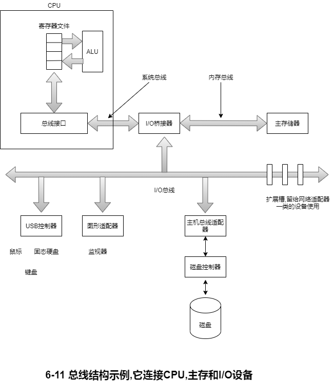

#### 1. 访问磁盘
CPU使用一种称为内存映射I/O(memory-mapped I/O)的技术向I/O设备发射命令.在使用内存映射的的I/O系统中,地址空间中有一块地址是为I/O设备通信保留的.每个这样的地址称为一个I/O端口(I/O port).当一个设备连接到总线时,它与一个或则多个端口相关联.(它被映射到一个或则多个端口)

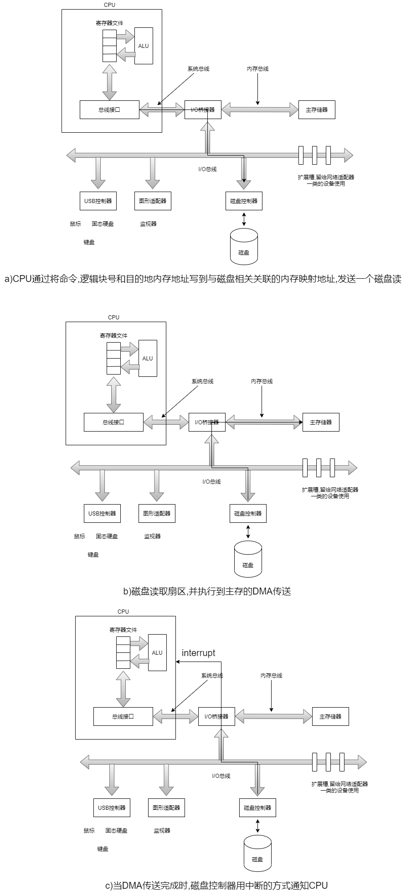

1. 发起磁盘读取:第一条指令,发送一个命令字,告诉磁盘发起一个读,同时还有其他的参数
2. 第二条指令,指明应该读的逻辑块号
3. 第三条指令指明应该存储磁盘扇区内容的主存地址.

设备可以自己执行读或则写总线事务而不需要CPU干涉的过程,称为直接内存访问(Direct Memory Access).这种数据传送称为DMA传送(DMA transfer)

### 6.1.3 固态硬盘

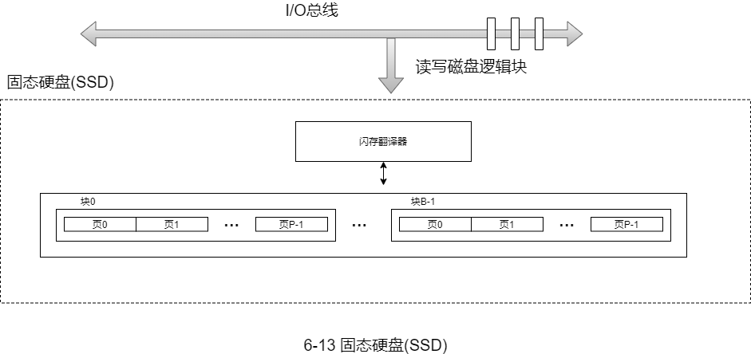

## 6.4 存储层次结构
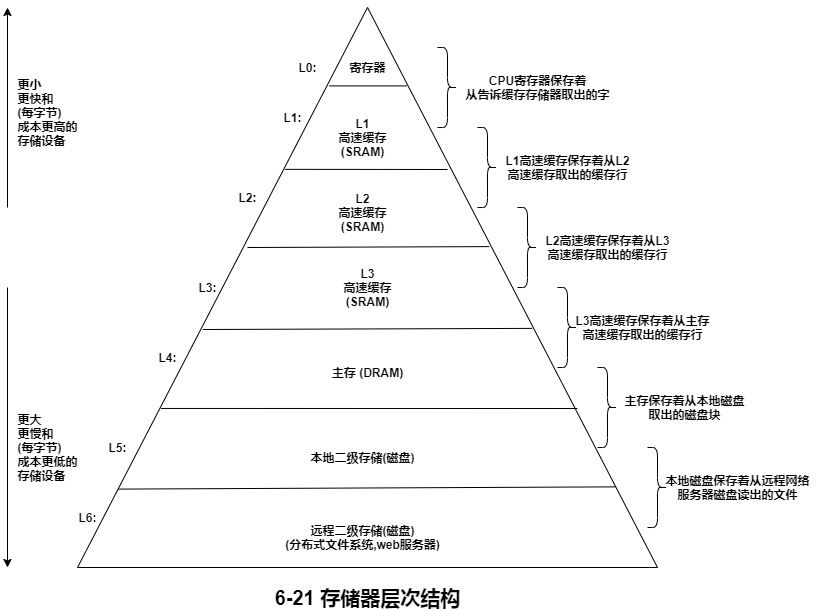

# 第九章 虚拟内存
## linux 虚拟内存系统
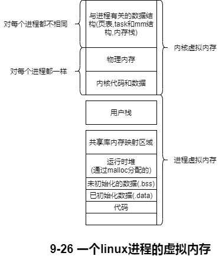

# 第十一章 网络编程
## 11.2 网络
不同主机中间的数据复制

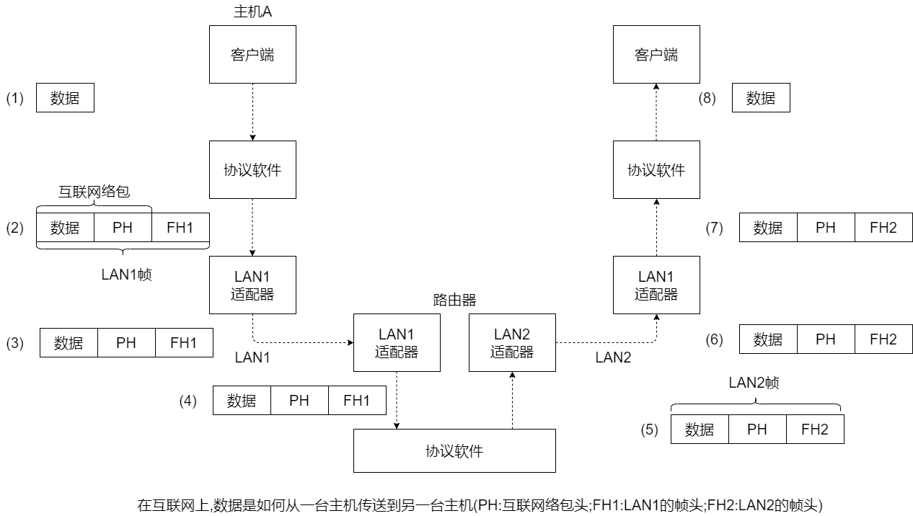

主机A发送数据到主机B的8个步骤:

1) 运行在主机A的客户端进行一个系统调用,从客户端的虚拟机地址空间复制数据到内核缓冲区

2) 主机A上的协议软件通过在数据前附加互联网络包头和LAN1帧头,创建了一个LAN1的帧.互联网络包头寻址到互联网络主机B.LAN1帧头寻址到路由器.然后它传送此帧到适配器.注意,LAN1帧的有效载荷是一个互联网络包,而互联网络包的有效载荷是实际的用户数据.这种封装是基本的网络互联方法之一.

3) LAN1适配器复制该帧到网络上

4) 当此帧到达路由器时,路由器的LAN1适配器从电缆上读取它,并把它传送到协议软件

5) 路由器的从互联网络包头中提取出目的地的互联网络地址.并用他作为路由表的索引,确定向哪里转发这个包,本例中是LAN2.路由器的剥落旧的LAN1的帧头,加上寻址到主机B的新的LAN2帧头,并把得到的帧传送到适配器.

6)路由器的LAN2适配器复制该帧到网络上.

7)当此帧到达主机B时,他的适配器从电缆上读取到此帧,并将它传送到协议软件.

8)最后,主机B上的协议软件剥落包头和帧头.当服务器进行一个读取这些数据的系统调用时,协议软件最终将得到的数据复制到服务器的虚拟地址空间.

