# 一 下载 
```plain
wget https://cdn.mysql.com//Downloads/MySQL-5.7/mysql-5.7.18-linux-glibc2.5-x86_64.tar.gz
```

# 二 安装
## 1 检查mariadb
```plain
yum  list  installed  |  grep mariadb 
```

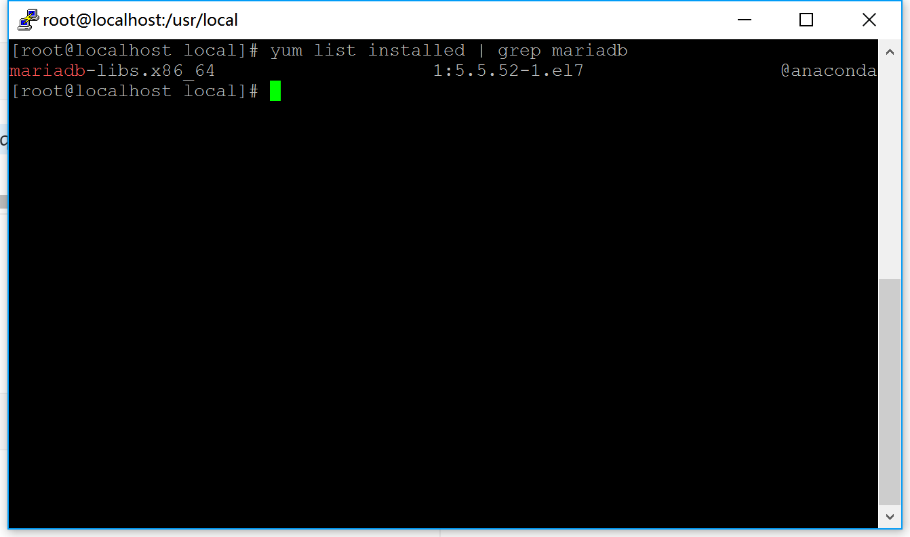

## 2 卸载mariadb
```plain
yum -y remove mariadb-libs.x86_64 
```

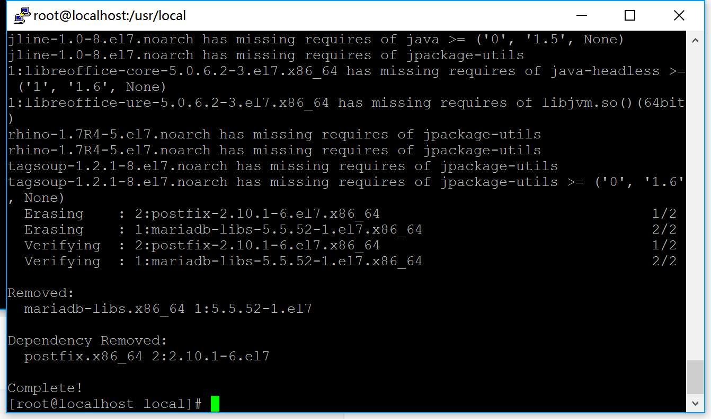

## 3 安装MySQL
```plain
tar  -zxvf  mysql-5.7.18-linux-glibc2.5-x86_64.tar.gz  -C  /usr/local/ 
mv mysql-5.7.18-linux-glibc2.5-x86_64/ mysql-5.7.18
```

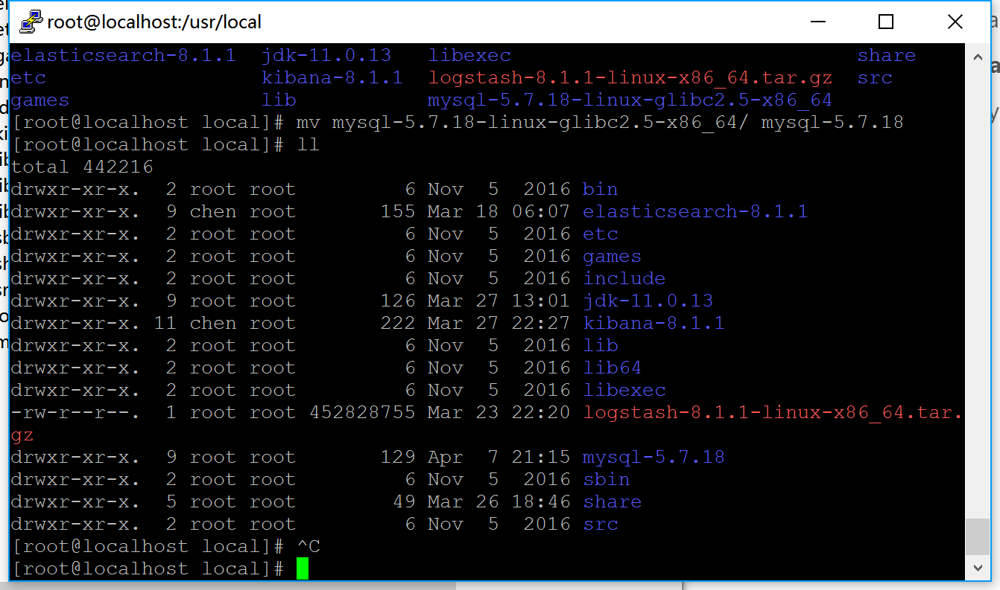

## 4 创建数据文件夹 data
在mysql主目录创建data文件夹

```plain
mkdir data
```

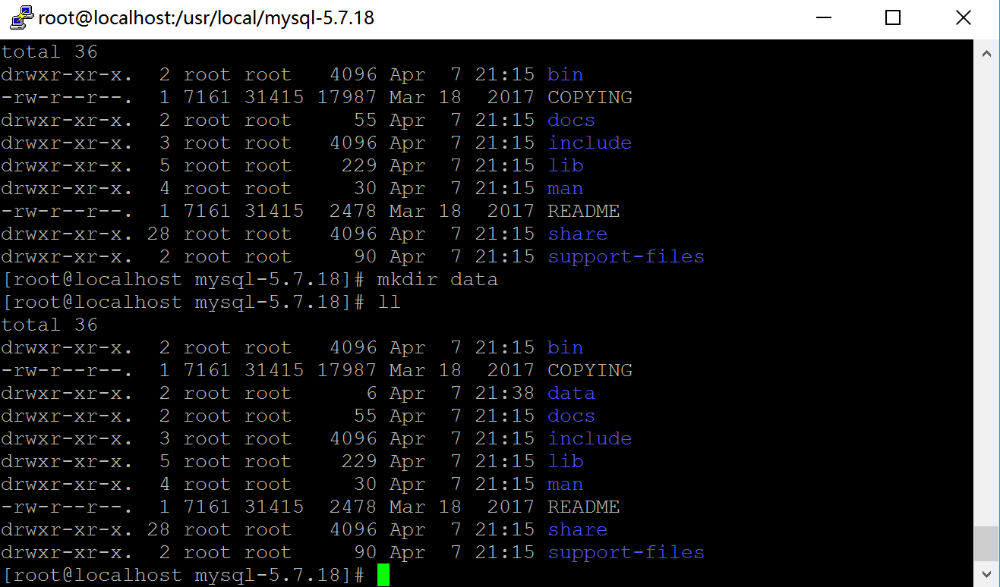

## 5 创建用户执行 mysqld命令
参考地址: [https://dev.mysql.com/doc/refman/5.7/en/binary-installation.html](https://dev.mysql.com/doc/refman/5.7/en/binary-installation.html) 

```plain
useradd mysql
```

## 6 初始化MySQL
在mysql安装bin目录执行,会生成一个临时密码,先拷贝出来;后继第一次登录mysql需要使用

```plain
./mysqld --initialize --user=mysql --datadir=/usr/local/mysql-5.7.18/data --basedir=/usr/local/mysql-5.7.18 
```

参数说明： 

--initialize 初始化 mysql，<font style="color:#E8323C;">创建 mysql 的 root, 随机生成密码。记住密码，登录 msyql 使用。 </font>

--user 执行 msyqld 命令的 linux 用户名 

--datadir : mysql 数据文件的存放位置，目录位置参照本机的设置。 

--basedir : msyql 安装程序的目录，目录位置参照本机的设置。 

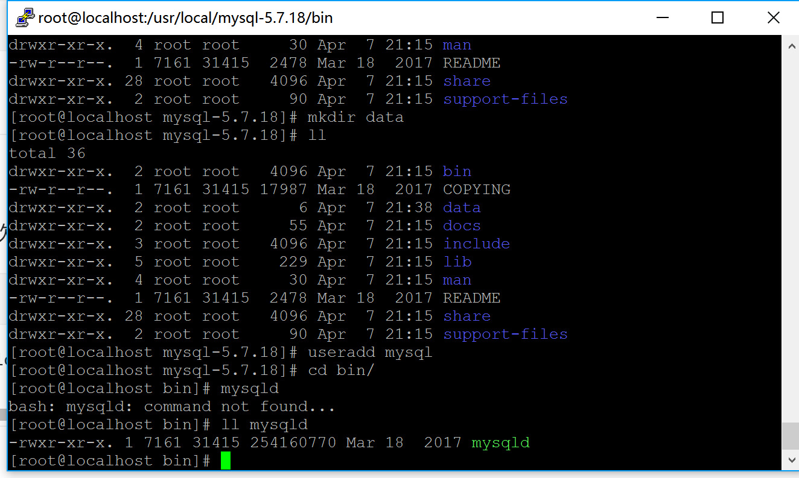

初始化,拷贝密码 ItSCo#UnR5>Z

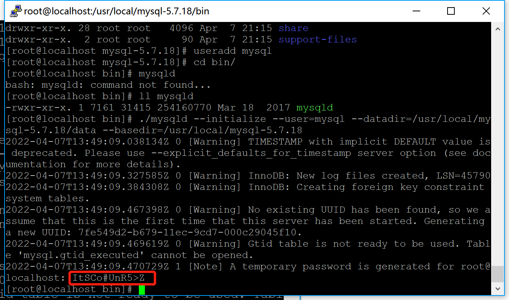

## 7 启用安全功能
服务器和客户端之间通信所有数据加密。使用证书身份证验证机制。开启数据加密功能，生成数字证书

bin目录执行

```plain
./mysql_ssl_rsa_setup --datadir=/usr/local/mysql-5.7.18/data
```

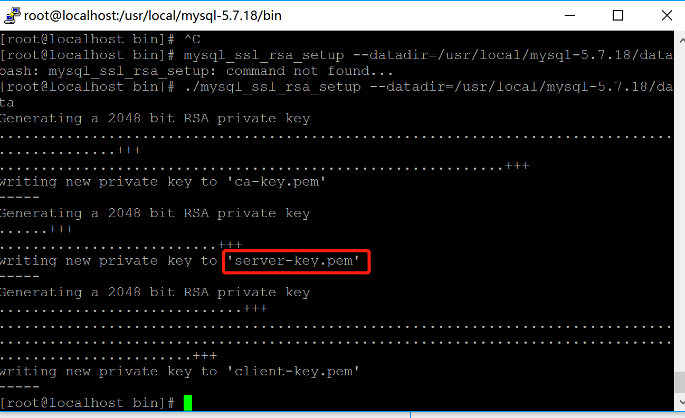

## 8 修改mysql安装目录的权限
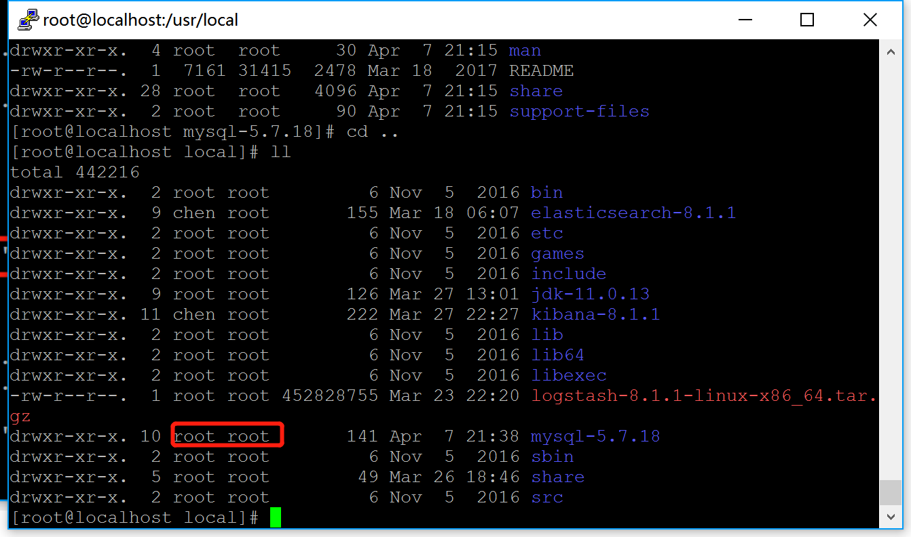

```plain
 chown -R mysql mysql-5.7.18/
```

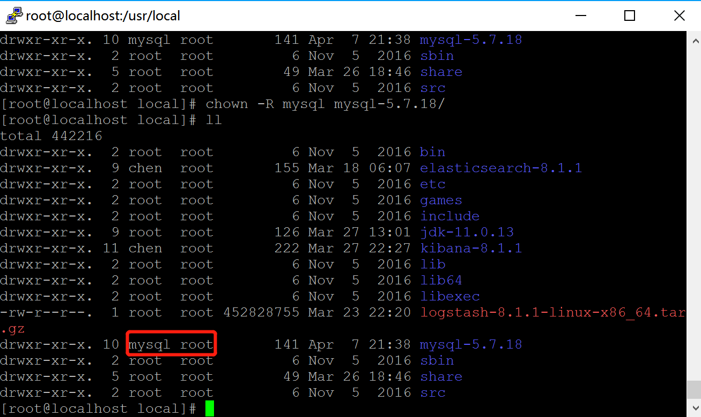

## 9 启动mysql
bin目录执行  ./mysqld_safe & (&表示后台启动)

```plain
./mysqld_safe &
```

确认mysql是否启动，查看进程 ps -ef | grep mysql

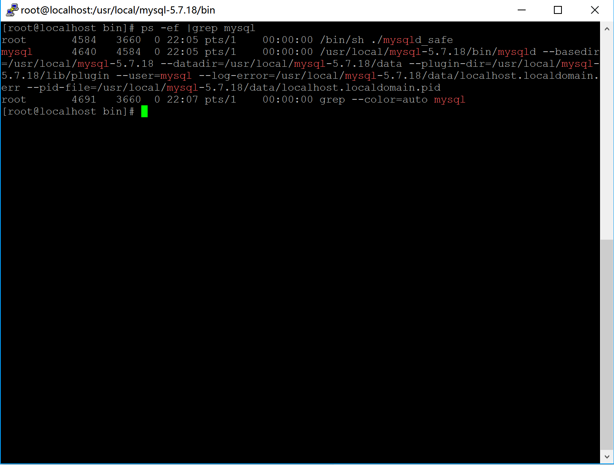

## 10 客户端进入mysql
bin目录执行 ./mysql -uroot -p

-u 使用root登录，使用第6部生成的密码

-p 使用密码登录

```plain
./mysql -uroot -p
```

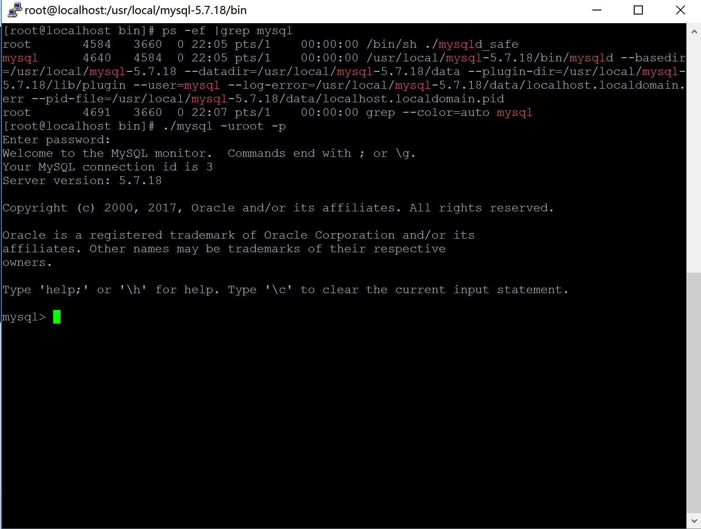

## 11 修改密码
执行sql提示修改密码，语法  alter user '用户名'@'主机域名或ip' identified by '新密码'

例如：alter user 'root'@'localhost' identified by '123456'; 

```plain
alter user 'root'@'localhost' identified by '123456'; 
```

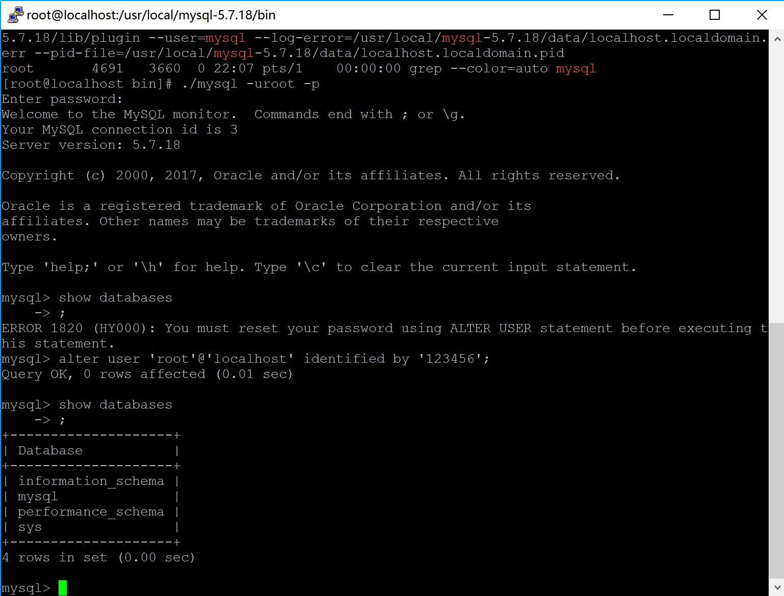

## 12 修改远程访问
命令 grant

语法 grant all privileges on *.* to root@'%' identified by '123456'; 

参数： 

其中*.* 的第一个*表示所有数据库名，第二个*表示所有的数据库表； 

root@'%' 中的root表示用户名，%表示ip地址，%也可以指定具体的ip地址，比如

root@localhost,root@192.168.10.129 


①执行授权命令

例如：grant  all  privileges  on *.* to root@'%'  identified by  '123456'; 


②更新权限信息，执行flush刷新权限例如：flush  privileges; 

```plain
grant  all  privileges  on *.* to root@'%'  identified by  '123456'; 
flush  privileges; 
```

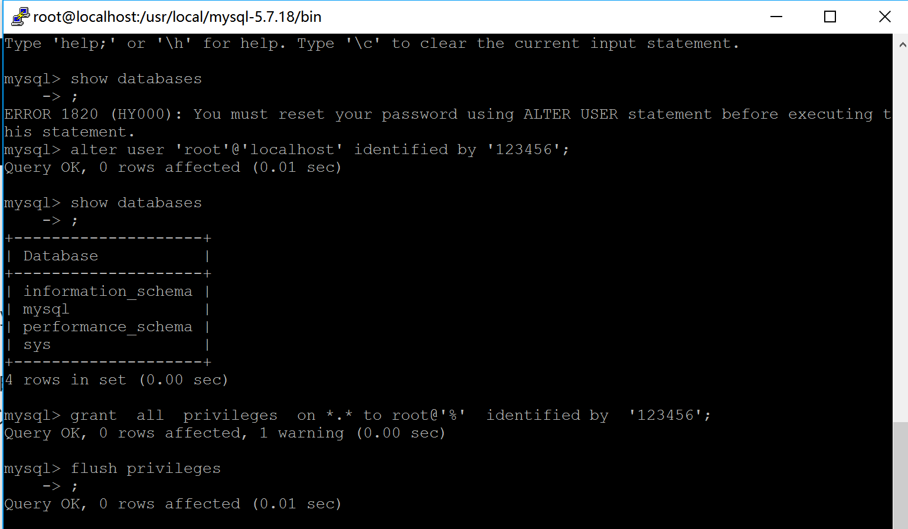

## 13 测试mysql客户端访问mysql
HeidiSQL：官方网站：[https://www.heidisql.com/](https://www.heidisql.com/) 

Navicat：官方网站：[http://www.navicat.com/](http://www.navicat.com/) 

SQLyog：官方网站：[http://www.webyog.com/](http://www.webyog.com/) 


连接错误可能是防火墙开启状态，关闭防火墙

查看防火墙： systemctl status firewalld

让防火墙可用： systemctl enable firewalld

让防火墙不可用：systemctl disable firewalld

开启防火墙：systemctl start firewalld

关闭防火墙：systemctl stop firewalld

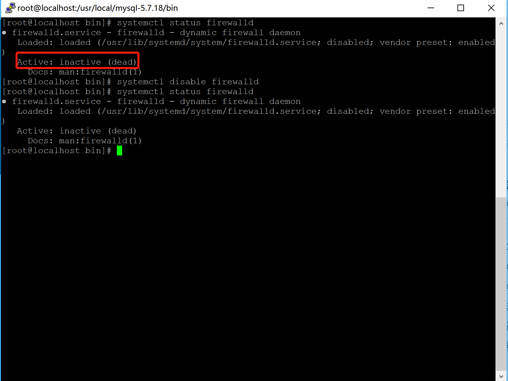

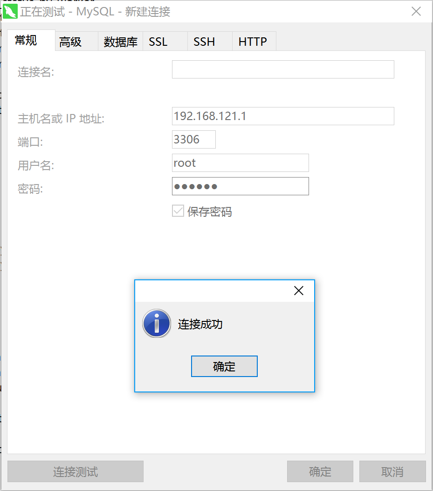

## 14 关闭mysql服务
1. 退出客户端

```plain
exit
```

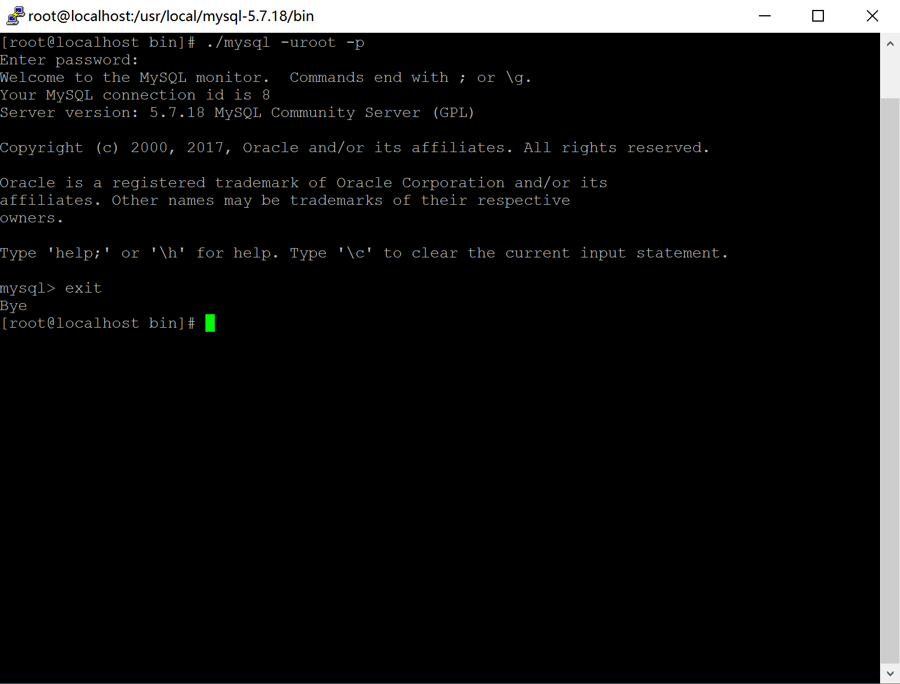

2. 关闭mysql服务器

```plain
./mysqladmin -uroot -p shutdown
```

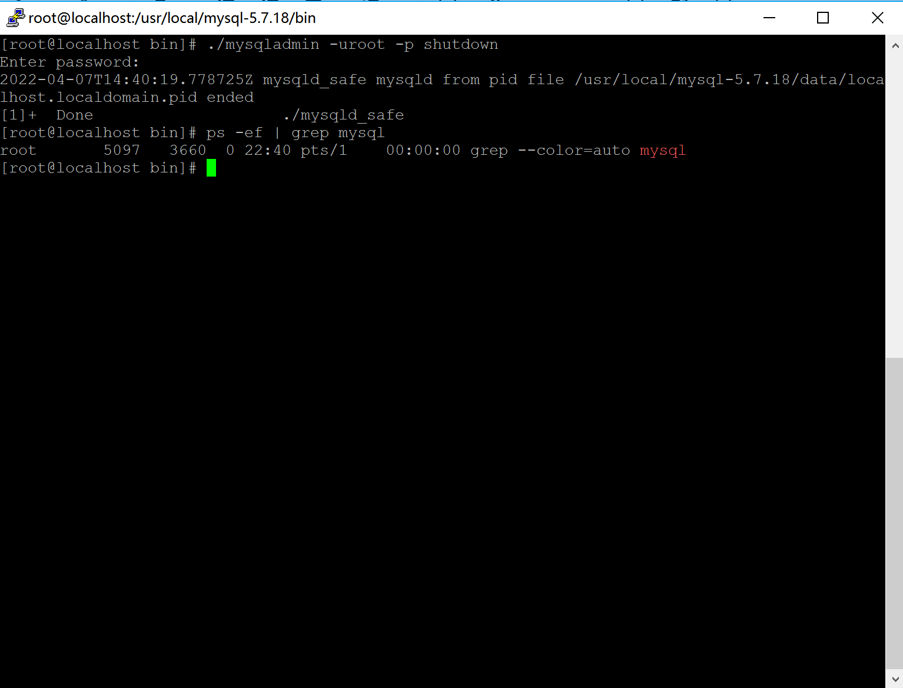

