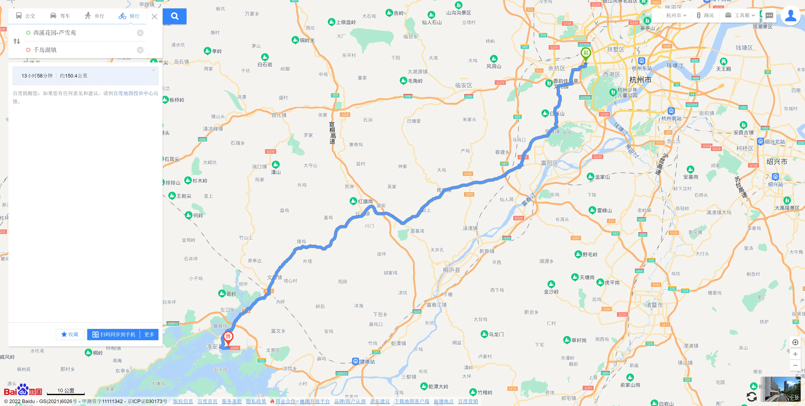
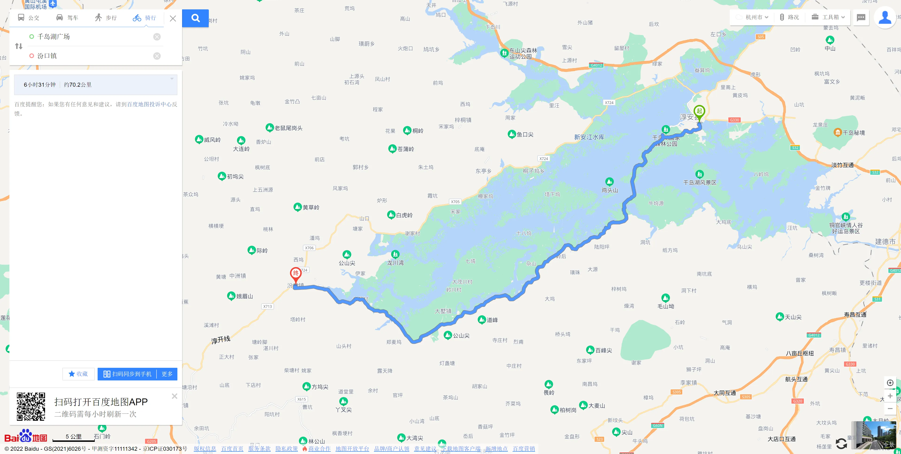
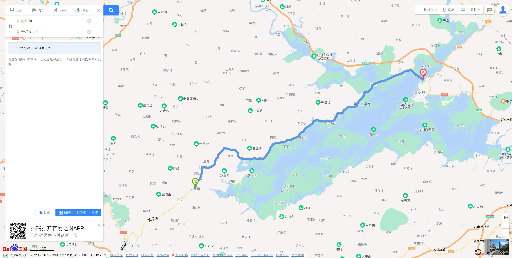
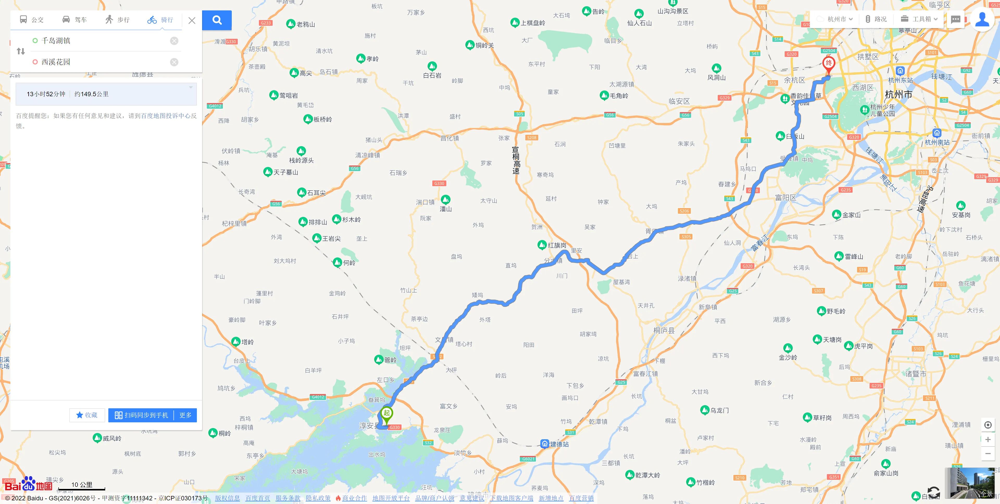

# 一 出发情况

| 出发时间   | 出行天数 | 同行好友 | 人均费用 |
| ---------- | -------- | -------- | -------- |
| 2022-05-01 | 4        | 3人游    | 600      |
|            |          |          |          |

# 二 准备情况

- 现金600

- 4.30号做核酸

- 吃饭
- 住宿

- 鸡蛋四个
- 牛奶两盒
- 面包两袋
- 巧克力一盒
- 脉动一瓶
- 农夫山泉两瓶

- 自行车包
- 手套
- 头盔
- 内胎
- 换胎工具
- 骑行服
- 运动手环

- 背包
- 4天衣服

- 手机
- 充电宝

- 身份证
- 口罩

- 刮胡刀
- 纸巾
- 地图
- 雨伞
- 牙刷
- 牙膏

# 三 行程安排

1. **路线概况**

- 千岛湖广场 -> 千岛湖大桥 -> 千汾线 -> 界首乡 -> 姜家镇 -> 汾口镇 -> 枫树岭镇 -> 大墅镇 -> 安阳乡 -> 上江埠大桥 -> 千岛湖旅游码头 -> 千岛湖广场

2. **特色**

   经典路线，全长160公里。分两天完成

## day01（05-01）

1. 早上8点，西溪花园-芦雪苑=》千岛湖镇

2. 晚上到千岛湖镇吃饭,住宿

   

## day02（05-02）

1. 早上8点在千岛湖镇做核酸，吃饭
2. 骑行开始，走西南线
3. 晚上到汾口镇，吃饭，住宿

- 千岛湖广场 -> 千岛湖大桥 -> 千汾线 -> 界首乡 -> 姜家镇 -> 汾口镇 

  

## day03（05-03）

1. 早上8点在汾口镇做核酸，吃饭
2. 骑行开始，走东北线

- 汾口镇 -> 枫树岭镇 -> 大墅镇 -> 安阳乡 -> 上江埠大桥 -> 千岛湖旅游码头 -> 千岛湖广场

3. 晚上到千岛湖镇吃饭，住宿

   

## day04（05-04）

1. 8点在千岛湖镇做核酸，吃饭，补给

2. 千岛湖镇 -> 西溪花园-芦雪苑

   