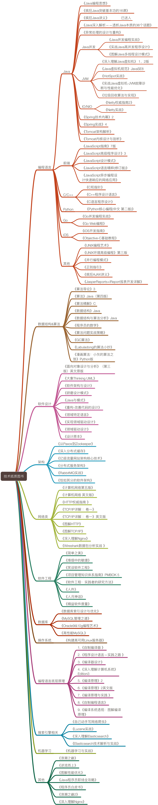

# 技术图书



# 面试题

# java集合

## jdk7 hashMap环形链表过程

### 1. 发生环的**必要条件**（缺一不可）：

* **JDK 7 HashMap**

* **多线程并发 put**

* **触发 resize()**

* **同一个 bucket 是链表结构**

* **扩容迁移使用头插法**

### 2. JDK 7 扩容核心代码（简化版）：

```java
Entry<K,V> e = oldTable[i];
while (e != null) {
    Entry<K,V> next = e.next;
    int newIndex = indexFor(e.hash, newCapacity);

    // 头插法
    e.next = newTable[newIndex];
    newTable[newIndex] = e;
    
    e = next;
}
```

### 3. 并发下死循环形成全过程：

我们用 **两个线程 T1、T2**，同时扩容同一个 bucket。

* Step 0：初始状态

```java
oldTable[i]:
A -> B -> C -> null
```

​		`newTable[j]` 为空

* Step 1：T1 开始迁移 A

```java
T1:
e = A
next = B
A.next = null
newTable[j] = A
```

​		结果：

```java
newTable[j]: A -> null
```

* Step 2：CPU 切换到 T2（关键）

```java
T2:
e = A   （注意：还是从 oldTable[i] 开始）
next = B
A.next = null   // 再次修改
newTable[j] = A
```

* Step 3：T1 继续迁移 B

```java
T1:
e = B
next = C
B.next = A
newTable[j] = B
```

​			结果：

```
newTable[j]: B -> A -> null
```

* Step 4：T2 继续迁移 B（致命点）

```java
T2:
e = B
next = C

B.next = newTable[j]   // newTable[j] 此时是 B！
```

​		于是发生：

```java
B.next = B   // 出现自循环
```

### 4. 最终结构

```
B
↑ \
|  \
└───┘
或者复杂情况：
B -> A -> B -> A -> ...
```

### 5. 为什么后续一定死循环？

HashMap 的 `get / put` 都是这样遍历链表：

```java
for (Entry<K,V> e = table[i]; e != null; e = e.next) {
    ...
}
```

当e.next == e，永远不为null，cpu 100%，线程卡死

### 6. 为什么 JDK 8 能从根本避免？

JDK 8 做了三件关键的事：

1️⃣ **不再使用头插法**
 2️⃣ **链表拆分为 low / high 两条链**
 3️⃣ **尾插 + 断链**

```
loTail.next = null;
hiTail.next = null;
```


