# idea搭建jdk1.8.0-144源码阅读环境

1. 新建maven 工程

   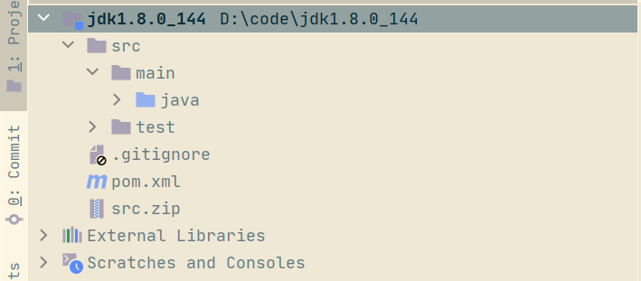

+ pom文件配置

```xml
<?xml version="1.0" encoding="UTF-8"?>
<project xmlns="http://maven.apache.org/POM/4.0.0"
         xmlns:xsi="http://www.w3.org/2001/XMLSchema-instance"
         xsi:schemaLocation="http://maven.apache.org/POM/4.0.0 http://maven.apache.org/xsd/maven-4.0.0.xsd">
  
  <artifactId>jdk1.8.0_144</artifactId>
  <groupId>cn.chen</groupId>
  <version>1.0</version>
  
  <modelVersion>4.0.0</modelVersion>
  <packaging>jar</packaging>
  
  <properties>
    <java.version>1.8</java.version>
    <project.build.sourceEncoding>UTF-8</project.build.sourceEncoding>
    <maven-war-plugin.version>3.3.0</maven-war-plugin.version>
    <junit-jupiter-api-version>5.8.2</junit-jupiter-api-version>
  </properties>
  
  
  <dependencies>
    <!-- https://mvnrepository.com/artifact/org.junit.jupiter/junit-jupiter-api -->
    <dependency>
      <groupId>org.junit.jupiter</groupId>
      <artifactId>junit-jupiter-api</artifactId>
      <version>${junit-jupiter-api-version}</version>
      <scope>test</scope>
    </dependency>
    
  </dependencies>
  
  <build>
    <finalName>jdk1.8.0_144</finalName>
    <plugins>
      <plugin>
        <groupId>org.apache.maven.plugins</groupId>
        <artifactId>maven-compiler-plugin</artifactId>
        <configuration>
          <source>${java.version}</source>
          <target>${java.version}</target>
          <encoding>${project.build.sourceEncoding}</encoding>
        </configuration>
      </plugin>
      
      <!--打war包 ,本地jar配置目录配置; tomcat读取 WEB-INF/lib jar包-->
      <plugin>
        <artifactId>maven-war-plugin</artifactId>
        <version>${maven-war-plugin.version}</version>
      </plugin>
      
      <!--打包jar 本地jar在 WEB-INF/lib-provided目录 -->
      <plugin>
        <groupId>org.springframework.boot</groupId>
        <artifactId>spring-boot-maven-plugin</artifactId>
        <configuration>
          <mainClass>cn.chen.application.Application</mainClass>
          <!--打jar包,本地jar加入此配置-->
          <!--<includeSystemScope>true</includeSystemScope>-->
        </configuration>
        <executions>
          <execution>
            <goals>
              <goal>repackage</goal><!--可以把依赖的包都打包到生成的Jar包中-->
            </goals>
          </execution>
        </executions>
      </plugin>
      
      
      <!-- surefire 测试出错不影响项目编译-->
      <plugin>
        <artifactId>maven-surefire-plugin</artifactId>
        <configuration>
          <testFailureIgnore>true</testFailureIgnore>
          <skipTests>false</skipTests>
        </configuration>
      </plugin>
    </plugins>
  </build>
  
  <!--maven远程仓库配置-->
  <repositories>
    <repository>
      <id>public</id>
      <name>aliyun nexus</name>
      <url>http://maven.aliyun.com/nexus/content/groups/public/</url>
      <releases>
        <enabled>true</enabled>
      </releases>
    </repository>
    
    <repository>
      <id>yonyoucloud</id>
      <name>yonyoucloud</name>
      <url>http://maven.yonyoucloud.com/nexus/content/groups/public/</url>
    </repository>
    
  </repositories>
  
  <!--maven远程插件库配置-->
  <pluginRepositories>
    <pluginRepository>
      <id>public</id>
      <name>aliyun nexus</name>
      <url>http://maven.aliyun.com/nexus/content/groups/public/</url>
      <releases>
        <enabled>true</enabled>
      </releases>
      <snapshots>
        <enabled>false</enabled>
      </snapshots>
    </pluginRepository>
    
    <pluginRepository>
      <id>yonyoucloud</id>
      <name>yonyoucloud</name>
      <url>http://maven.yonyoucloud.com/nexus/content/groups/public/</url>
    </pluginRepository>
  </pluginRepositories>
</project>
```

2. 解压jdk1.8.0_144安装目录源码src.zip至工程src/main/java目录下

   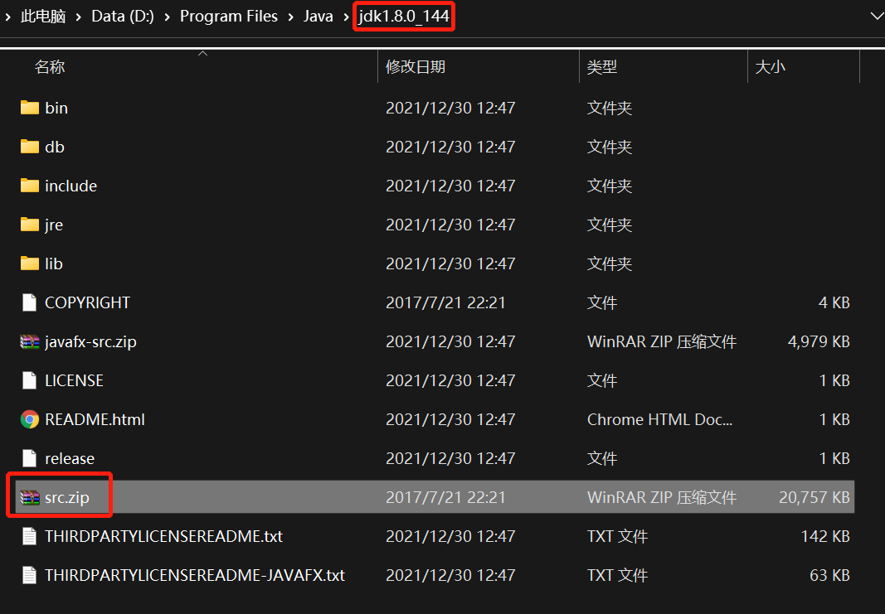

   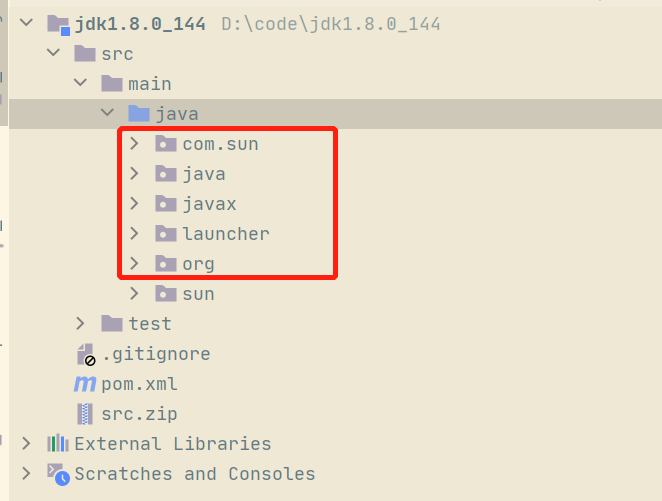

3. 修改源码位置为当前工程

   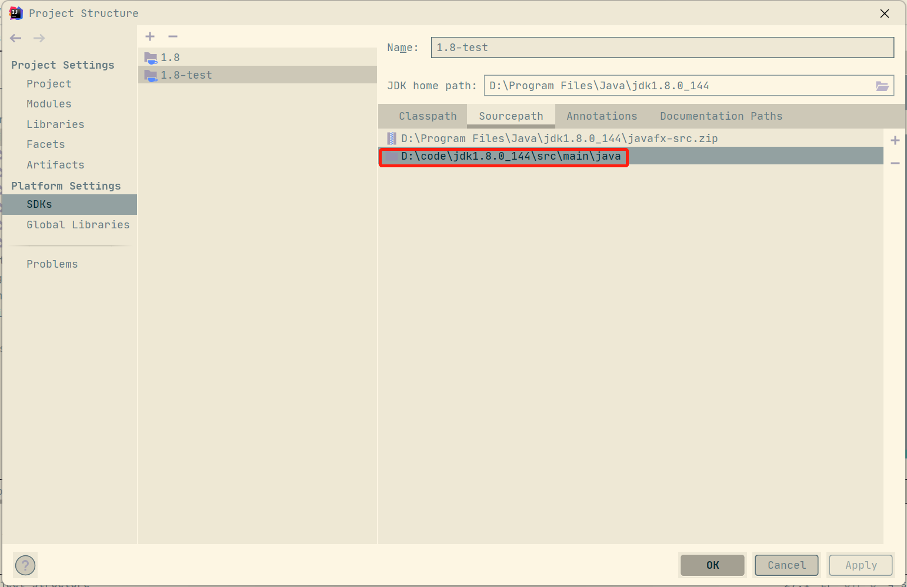

4. 引入jdk安装目录tools.jar

   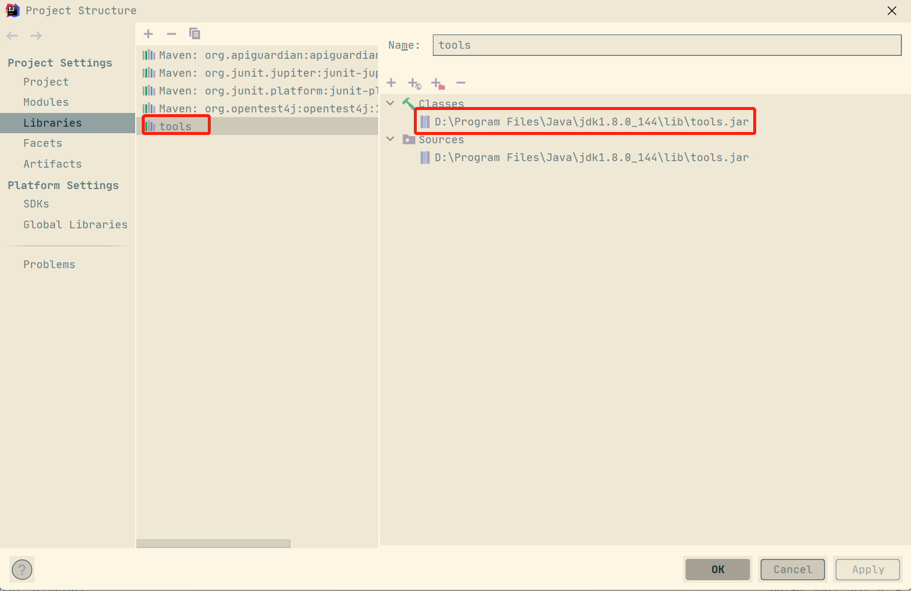

5. 修改编译堆大小 700->1000

   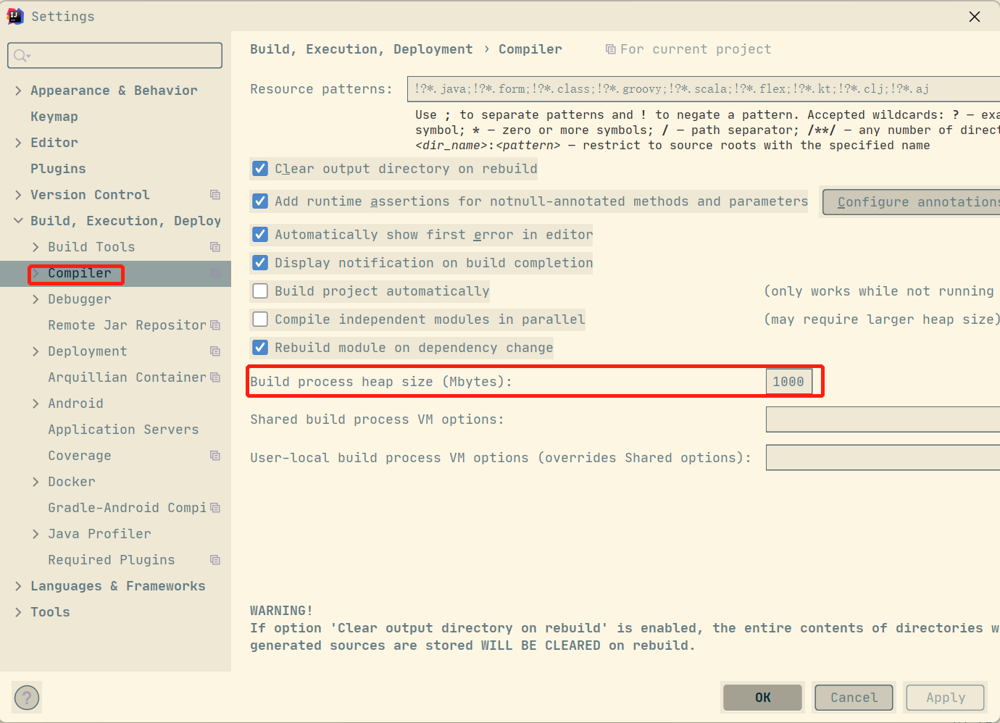

6. 允许dbugclass

   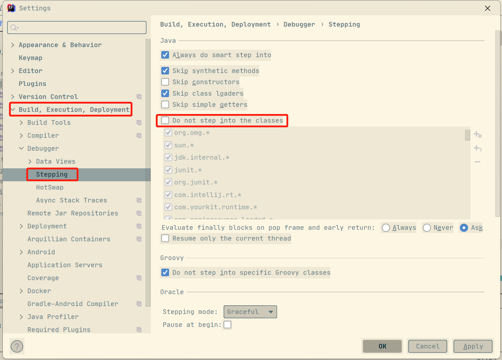

7.   找不到sun.awt.UNIXToolkit、找不到sun.font.FontConfigManager;拷贝文件到工程目录

+ [http://openjdk.java.net/](http://openjdk.java.net/)
+ 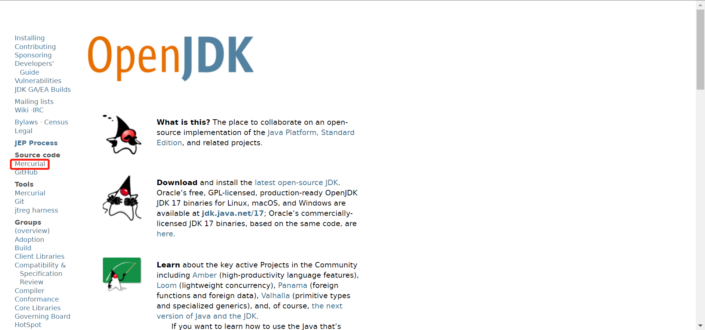
+ 
+ 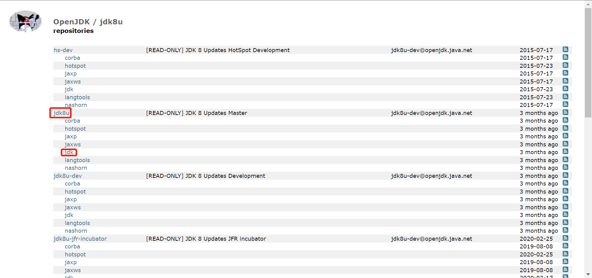
+ 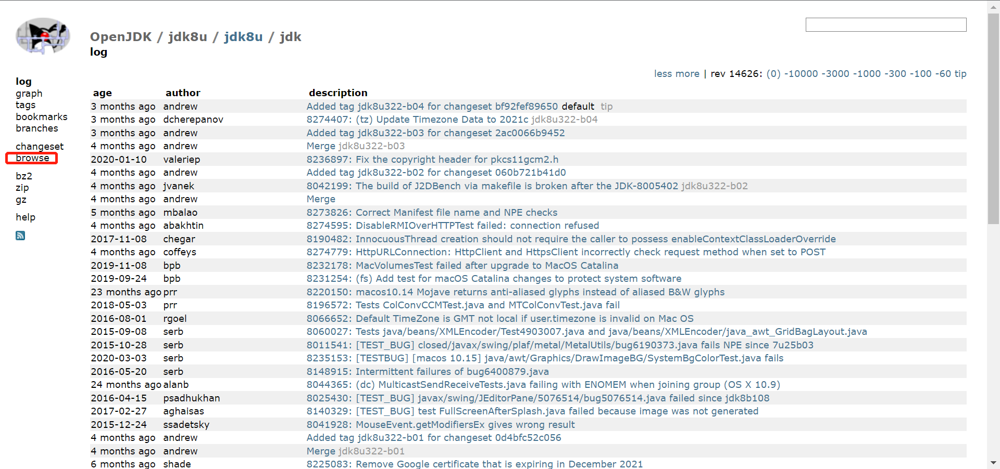
+ 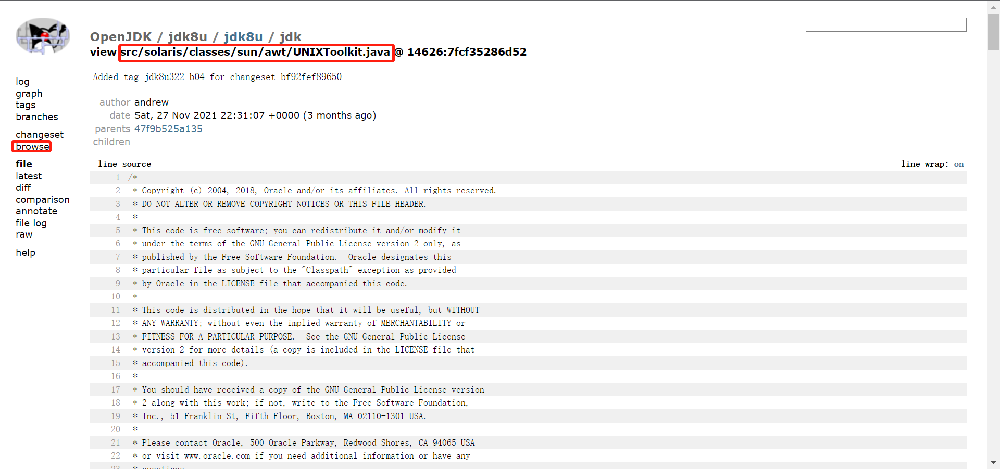
+ [UNIXToolkit.java](https://www.yuque.com/attachments/yuque/0/2022/java/21761290/1647161229700-67f57b7c-ddd3-417c-a356-5c6bf0069df9.java)
+ 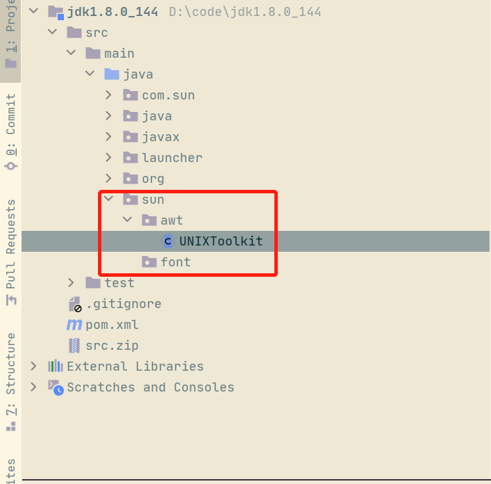


# springboot打war配置

1. pom配置war包插件

```xml
<build>
<finalName>${project.name}</finalName>
	<plugins>
		<plugin>
			<artifactId>maven-war-plugin</artifactId>
			<version>3.0.0</version>
		</plugin>
	</plugins>
</build>
```

2. 配置打包方式

```xml
	<artifactId>xxl-job-admin</artifactId>
	<packaging>war</packaging>
```

3. 修改springboot启动类，继承 SpringBootServletInitializer，重写 configure方法

```java
package com.xxl.job.admin;

import org.springframework.boot.SpringApplication;
import org.springframework.boot.autoconfigure.SpringBootApplication;
import org.springframework.boot.builder.SpringApplicationBuilder;
import org.springframework.boot.web.servlet.support.SpringBootServletInitializer;

/**
 * @author xuxueli 2018-10-28 00:38:13
 */
@SpringBootApplication
public class XxlJobAdminApplication extends SpringBootServletInitializer {

	public static void main(String[] args) {
        SpringApplication.run(XxlJobAdminApplication.class, args);
	}

	@Override
	protected SpringApplicationBuilder configure(SpringApplicationBuilder builder) {
		return builder.sources(XxlJobAdminApplication.class);
	}
}
```

4. 打包

```java
mvn clean package -Dpackage.skip.test
```

5. 注意
   1. 打jar包，配置成jar
   2. 打war包，用工程目录访问资源；<font style="color:rgb(241, 70, 104);">application.properties</font>如下配置将失效，使用tomcat配置

```java
server.port=8080
server.servlet.context-path=/xxl-job-admin
```

    3. main方法和tomcat都可以跑起来
    4. 打jar和war具体看线上环境和运维部署方式


