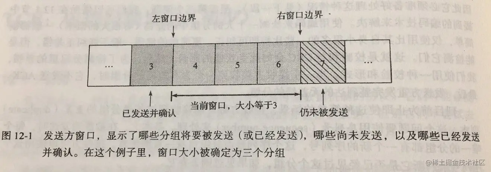
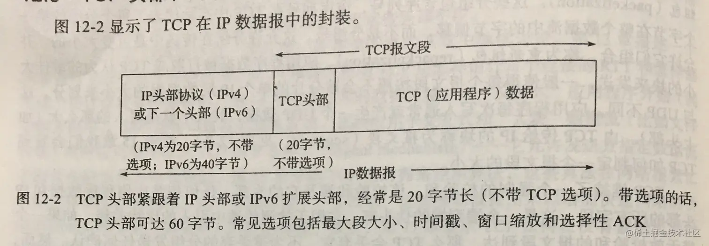
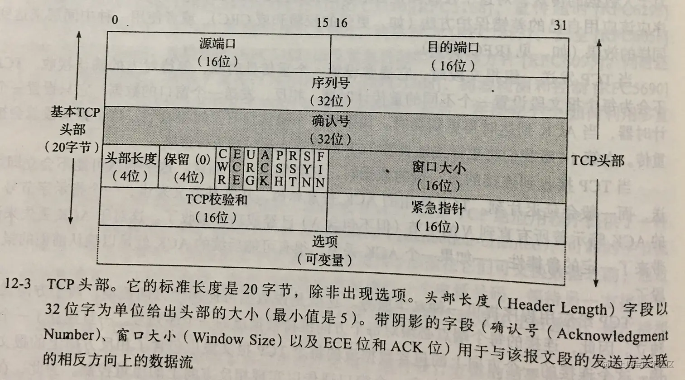
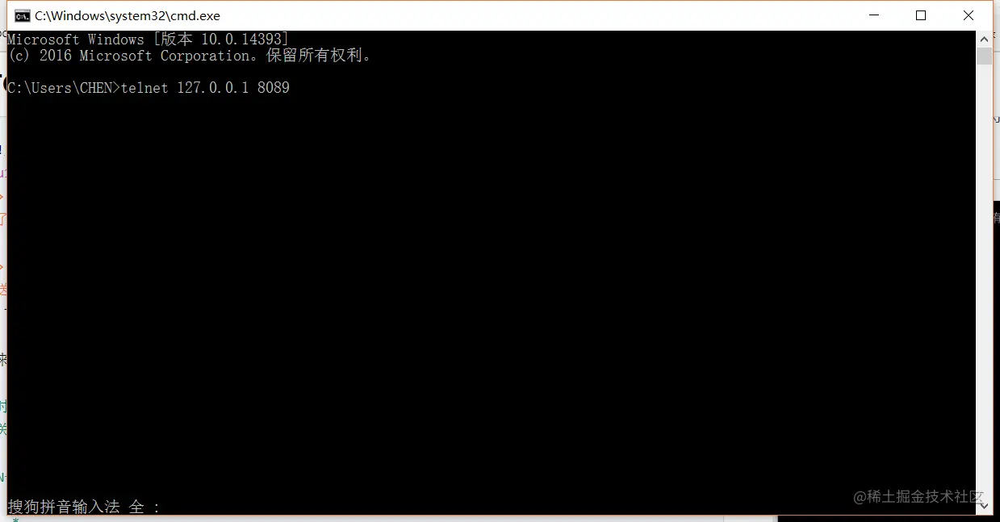
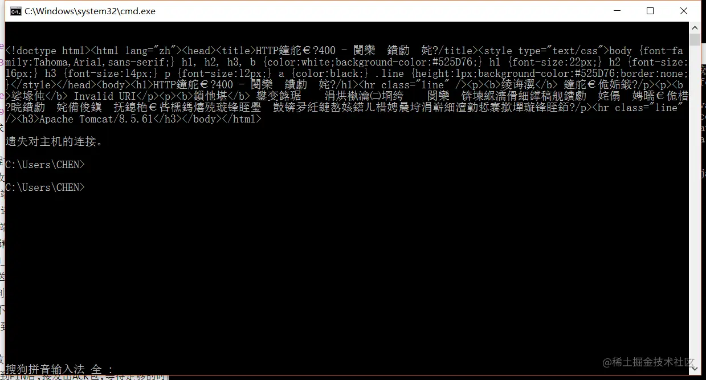
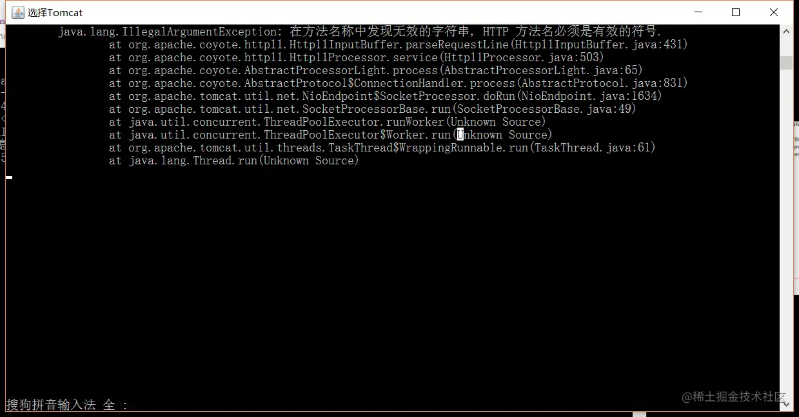
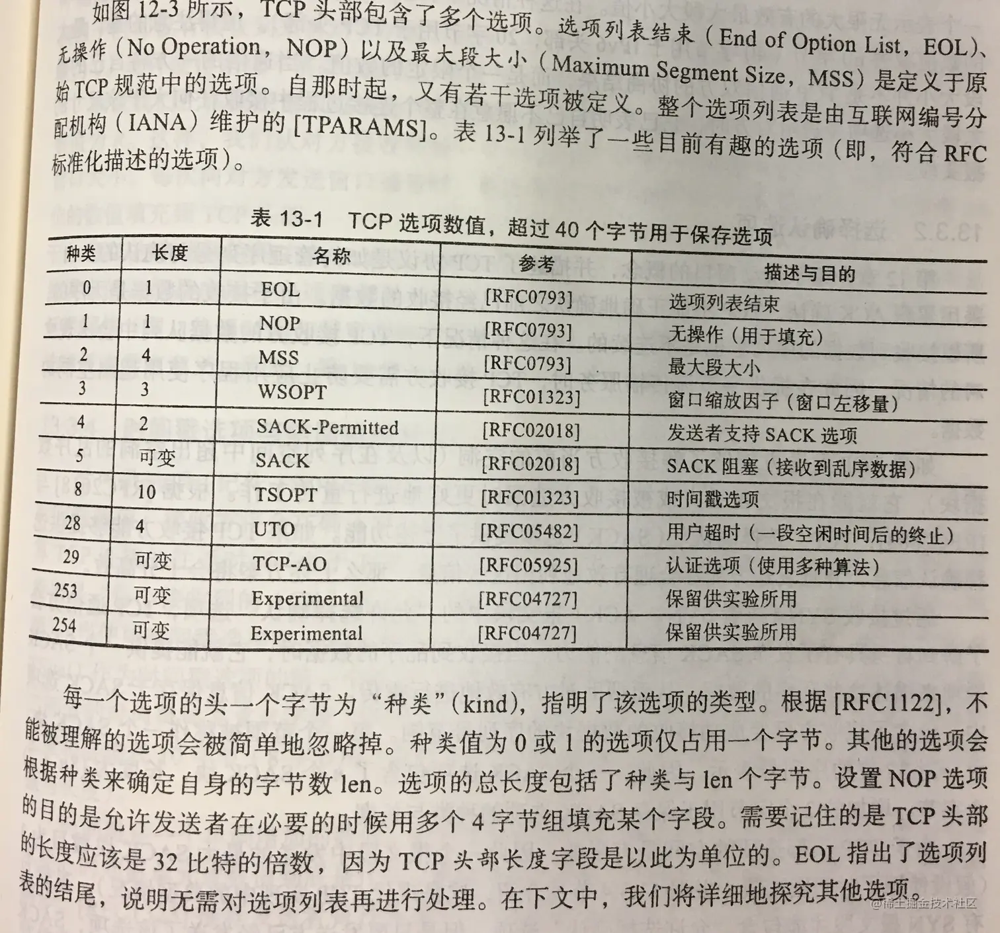
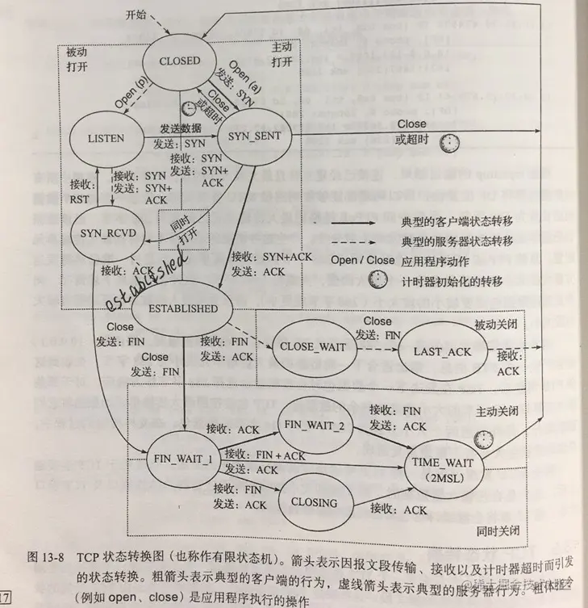
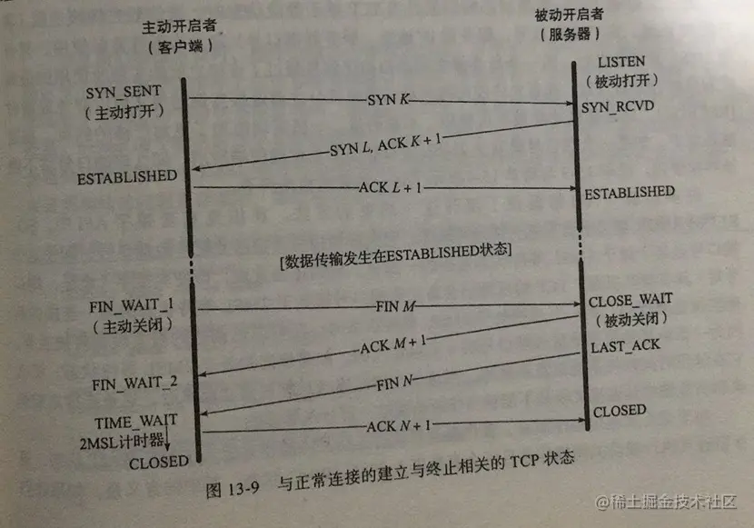
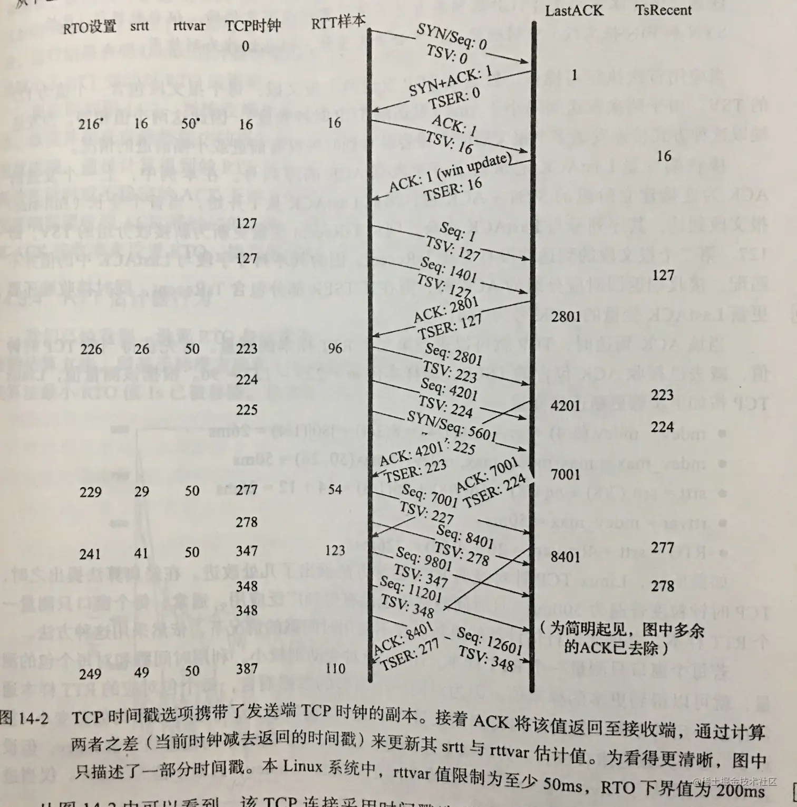

# **TCP/IP概述**

## 1.1 体系结构原则

**分组,连接和数据报**

面向连接网络的联网方式:

+ **分组交换**
  - **信息块**(包含一定字节数信息)可以独立通过网络.不同来源或则发送方的块可以组合,而且以后可以分解,称为"**多路复用**",依赖交换机
  - 优点:网络具有弹性,可以统计统计多方流量,更好的利用网络链路和交换设备
  - 缺点:可预测性有限
+ **连接**:时分复用(TDM)和静态复用,在每个连接上为数据保留一定数量的时间或其他资源,不依赖交换机
  - 优点:更好的预测性,支持恒定比特率的电话功能
  - 缺点:由于保留的宽带可能未使用,无法充分利用网络宽带,
+ **数据报**:有关来源和最终目的的所有识别信息都位于分组中.

## 1.2 设计和实现

对协议体系结构和实现体系结构加以区分,实现体系结构定义了协议体系机构中的概念如何用于软件形式大的实现.使用一种层次结构的处理方式,以检查一个大型软件实现逻辑的稳定性和正确性.这种方案称为分层.

**分层**

通过分层,每层只负责通信的一个方面.不同层级,由不同的领域的专业人员完成.基于OSI模型(开放系统连接标准)


<font style="color:#52C41A;">OSI模型</font>

------------------------------------------------主机------------------------------------------------------------

* 第七层:应用层(Application Layer)

  提供为应用软件而设计的接口,以设置与另一应用软件之间的通信,通常由应用开发者设计和实现.例如:HTTP,HTTPS,FTP,Telnet,SSH,SMTP,POP3,Skype等

* 第六层:表示层(Presentation Layer)

  把数据转换为能与接收者的系统格式兼容并适合传输的格式,指定针对应用程序的数据表示格式和转换规则的方法,典型的例子如字符串EBCDIC转换为ASCII码.加密有时与本层有关,但也可能在其他层中.

* 第五层:会话层(Session Layer)
  负责在数据传输中设置和维护计算机网络中两台计算机之间的通信连接.指定由多个连接组成一个通信会话的方法.它可能包含关闭连接,重启连接和检查点进程.ISO X.225是一个会话层协议.

* 第四层:传输层(Transport Layer)
  把传输表头(TH)加至资料以形成分组.传输表头包含了所使用的协议等发送信息.例如:传输控制协议(TCP)等.指定运行在相同计算机系统中的多个程序之间的连接或关联的方法.如果在其他地方没有实现,本层可能实现可靠的投递(例如TCP,ISO TP4)

---------------------------------------------所有网络设备--------------------------------------------------------

* 第三层:网络层(Network Layer)
  决定数据的路径选择和转寄,将网络表头(NH)加至数据包,以形成分组.网络表头包含了网络资料.例如互联网协议(IP)等.指定经过潜在不同类型链路层网络的多跳通信方法.对于分组网络,它描述了抽象的分组格式和标准的编址结构.(例如IP数据包,X.25PLP,ISO CLNP)

* 第二层:链路层(Data Link Layer)
  负责网络寻址,错误侦测和改错.当表头和表尾被加至数据包时,会形成信息框.数据链表头(DLH)是包含物理地址和错误侦测及改错的方法.数据链表尾(DLT)是一串指示数据包末端的字符串.例如以太网,无线局域网(Wi-Fi)和通用分组无线服务(GPRS).指定经过单一链路通信的方法,包含多个系统共享同一介质时的"介质访问"控制协议.本层通常包含差错检测和链路层地址格式

* 第一层:物理层(Physical Layer)
  在局域网上发送数据帧(Data Frame),他负责管理电脑通信设备和网络媒体之间的互通.包括了阵脚,电压,线缆规范,集线器,中继器,网卡 ,主机接口卡等.指定连接器,数据速率和如何在某些介质上进行位编码.本层也描述低层的差错检测和纠正,频率分配

## 1.3 TCP/IP协议族结构和协议

**ARPANET参考模型**

互联网的前身是产生在美国的因特网称作阿帕网（Advanced Research Projects Agency Network，ARPANET），又称ARPA网。它是美国国防部高级研究计划局（Advanced Research Projects Agency，ARPA）信息处理处（Information Processing Techniques Office，IPTO）开发的世界上第一个计算机远距离的封包交换网络，被认为是现今互联网（Internet）的前身。

* 第七层:应用层

  Internet兼容的任何应用.例如HTTP,DNS,DHCP

* 第四层:传输层
  与应用程序端口之间的数据交换.可能包含差错和流量控制.例如TCP,UDP,SCTP,DCCP

* 第三层:网络层
  协助完成网络设置,定义抽象的数据报和提供路由.例如IP和IP6

* 第二层:链路层
  网络层到链路层的地址映射,例如ARP

协议简介:

+ <font style="color:#E8323C;">ARP</font>:最古老和最重要的地址解析协议.ipv4的专用协议,只用于多接入链路层协议(例如Wi-Fi),完成IP层使用的地址和链路层使用地址之间的转换.
+ <font style="color:#E8323C;">IP</font>:TCP/IP中最重要的<font style="color:#E8323C;">网络层协议</font>.IP发送给链路层协议的PDU(帧)称为IP数据报,大小为64KB(IPV6将他扩大为4GB).将"分组"来表示IP数据报.大的分组放入链路层PDU(帧)时需要进行缩小处理,这个过程称为分片,他通常由IP主机个路由器执行.在分片的过程中,大数据报的一部分被放入多个分片的数据报中,并在到达目的地之后组合(称为重组)
+ <font style="color:#E8323C;">ICMP</font>:<font style="color:#E8323C;">网络层协议,</font>internet控制消息协议,他是IP的一个辅助协议.IP层使用ICMP与其他主机或则路由器的IP层之间交换差错消息和其他重要信息.
+ <font style="color:#E8323C;">IGMP</font>:<font style="color:#E8323C;">网络层协议</font>internet组管理协议,他是ipv4的另一个辅助协议,它采用组播寻址和交付来管理作为组播组成的主机.
+ TCP:传输协议tcp会处理数据报丢失,重复和重新排序等,IP层不处理的问题.他采用面向连接(VC)的方式,并且不保留消息边界.
+ <font style="color:#E8323C;">UDP</font>:传输协议,用户数据报协议,提供比IP协议稍多的功能.UDP允许应用程序发送数据报并保留边界,但不强制实现速率控制和差错控制.允许将数据报从一台主机发送到另外一台主机,但不保证数据报到达另一端.任何可靠性都需要应用层提供.UDP所作的是提供一套端口号,用于复用,分解数据和校验数据的完整性.UDP和TCP在同一层,他们完全不同
+ <font style="color:#E8323C;">DCCP</font>:传输协议,数据报拥塞控制协议.提供了一种介于TCP和UDP之间的服务类型:面向连接,不可靠数据交换,但具有拥塞控制功能.拥塞控制包含发送方控制发送速率,以免流量堵塞整个网络.
+ <font style="color:#E8323C;">SCTP</font>:传输协议,流控制传输协议.用于特定系统的传输协议.SCTO提供类似TCP的可靠交付.但不要求严格保持数据的顺序.还允许多个数据逻辑上在同一连接上传输,并提供了一个消息抽象.他是与TCP的主要区别.SCTP用于在IP网络上携带信令消息,类似电话网络中的用途.

**TCP/IP中的复用,分解和封装**

**端口号**

端口号是16位非负整数（0-65535），他们被用于确定正确的接收数据的具体服务。标准的端口号由Internet号码分配（IANA）机构分配。

+ 熟知端口号，范围：0-1023，识别众所周知的服务，

> 安全外壳协议 SSH：22
>
> FTP协议 ：20，21
>
> Telnet远程终端协议：23
>
> 电子邮件协议SMTP：25
>
> 域名系统协议 DNS：53
>
> 超文本传输协议或WEB HTTP/HTTPS:80和443
>
> 交互式邮件访问协议IMAP和IMAPS：143，993
>
> 简单网络管理协议SNMP：161和162
>
> 轻量级目录访问协议 LDAP：389

+ 注册端口，范围 1024-49151，提供给有特殊权限的客户机或者服务。
+ 动态/私有端口号，范围49152-65535，也叫临时端口号码，基本不受监管

**名称，地址和DNS**

在TCP/IP中，每台计算机的每个链路层至少有一个IP地址。ip地址足以识别主机，但他们不方便被人们记忆或则操作。在TCP/IP中，DNS是一个分布式数据库，提供主机名和IP直接的映射（反之亦然）


# 1.TCP:传输控制协议

## 1.1引言
IP和UDP协议,没有实现差错纠正;对于以太网和基于其上的其他协议,协议都提供了一定次数的重试,如果还是不成功则放弃.
通信媒介可能会丢失或则改变传递的消息,出现了通信的问题.这个课题的最重要的理论研究者是**劳德.香农**,在1948年给出[S48]

通信差错问题的解决

* 使用差错校验码(添加一些冗余的比特,即使比特丢失丢失,真实的信息也可以被恢复出来)
* 自动重复请求(Automatic Repeat Request,ARQ),包含了TCP协议

### 1.1.1 ARQ和重传
处理分组丢失(比特差错)的方法是重发分组直到他被正确的接受.判断方法?

1. 接收方是否已经收到分组
2. 接收方接收到的分组是否与执之前发送方的一样

> **ACK**(acknowledge)

* 发送方发送一个分组,然后等待一个ACK.当接收方接收到这个分组时,它发送对应的ACK,整个过程就这样继续.

> **ACK**出现的问题:

1. 对一个请求ACK应该等待多久?
2. 如果ACK丢失了怎么办?
3. 如果分组被接受到了,但是里面有错怎么办?
> **ACK**出现的问解决:

* 问题1:后面讨论
* 问题2:再次发送原分组
* 问题3:一般使用校验和与CRC,当接收方接受到一个含有差错的分组,它不发送ACK.最后,发送方重发完整分组到无差错的分组.

> 接收方接收到重复分组的解决办法:

* 使用序列号,发送方为每个分组分配序列号,由分组自身携带着.接收方使用这个序列号码来判断是否已经见过这个分组,如果见过则丢弃.
### 1.1.2 分组窗口和滑动窗口
* 存在于发送方和接收方,窗口结构便于记录在发送方和接收方数据的流动
* 发送方窗口:记录哪些分组可以释放,哪些分组可以被释放,哪些分组正在正在等待ACK,以及哪些分组不能被发送.
* 接收方窗口:记录着哪些分组已经被接受和确认,哪些分组是下一步期望的(和已经分配多少内存来他们),以及哪分组即使被接受也将会因为内存限制而被丢弃.
* window size(窗口大小):分组窗口中的分组数量(window)
* window(分组窗口):发送方注入但还没有完成确认的分组集合

### 1.1.3 变量窗口:流量控制和拥塞控制
> 流量控制(flow control):处理当接收方相对发送方太慢产生的问题,在接收方跟不上的时候会强迫发送方慢下来.

> flow control的操作方法

1. rate_based(速率)流量控制:给发送方指定某个速率,同时确保数据永远不能超过这个速率.这种类型的流量控制最适合流应用程序,可被用于广播和组播发现.
2. window-based(基于窗口)流量控制,是使用滑动窗口时最流行的方法.窗口大小不是固定的,是随时间而变动的.必须使用window advertisement或则简单地称为window update(窗口更新)---让接收方可以通知发送方使用多大的窗口

流量控制原理

> 修改发送方的窗口大小:分组没有收到任何一个ACK之前,发送方注入W个分组到网络,如果发送方和接收方足够快,网络没有丢失一个分组以及有无穷的空间的话,这就意味着通信正比于(SW/R)b/s,这里W是窗口大小,S是分组大小(比特单位计算),R是往返时间.当来自接收方的窗口夹带着发送方的值W时,那么发送方的全部速率就被限制而不能超越接收方.这种方法可以很好的保护接收方.但是对于中间的网络呢?在接收方和发送方可能会有有限内存的路由器,他们与低速网络链路抗争着,这种情况出现了,发送方的速率可能超过某个路由器的能力,从而导致丢包.这种情况由 congestion control(拥塞控制)的流量控制形式来处理.
> congestion control(拥塞控制)
> 拥塞控制涉及发送方以及减速以不低于压垮其与接收方之间的网络.使用一个窗口通告来告诉发送方为接收方减速.

### 1.1.4 设置重传超时
重传超时应该是多大?

> round-trip-time estimation(往返时间估计),这是一个统计过程.总的来说,选择一组RTT样本的平均值作为真实的RTT是最有可能的.这个RTT值是动态的.

## 1.2 TCP的引入
### 1.2.1 TCP服务模型
TCP提供了一种connection-oriented(面向连接),可靠的字节流服务.
* 面向连接:TCP的两个应用程序之间必须在他们可交换数据之前,通过联系来建立一个TCP连接.例如,打电话,等待另外一方接听电话并说"喂",然后再说"找谁?".这正是TCP连接的两个端点在相互通信.

* 字节流服务:抽象概念给应用程序使用,一端给TCP字节流,同样的字节流会出现另外一端.每个端点独立选择自己的读和写大小.TCP不会解读字节流里的字节内容,他不知道正在交换的数据字节是不是二进制数据,ASCII字符,EBCDIC字符或作其他东西.对于这个字节流的解读取决于连接中的每个端点的应用程序.
### 1.2.2 TCP中的可靠性
可靠性:
* 提供了一个字节流接口,TCP必须把一个发送应用程序的字节流转换成一组IP可以携带的分组,称为组包(packetization).分组包含序列号,在TCP中代表了每个分组第一个字节在整个数据流中的字节偏移,而非分组号.这允许分组在传送中是可变的大小的,并且允许他们组合,称为**重新组包**(repacketization).应用程序数据被打散成TCP认为最佳大小的快来发送,每个报文段大小与分片的单个IP数据报大小不同.TCP传给IP的块称为报文段(segment)
* TCP维持了强制的校验和:校验和涉及他的头部,任何相关程序数据和IP头部的所有字段.这是一个端到端的伪头部,用于检测传送中引入的比特差错.
* 重传计时器:当TCP发送一组报文段时,他通常设置一个重传计时器,等待对方的确认接收.当ACK到达时再更新超时.如果一个ACK没有及时接收到,这个报文段就会被重传.
* ACK:当TCP接收到连接的另一端的数据时,他会发送一个确认.
* TCP给应用程序提供了双工服务:数据可以同时往两个方向流动,两个方向相互独立.因此,连接的每个端点必须对每个方向的维持数据流的一个序列号.
* 使用序列号:一个TCP接收端可丢弃重复的报文段和记录以及杂乱无序的报文段
## 1.3 TCP头部和封装




每个TCP头部包含了源和目的的端口号码.这两个值与IP头部中的源和目的地IP地址一起,唯一性地标识了每个连接.在TCP术语中,一个IP地址和一个端口的组合被称为一个端点(endpoint)或则套接字(socket).每个TCP连接都有一对套接字或端点(四元组,由客户机IP地址,客户机端口号,服务器IP地址以及服务器端口组成唯一标识)

* 序列号(Sequence Number)字段标识了TCP发送端到TCP接收端的数据流的一个字节,该字节代表着包含该序列号的报文段的第一个字节.范围0-2^32-1,每个被交换的字节都已经被编号,确认号字段(ACK号/ACK字段)包含的值是该确认号的发送方期待的接受的下一个序列号.即最后被成功接收的数据字节的序列号加1.在ack字段被启用有效.
SYN字段:建立新连接时,从客户机发送服务器的第一个报文段的SYN位字段被启用.这样的报文段称为SYN报文段.序列号包含了本次连接的这个方向上要使用的第一个序列号.经常是一个随机数(Initial Sequence Number,ISN)
* CWR（Congestion Window Reduce）---拥塞窗口减小标识(发送降低它的发送速率),收到了设置ECE标识的包,减小发送窗口大小来降低发送的速率
* ECE(ECN Echo)---ECN回显(发送方接收到了一个更早的拥塞通知),三次握手的时候表明TCP端是具备ECN功能的,在数据传输的时候标识收到的TCP包的IP头部ECN被设置成11,即网络拥堵
* URG(Urgent)---紧急(紧急指针字段有效--很少使用),标识报文段发送的数据是否包含紧急数据,URG=1标识有紧急数据,这时的紧急指针字段才有效果
* ACK---确认(确认字段有效--连接建立以后一般是启用状态),ACK=1时,确认的字段才有效,TCP规定,建立连接后ACK必须是1
* PSH(PUSH)---推送(接收方应尽快给应用程序传送这个数据---没被可靠地实现或用到),PSH=1表示,应该立马把数据推送给应用程序,而不是缓存起来
* RST---重置连接(连接取消,经常是错误),RST=1表示TCP出现了严重错误(主机崩了),必须释放连接,重新建立连接
* SYN---用于初始化一个连接的同步序列号,SYN=1,ACK=0表示这是一个建立连接的报文段,当SYN=1,ACK=1表示双方同意建立连接.SYN=1,只能表示这是一个建立连接或则同意建立连接的报文.只有在前两次握手中SYN才是1
* FIN---标记数据是否发送完成.如果FIN=1,表示数据发送完成,可以释放连接
* TCP校验和字段覆盖了TCP的头部和数据以及头部中的一些字段.
* 紧急指针(Urgent Pointer)字段只有在URG为字段被设置时才有效.这个指针是一个必须要加到报文段的序列号字段上的正偏移,以产生紧急数据的最后一个字节的序列号.TCP的紧急机制是发送方给另外一端提供特殊标识数据的方法,

# 2.TCP 连接管理

## 2.1 TCP连接的建立与终止
TCP连接的组成:一对端点或则套接字组成(两个IP地址和端口)

连接的阶段:启动,数据传输(连接建立),和退出

TCP连接的建立

1. 主动开启者(客户端)发送一个SYN报文段,并指明自己要连接的端口号和他的客户端初始序列号(ISN(c))
2. 服务器也发送自己的SYN报文段作为响应,包含了服务器的初始序列号(ISN(s)).为了确认客户端的SYN,服务器将其包含的ISN(c)数据加1作为返回的ACK数值.每发送一个SYN,序列号码就会加1.如果丢包,该SYN就会重
3. 为了确认服务器的SYN,客户端将ISN(s)的数值加1作为返回的ACK值.
   

> 通过上述3个报文段能够完成一个TCP连接的建立,通常称为**三次握手**.三次握手的目的不仅让通信双方了解一个连接的建立,还可以利用数据包的选项来承担特殊的信息,交换序列号.

>  首次发送SYN的一方被认为是主动打开一个连接,通常是一个客户端.连接的另外一个会接受这个SYN,并发送下一个SYN,因此被称作被动的打开一个连接.通常是称为服务器.

TCP连接的关闭(发送一个FIN报文段)

   	1. 连接的主动关闭者发送一个FIN段申明自己的序列号(K).FIN段包含了一个ACK段用于确认最近一次的发来的数据.
      	2. 连接的被动关闭者将K的数值加1作为响应的ACK值,表明自己已经成功接收到了主动关闭者发送的FIN.同时上层的应用程序会被告知连接的另外一端已经提出了关闭的请求.应用程序发起自己的关闭操作.接着,被动关闭者将身份转换成主动关闭者,发送自己的FIN.
         	3. 为了完成连接的关闭,最后的发送的报文段还包含一个ACK用于确认上一个FIN值.注意的是,如果出现FIN丢失的情况,那么发送方将重新传输直到接受到一个ACK确认为止.

telnet 连接远程主机,测试端口号:







## 2.2 TCP选项

## 2.3 TCP状态转换
### 2.3.1 TCP状态转换图




* SYN_SENT:客户端在发送请求之后等待匹配的连接请求,通过connect()函数向服务器发出一个同步(SYN)信号后进入此状态
* LISTEN:服务器等从任意远程TCP端口的连接请求
* SYN_RECEIVED:服务器已经收到并发出同步(SYN)信号之后等待确认(ACK)请求
* ESTABLISHED:服务器与客户端的连接已经打开,收到的数据可以发送给用户.数据传输步骤正常情况.此时连接的两端的平等的.这时称为全连接
* FIN_WAIT1:客户端或则服务端主动关闭调用close()函数发出FIN包,表示本方的数据全部结束等待TCP连接另一端的ACK确认包或FIN&ACK请求包
* FIN_WAIT_2:主动关闭在FIN_WAIT_1状态下收到的ACK确认包,进入等待远程TCP的连接终止请求的半关闭状态,这时可以接受数据,但不发送数据
* CLOSE_WAIT:被动关闭端接到FIN后,接发出ACK以回应FIN请求,并进入等待本地用户的连接终止请求的半关闭状态.这时可以发送数据,但不再接受数据
* CLOSING:在发出FIN后,又收到对方发来的FIN后,进入等待对方对方对己方的连接终止(FIN)确认(ACK)的状态.
* LAST_ACK:被动关闭端全部数据发出完成之后,向主送关闭端发送FIN,进入等待确认包的状态
* TIME_WAIT:主动关闭端接受到FIN后,接发出ACK包,等待足够的时间以确保被动关闭端收到了终止请求的确认包.
* CLOSED:完全没有连接
> TIME_WAIT状态也称为2MSL等待状态.TCP将会等待两倍于最大段生存期(Maximum Segment Lifetime,MSL)的时间,有时也称作加倍等待
## 2.4 与TCP连接管理相关的攻击 
SYN泛洪是一种拒绝服务攻击,一个或则多个客户端产生一系列TCP连接尝试(SYN报文段),并将它们发给一条服务器,通常采用伪造的源IP地址.服务器会为每一条连接分配一定数量的连接资源.由于连接尚未完全建立,服务器为了维护大量的半打开的连接会会耗尽自身的内存,然后拒绝后续合法的连接请求.

* 预防机制:SYN cookies
 	* 思想:接收到一个SYN时,这条连接存储的大部分信息会被编码并保存在SYN + ACK报文段的序列号字段.采用SYN cookies 的目标主机不需要为进入的连接请求分配任何存储资源----只有当SYN + ACK 报文段本身被确认后(并且返回初始序列后)才会分配真正的内存.
## 2.5 TCP的应用
实时应用并不需要甚至无法忍受TCP的可靠传输机制。在这种类型的应用中，通常允许一些丢包、出错或拥塞，而不是去校正它们。例如通常不使用TCP的应用有：流媒体、网络游戏、IP电话（VoIP）等等。任何不是很需要可靠性或者是想将功能减到最少的应用可以避免使用TCP。在很多情况下，当只需要多路复用应用服务时，用户数据报协议（UDP）可以代替TCP为应用提供服务。

# 3.TCP 超时与重传

## 3.1 引言
> 下层网络层(IP)可能会出现丢失,重复或则失序包的情况,TCP协议需要提供可靠的数据传输服务.为保证数据传输的正确性,TCP重传其认为已经丢失的包.TCP根据接收端返回至发送端的一系列确认信息来判断是否丢包.当数据段或确认信息失败,TCP启动重传操作,重传尚未确认的数据.**重传的两套机制**:1.基于时间,2.基于确认信息的构成(更高效)

>1.**RTO(retransmission timeout,重传超时)**:tcp在发送数据的时候设置一个计时器,若超时未收到数据确认信息,则会引发相应的超时或则基于计时器的的重传操作,这种计时器超时称为RTO(重传超时)

> 2.**fast transmission(快速重传)**:若TCP累计确认无法返回新的ACK,或则当ACK包含的确认信息(SACK,selective acknowledge)表明出现失序报文段时,快速重传会推断出现丢包.

## 3.2 简单的超时与重传举例
**binary exponential backoff(二进制指数退避)**:每次重传间隔时间
> 逻辑上讲,TCP拥有两个阀值来决定如何重传一个报文段.R1和R2

> R1:TCP在向IP层传递"消极建议"(如重新评估当期那的IP路径)前,愿意尝试重传的次数(或则等待时间);数据传输段(SYN报文段)的R1>=3

> R2:(R2>R1)指示TCP应该放弃当前连接的时机.数据传输段的R2>=100s,TCP建立连接段的R2>=180s

> linux中的R1和R2的设置,通过应用程序或则系统配置.参数
> net.ipv4.tcp_retries1:重传次数,默认为3,
> net.ipv4.tcp_retries2:默认15,对应约为13~30分钟,根据具体的RTO而定,
> 对于SYN报文段net.ipv4.tcp_syn_retries和net.ipv4.tcp_synack_retries限定了重传次数,默认为5(约180s)

## 3.3 设置重传超时
  TCP怎样根据给定连接的RTT设置RTO?若TCP先于RTT重传,可能会在网络中引入不必要的重复数据,反之,若延迟至大于RTT的间隔发送数据,整体网络利用率就会下降.

  TCP在收到数据之后会返回确认信息,因此可在该信息中携带一个字节的数据来测量传输该确认信息所需要的时间.每个测量结果称为RTT样本(RTT sample).TCP首先需要根据一段时间内的样本值建立好估值,第二部是怎样根据估值设置RTO.
### 3.3.1 经典方法

 最初的TCP规范[RFC0793]采用以下公式计算得到平滑的RTT估值(称为SRTT):
 > **SRTT <---  α(SRTT) + (1 - α)RTTs**

 * **SRTT**是基于现存值和新样本RTTs的到的更新结果,这种测量方法称为指数加权移动平均(Exponentially Weightd Moving Average,EWMA)或则低通过滤(low pass filter)
 * **α**:平滑因子,推荐值为0.8-0.9,80% ~ 90%来自现存值,10% ~ 20%来自新测量值
 考虑到SSRTT估计器的得到的估计值会随RTT为变化,[RFC0793]推荐根据如下公式设置RTO:
 > **RTO = min(ubound,max(lbound,(SRTT)β))**
* **β**:时延离散因子,推荐为1.3 ~ 2.0
* **ubound**:RTO上边界(可设置为建议值1分钟)
* **lbound**:RTO下边界(可设置建议值,1秒)
> 我们称为经典方法,他使得RTO的值设置为1秒,或约为两倍的SRTT
### 3.3.2 标准方法(Jacobson)

按照上述经典方法设置计时器,将无法适应RTT大规模变动(特别是当实际的RTT远大于估计值,会导致不必要的重传).增大的RTT样本表明网络出现了过载,此时不必要的重传会进一步加重网络的负担.

为解决这一问题,可对原方法改进一适应RTT变动较大的情况.记录RTT测量值的变化情况以及平均值老得到较为准确的估计值.基于均值和估计值的变化来设置RTO,将比使用均值的常数倍来计算RTO更能适应RTT变化幅度较大的情况.

如下的算法采用了经典方法([RFC0793]),还同时考虑到了RTT样本变化值的方法计算RTO的对比情况.我们将TCP得到的RTT测量样本值作为一统计过程,同时测量平均值和方差(或则标准差)能更好的估计将来值,还可以帮助TCP设置一个能适应大多数情况的RTO值.
> 平均偏差(mean deviation)是对标准差的一种好的逼近,但是计算更容易,更快捷.这是因为计算标准差需要对方差的进行平方根运算,对于快速TCP实现来说代价较大.因此我们结合了平均值和平均偏差来进行估值.对每个RTT测量值M(前面的RTTs)采用以下公式:

> **srtt <--- (1 - g)(srtt) + (g)M**

> **rttvar <--- (1 - h)(rttvar) + (h)(|M - srtt|)**

> **RTO = srtt + 4(rttvar)**
> 这里,srtt代替了之前的SRTT,并且rttvar为平均偏差的EWMA,而非采用之前的β来设置RTO.上述等式也可以写成另外一种形式,对计算机实现来说较为方便:
> **Err = M - srtt**

> **srtt <--- srtt + g(Err)**

> **rttvar <--- rttvar + h(|Err| - rttvar)**

> **RTO = srtt + 4(rttvar)**

* **srtt**:平均值的EWMA,参与计算RTO,并且随时间变化
* **rttvar**:绝对误差|Err|的EWMA,参与计算RTO,并且随时间变化
* **Err**:测量值M与当前RTT估值srtt之前的偏差
* **g**:增量g,新RTT样本M占srtt估计值的权重,取值**1/8**,取值为2的(负的)多少次方
* **h**:增量h为新平均偏差样本(新样本M与当前平均值srtt之前的绝对误差)占偏差估计值rttvar的权重,取值**1/4**,取值为2的(负的)多少次方
> 当RTT变化时,偏差的增量越大,RTO增长越快.

经典方法和Jacobson计算方法的区别:
* 平均RTT的计算过程类似(α 等于 1 - g),采用的增量不同.
* Jacobson同时基于平滑RTT和平滑偏差计算RTO,而经典方法简单的采用平滑RTT的倍数,这是迄今为止许多TCP实现RTO的方法.

#### 3.3.2.1 时钟粒度与RTO边界

在测量RTT的过程汇总,TCP时钟时钟处于运行状态.对于初始序列号码来说,实际的TCP连接的时钟并非从零开始,也没有绝对精确的精度,TCP的时钟通常为某个变量,该变量随着系统时钟而做出更新,但并非一对一地同步更新.TCP时钟一个"滴答"的时间通常称为粒度.通常,该值相对较大(约500ms),但新的时钟粒度更细(linux采用了1ms)

粒度会影响RTT的测量值以及RTO的设置.粒度用于优化RTO的更新情况,并给RTO设置了一个下界.计算公司如下:
> **RTO = max(srtt + max(G,4(rttvar)),1000)**
* **G**:计时器的粒度,1000ms为整个RTO的下界值,因此RTO至少为1s,可选上届值
#### 3.3.2.2 初始值

在首个SYN交换之前,除非系统提供,否则TCP无法设置RTO初始值.根据[RFC6298],RTO的初始值为1s,而初始SYN报文段采用的超时时间为3s.当收到首个RTT测量结果M,估计器按照以下方式进行初始化:
>**srtt <--- M**

> **rttvar <--- M/2**
#### 3.3.2.3 重传二义性与Karn算法

**重传二义性**:在测量RTT样本的过程中若一个包的传输出现超时,该数据就会被重传,接着收到一条ACK信息,那么该ACK是对第一条还是第二条传输的确认就存在这二义性.

**Karn算法**

* [KP87]指出,出现超时,接收到重传数据的确认信息时不能更新RTT估计值.这是**Karn**算法的第一部分.通过排除二义性数据来解决RTT估计值出现的二义性问题.

* TCP在计算RTO的过程中采用一个退避系数(backoff factor),每当重传计时器出现超时,退避系数加倍,该过程一直持续到非重传数据.此时退避系数为1,重传计时器返回正常值.对重传过程退避系数加倍,这是**Karn**算法的第二部分.若TCP超时,同时会引发拥塞控制机制,以此改变发送速率.[KP89]中所述:
> 当接收到重复传输(即至少重传一次)数据的确认信息时,不进行该数据包的RTT测量,可以避免重传二义性问题.另外,对该数据之后的包采取退避策略.仅当接受到未经重传的数据时.该SRTT才用于计算RTO.
#### 3.3.2.4 带时间戳选项的RTT测量

TCP时间戳选项(TSOPT)作为PAWS算法的基础,还可以作RTT测量(RTTM).允许发送者在返回的对应确认信息中携带一个32比特的数.

时间戳值(TSV)携带初始SYN的TSOPT中,并在SYN+ACK的TSOPT的TSER部分返回,以此设定srtt,rttvar与RTO的初始值.

当传输大批量数据时,TCP通常采取每两个报文段返回一个ack的方法,当数据出现丢失,失序或则重传成功时,TCP的累计确认机制报文段与其ACK之间的不是一一对应关系.为了解决这些问题,使用时间戳选项的TCP采用以下算法来测量RTT样本值:
1. TCP发送端在其发送的的每个报文段的TSOPT的TSV部分携带一个32比特的时间戳值.该值包含数据发送时刻的TCP时钟值.

2. 接收端记录接收到的TSV值(TsRecent的变量)并在对应的ACK中返回,并且记录其上一个发送的ACK号(LastAck的变量).ACK号代表接收端(ACK发送方)期望接收到的下一个有序序号.

3. 当一个新的报文段到达时,如果其序列号码与LastACK的值吻合(即为下一个期望接收的报文段),则将其TSV值存入TsRecent.

4. 接收端发送的任何一个ACK都包含TSOPT,TsRecent变量包含的时间戳被写入其TSER部分.

5. 发送端收到ACK后,将当前的TCP时钟减去TSER值,得到的差值即为新的RTT样本估计值.

### 3.3.3 Linux 采用的方法

RTO通常设置为srtt+4(rttvar),无论最大RTT样本的值是大于还是小于srtt,rttvar的任何大的变化,都会导致RTO的增大.Linux通过减小RTT样本值大幅减小rttvar的影响来解决这一问题.Linux设置RTO的方法:

与标准方法一样,Linux也记录srtt和rttvar值,但还同时记录两个新的变量mdev和mdev_max.
* mdev:标准方法的瞬时平均偏差估计值,即上面的rttvar
* mdev_max:记录测量RTT样本过程中的最大mdev,最小值为50ms.rttvar需定期更新一保证以保证其不小于mdev_max.因此RTO不会小于200ms.

Linux根据mdev_max的值来更新rttvar.RTO总是等于srtt与4(rttvar)之和,以此保证RTO不超过TCP_RTO_MAX(默认值为120s).如下图.


* 首次RTT样本测量

* > srtt = 16ms

* > mdev = (16/2)ms = 8s

* > rttvar  = mdev_max = max(mdev,TCP_RTO_MIN) = max(8,50)

* > RTO = srtt + 4(rttvar) = 16 + 4(50) = 216ms

在初始SYN交换之后,发送端对接收端的SYN返回一个ACK,接收端进行了一次窗口更新.这些包未包含数据数据(SYN或则FIN字段,但算作数据),并且没有记录相应的时间,并且发送端接收到窗口更新时也没有进行RTT更新.TCP对不含数据的报文段不提供可靠性传输,意味着若出现丢包也不会重传,因此无需设定重传计时器.

> **注意**:TCP选项本身并不进行重传或可靠性传输.仅仅当数据段(包含SYN和FIN报文段)中明确设定,才会丢失重传,但也仅作为副作用.

当应用首次执行写操作,发送端TCP发送两个报文段,每个报文段包含一个值为127的TSV.由于两次发送间隔小于1ms(发送端的TCP发送粒度),因此两个值相等.当发送端以这种方式发送多个报文段时,可以看到之中并没有前进的情况.

接收端变量LastACK记录上一次发送的ACK的序列号码.本例中,上一个发送的ACK为连接建立阶段的SYN + ACK包,因此AC从1开始.首个全长(full-size)报文段到达,其序列号与LastACK吻合,则将TsRecent变量更新为接收分组的TSV,即127.第二个报文段的到达并没有更新TsRecent,因为其序列号码字段与LastACK不匹配.接收端返回对应分组的ACK时,需在其TSER部分包含TsRecent,同时接收端还要更新LastACk变量的ACK号为2801.

* 第二次RTT样本测量
样本m = 223 - 127 = 96
* > mdev = mdev(3/4) + |m - srtt|(1/4) = 8(3/4) + |80|(1/4) = 26ms
* > mdev_max = max(mdev_max,mdev) = max(50,26) = 50ms
* > srtt = srtt(7/8) + m(1/8) = 16(7/8) + 96(1/8) = 14 + 12 = 26ms
* > rttvar = mdev_max = 50ms
* > RTO = srtt + 4(rttvar) = 26 + 4(50) = 226ms

标准方法中rttvar所占权重较大(系数为4),因此当RTT减小时,也会导致RTO增长.在时钟粒度较大时(500ms),不会有太大的影响,因为RTO可用值很少.但是,若时钟颗粒较细,比如Linux的1ms,可能出问题.针对RTT减小的情况,若新样本值小于RTT估值范围的下界(srtt - mdev),则减小样本的权重.伪代码如下:

```
if(m < (srtt - mdev))
    mdev = (31/32) * mdev + (1/32)*|srtt -m|
else
    mdev  = (3/4)* mdev + (1/4) * |srtt - m|
```
## 3.5 快速重传
快速重传机制基于接收端的反馈信息来引发重传,而非重传计时器的超时.与超时重传相比,快速重传能更加及时有效地修复丢包情况.

**快速重传算法**:TCP发送端在观测到至少dupthresh(重复ACK的阀值)个重复ACK后,即重传可能丢失的数据分组,而不必等到重传计时器超时.当然也可以同时发送新数据.根据重复ACK推断的丢包通常与网络拥塞有关,因此伴随快速重传应促发拥塞控制机制.不采用SACK时,在接受到有效ACK前至多只能重传一个报文段.采用SACK,ACK可包含额外信息,使得发送端在每个RTT时间内可以填补多个空缺. 
## 3.6 带选择确认的重传
随着选择确认选择的标准化,TCP接收端可提供SACK功能,通过TCP头部累计的ACk字段来描述描述其接受到的数据.ACK号与接收端缓冲中的其他数据之间的间隔称为空缺.序列号高于空缺的数据称为**失序数据**,因为这些数据和之前接受的序列号码不连续.

TCP发送端的任务是通过重传丢失的数据来填补接收端缓冲中的空缺,但同时也要尽可能保证不重传正确接收到的数据.合理采用SACK信息能够更快地实现空缺填补,且能够较少不必要的重传,原因在于其在一个RTT内能够获知过个空缺.当采用SACK选项时,一个ACK可包含三四个告知失序数据的SACK信息.每个SACK信息包含32位的序列号,代表接收端存储的失序数据的起始至最后一个序列号.

SACK选项指定n个块的长度为8n+2字节,因此40字节可包含4个块.通常SACK会与TSOPT一同使用,因此需要额外的10个字节(外加2字节的填充数据),这意味着SACK在每个ACK中只能包含3个块.
### 3.6.1 SACK接收端的行为
接收端在TCP连接建立期间收到SACK许可选项即可生成SACK.通常来说,每当缓存中存在失序数据时候,接收端就可以生成SACK.

第一个SACk块内包含的是最近接收到的报文段的序列号码.由于SACK选项的空间有限,应尽可能确保向TCP发送端提供最新的信息.其余的SACK块包含的内容也按照接收到的先后依次排列.也就是说,最新的一个块包含的内容除了包含接受到的序列号,还需要重复之前的SACK块.

在一个SACK选项中包含多个SACK块,并且在多个SACK中重复这些块信息的目的是为了防止SACK丢失提供一些备份.

### 3.6.2 SACK发送端的行为
在发送端也应该提供SACK功能,并且合理地利用接收到的SACK块来进行丢包重传,该过程称为**选择性重传(selective retransmission)** 或**选择性重发(selective repeat)**.SACk发送端记录接收到的累计ACK信息,还需要记录接收到的SACK信息,并利用该信息来避免重传正确接受的数据.

当SACk发送端执行重传时,通常是由于接收到了SACK或则重复的ACK,它可以选择发送新数据或则旧数据.SACK信息提供接受端数据的序号范围,因此发送端可据此推断需要重传的空缺数据.最简单的办法是使发送端首先填补接收端的空缺,然后再继续发送新数据.这是常用的方法.

## 3.7 伪超时与重传
在很多情况下,即使没有出现数据的丢失也可能引发重传.这种不必要的重传称为**伪重传(spurious retransmission)**,主要原因是伪超时过早判断超时,其他原因包括失序,包重复,或则ACK丢失.在实际RTT显著增长,超过当前RTO时,可能出现伪超时.在下层协议性能变化较大的环境中(无线环境),这种情况出现的比较多.

伪超时的解决方法,通常包含**检测算法(detection)**与**响应算法(response)**

### 3.7.2 Eifel检测算法
实验性质的Eifel检测算法利用了TCP的TSOPT来检测伪重传.在发生超时重传后,Eifel算法等待接收下一个ACK,若对第一次传输的确认,则判断该重传是伪重传.

Eifel检测算法的机制很简单.它需要使用TCP的TSOPT.当发送一个重传后,保存器TSV值.当接收到的相应分组的ACK后,检测该ACK的TSER部分.若TSER部分小于之前的存储的TSV值,则可判断该ACK对应的是原始的传输分组,即该分组是伪重传.

### 3.7.3 前移RTO恢复(F-RTO)
**前移RTO恢复(Forward-RTO Recovery,F-RTO)**是检测伪重传的标准算法.该算法只检测由重传计时器超时引发的伪重传;对于其他原因引发的伪重传则无法判断.

F-RTO会修改TCP的行为,在超时重传之后接受到的第一个ACK时,TCP会发送新(非重传)数据,之后再响应一个到达的ACK.如果其中有一个重复ACK,则认为此次重传没有问题.
如果这两个都不是重复ACK,则表示该重传是伪重传.如果新数据的传输得到了相应的ACK,就使得接收端窗口前移.如果新数据的发送导致了重复的ACK那么接收端至少有一个或更多的空缺.这两种情况,接收新数据都不会影响整体数据的传输性能.

### 3.7.4 Eifel相应算法
一旦判断出现伪重传,则会引发一套标准操作,即为Eifel响应算法.在重传计时器超时后,它会检查srtt和rttvar的值,并按照如下的方式记录新的变量srtt_prev和rttvar_prev:
* > srtt_prev  = srtt + 2(G)
* > rttvar_prev = rtvar
* G:TCP时钟粒度
* srtt_prev:设为srtt加上两倍的时钟粒度,因为srtt过小,可能出现伪超时.如果srtt稍大,就可能发生超时.
完成srtt_prev和rttvar_prev的存储之后,就要触发某种检测算法.运行检测算法之后可得到一个特殊值,称为伪恢复(SpuriousRecovery).如果检测到一次伪超时,则将伪恢复置为SPUR_TO.如果检测到迟超时,则将其置为LATE_SPUR_TO.否则超时,改次超时为正常超时,TCP继续执行正常的响应行为.

若为伪恢复SPUR_TO,TCP可在恢复阶段完成之前进行操作.将下一个要发送报文段的序列号修改为最新的未发送过报文段.这样可以避免"回退N"行为.

若检测到一次迟到伪超时,此时已生成对首次的重传的ACK,则SND.NXT不改变.在以上两种情况中,都要重新设置拥塞控制状态.并且一旦接收到重传计时器超时后的发送的报文段ACk,就要按照如下方式更新srtt,rttvar和RTO
* > srtt <--- max(srtt_prev,m)
* > rttvar <---max(rttvar_prev,m/2)
* > RTO = srtt + max(G,4(rttvar))
* m:RTT样本值,超时后首个发送数据接收到的ACK计算得到的.

# 4.TCP 数据流与窗口管理
# 5.TCP 拥塞控制
# 6.TCP 保活机制